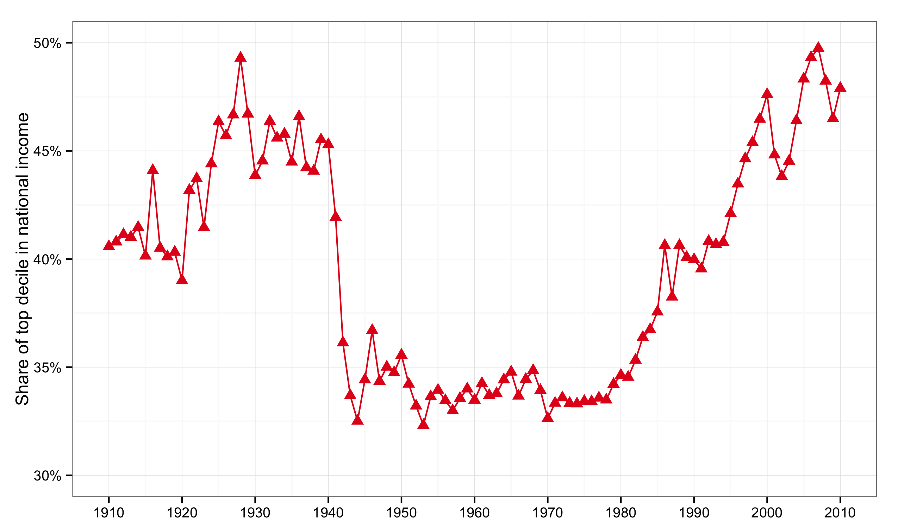
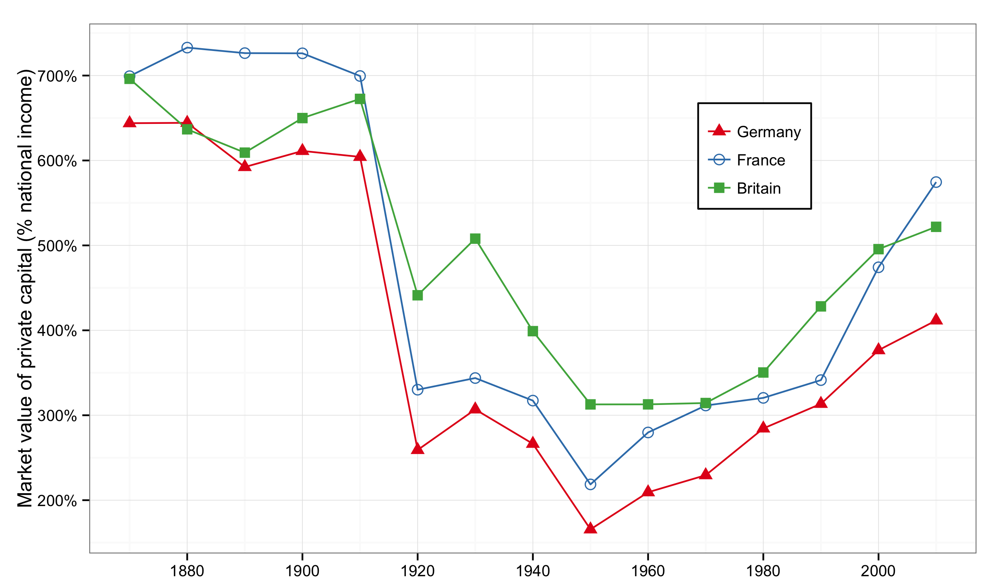

### Introduction

- This set of lecture notes surveys selected topics from *Capital in the Twenty-First Century*, a book written by economist Thomas Piketty, published in English in 2014 to great acclaim.
- The intended audience for these notes is any curious person with or without training in economics.
- The book deals with technical matters but its streamlined presentation of technical issues makes it highly readable.

---

### Thomas Piketty
<br />
<figure class = "centeredImage">  

<figcaption class = 'figcaption'>Piketty's Capital took America by storm. 
</figcaption>  
</figure> 

---

### Capital in the 21st Century

- What do we know about the distribution of income? 
- What do we know about the distribution of wealth? 
- What prediction can we make about the evolution of income and wealth over the long term?
- Do the forces of private capital accumulation inevitably lead to the concentration of wealth in ever fewer hands?
- Can the balancing forces of growth, competition, and technological progress be strong enough to reduce inequality and reduce class conflicts?
- This introduction presents an ultra brief history of inequality and sketches the book's main themes.

--- 

### Adam Smith
<br />
<figure class = "centeredImage">  

<figcaption class = 'figcaption'>Adam Smith (1723-1790).
</figcaption>  
</figure> 

--- 
### Adam Smith and Poverty

- In 1776, Adam Smith published his study on the *Wealth of Nations*.
- Adam Smith is thought of as 'the first economist.'
- Adam Smith lived in a world where poverty, hunger, and early death were commonplace. 
- In this chaos he viewed the economy as nothing short of a miracle, the work of an 'invisible hand.'
- To Smith opulent societies are unequal and while backward societies are less unequal they are poor. 
- Smith believed that capital accumulation would reduce the marginal productivity of capital and raise the marginal productivity of labor, helping to reduce equality.
- Smith expected that as the societies developed further, both equality and opulence would be achieved.

---

### Thomas Robert Malthus
<br />
<figure class = "centeredImage">  

<figcaption class = 'figcaption'>Reverend Thomas Malthus (1766-1834).
</figcaption>  
</figure> 

---

### Malthus and the Problem of Overpopulation
 
- In 1798, Thomas Malthus published his *Essay on the Principle of Population*. His main fear was overpopulation.
- Population in the French kingdom had increased from 20 million in 1700 to 30 million by 1780. This very rapid population growth contributed to a stagnation of agricultural wages and an increase in land rents in the decades prior to the Revolution of 1789.
- As the country was getting richer, the poor were getting poorer, because there were more of them and the typical poor family's resources had fallen. This unfortunate paradox worried Malthus.
- Malthus argued that reproduction by the poor must be reduced to avoid overpopulation, chaos and misery, and that welfare assistance must be cut to achieve that.

---

### David Ricardo

<br />
<figure class = "centeredImage">  

<figcaption class = 'figcaption'>David Ricardo (1772-1823), Portrait by Thomas Phillips.
</figcaption>  
</figure> 

---

### Ricardo and the Principle of Scarcity

- In 1817, Ricardo published his *Principles of Political Economy and Taxation*. His main concern was the long-term evolution of land prices and land rents. 
- Ricardo thought capitalism suffered from an internal contradiction. 
- As both population and output grow steadily, land tends to become increasingly scarce relative to other goods. The law of supply and demand then implies that the price of land will rise continuously, as will the rents paid to landlords. The landlords will therefore claim a growing share of national income, at the expense of the rest of the population.
- For Ricardo, a politically acceptable solution was to impose a steadily increasing tax on land rents.

---

### Ricardo and the Principle of Scarcity

- Ricardo's prediction proved wrong: in the course of economic development, as the share of agriculture in national income decreased, the value of farm land declined relative to other forms of wealth.
- Ricardo had not anticipated the importance of technological progress and its role in offsetting the principle of scarcity.
- The principle of scarcity remains important: replace the price of farmland with the price of urban real estate and consider what would happen to wealth inequality if the price trend of 1970–2010 were extrapolated to 2010–2050!
- The mechanism of supply and demand eventually counterbalances extreme trends: If the supply of some good is short and its price too high, then demand for that good would decrease and eventually its price would decrease.

---

### Karl Marx

<br />
<figure class = "centeredImage">  

<figcaption class = 'figcaption'>Karl Marx (1818-1883), Portrait dated 1875.
</figcaption>  
</figure> 

---

### Marx and the Kapital

- In 1867, Marx published the first volume of *Capital*. The other two volumes would be published posthumously by Friedrich Engels, the co-author of the *Communist Manifesto* (1848).
- The question was no longer whether farmers could feed a growing population or whether land prices would go on rising.
- During the first half of the 19th c. wages stagnated at very low levels, in some cases even lower than previous centuries. 
- The capital income share increased considerably in Britain and France in the first half of the 19th c.
- With the industrial revolution and the vast rural exodus workers crowded into urban slums. Poverty was now visible in urban areas side by side with extreme opulence. 

---

### Marx and the Falling Rate of Profit

- Marx predicted a tendency for capitalists to accumulate wealth and for wealth to become concentrated in ever fewer hands, with no natural limit to the process. 
- Marx predicted the excessive accumulation of capital would lead to a falling rate of profit and the collapse of industrial capitalism. 
- Marx saw the tendency of the profit rate to fall as 'the most important law of political economy.'
- As the rate of profit fell, capitalists would seek to extract more surplus and workers' wages would stagnate.
- Marx's prediction did not come true. In the last third of the nineteenth century, wages finally began to increase.
- The communist revolution came in the most backward country in Europe, Russia, and not in the advanced industrial countries.

---

### Simon Kuznets and the Kuznets Curve

- In 1953, Kuznets published *Shares of Upper Income Groups in Income and Savings*, a study of the United States over 1913–1948. 
- Kuznets noted a sharp reduction in the upper deciles and centiles of income between 1913 and 1948. 
- In 1913, the top 10 percent of US earners received 45–50 percent of annual national income. In 1948, they earned 30–35 percent.
- The 'Kuznets curve' suggests inequality increases in the early stages of industrialization, decreases later. 
- The mechanism is due to another Nobel prize, W. Arthur Lewis (1915-1991): in early stages of development, the 'unlimited' supply of labour from rural areas allows the urban areas to expand for a time without upward pressure on wages.
- In truth, however, the compression of high incomes was largely accidental, caused by the Great Depression and World War II.

---

### Piketty's Capital

- While Marx's vision was a nightmare, Kuznets's was a fairy tale.
- Piketty seeks to ground his theories on facts. He surveys economic data spanning several centuries and continents.
- Piketty's theory places the data within a simple, universal accounting framework and focuses on the very long run.
- Piketty's vision of the future draws from history and does not speculate about future technologies or future societies.
- This 'lack of imagination' leads Piketty to search for fiscal solutions to the economic and political problem of inequality.
- Piketty advocates high taxes on high incomes and wealth transmission.

---

### Forces of Convergence & Divergence

- **Convergence**
    - The main force is the diffusion of knowledge.
    - It depends in large part on education policies, access to skills and training, and on institutions.
- **Divergence**
    - `1.` Top earners earn hundreds of times average earnings. 
    - `2.` Wealth concentration tends to occur when economic growth is smaller than the rate of return on wealth.
    - We have become accustomed to 1, thanks to the work of Thomas Piketty and Emmanuel Saez, and many others.
    - We are now discovering 2 thanks to Piketty's book and the dire warnings of Larry Summers, Paul Krugman, and others.

---

### Forces of Convergence & Divergence

- Figures I.1 and I.2 show two basic patterns of divergence. 
    - Figure I.1 depicts income inequality in the United States.
    - Figure I.2 depict the capital/income ratio in several European countries. 
- Both graphs depict "U-shaped curves": a period of decreasing inequality followed by one of increasing inequality. 
- But the phenomena depicted in the figures involve distinct economic, social, and political processes. 

---

### Forces of Convergence & Divergence

- Figure I.1 shows the share of the upper decile of the income hierarchy in US national income from 1910 to 2010. 
- The top decile claimed as much as 45–50% of national income in the 1910s–1920s, fell to 30–35% by the end of the 1940s, rose again in the 1980s, and by 2000 reached about 45–50%.
- Figure I.2 shows the total value of private wealth (in real estate, financial assets, and professional capital, net of debt) in Britain, France and Germany, expressed in years of national income, for the period 1870–2010. 
- The total amount of private wealth was about 6 or 7 years of national income in the 19th c., fell sharply to 2 or 3 years, in response to the shocks of the period 1914–1945 (the great depression sandwiched by two world wars), started to rise steadily after 1950, and is up to about 5 years in 2010.

---

### Income Inequality in the United States

- The spectacular increase in inequality largely reflects an unprecedented explosion of very elevated incomes from labor, caused by a separation of the top managers of large firms from the rest of the population.
- Did the skills and productivity of these top managers rise suddenly in relation to those of other workers?
- Top managers suddenly acquired the power to set their own remuneration!
- The tendency is less marked in other wealthy countries, but the trend is in the same direction.

---

### The capital-income ratio

- The rise of capital/income ratios over the past few decades is in large part a return to a regime of slow growth. 
- If the rate of return on capital remains significantly above the growth rate for an extended period of time, then the possibility of divergence in the distribution of wealth is likely.
- In slowly growing economies, past wealth matters more.
- The logic is captured by an inequality:
$$ 
r > g
$$
where r stands for the average annual rate of return on capital, including profits, dividends, interest, rents, and other income from capital, and g stands for the rate of growth of the economy, that is, the annual increase in income or output.

<!--- Comment out this slide

### Income inequality in the United States

<figure class = "centeredImage">  
  
<figcaption class = 'figcaption'>Figure I.1. The top decile share in U.S. national income dropped from 45-50% in the 1910s-1920s to less than 35% in the 1950s (this is the 1950-1960 fall documented by Kuznets); it then rose from less than 35% in the 1970s to 45-50% in the 2000s-2010s.
</figcaption>  
</figure> 
<footer class = 'footnote'>
Concept and data: Thomas Piketty. Chart created with ``ggplot2`` (author: Hadley Wickham)
</footer>  

-->

---

### Income inequality in the United States

```{r 'Figure_0_1_rCharts',  message = FALSE, warning = FALSE, error = FALSE, echo = FALSE, tidy = FALSE, cache = FALSE}  
require(rCharts)
load("../../data/df_0_1.Rda") 
# round data for rChart tooltip display
df_0_1$value <- round(df_0_1$value, 3)
n <- nPlot(data = df_0_1, value ~ Year, group = 'variable', color = 'variable', shape = 'variable', type = 'lineChart') 
n$chart(forceY = c(.3, .5))
n$yAxis(axisLabel = 'Share of top decile in national income')
n$chart(margin = list(left = 80)) 
n$yAxis(tickFormat = "#! function(d) {return Math.round(d*100*100)/100 + '%'} !#")
n$xAxis(axisLabel = 'Year')
n$chart(showLegend = FALSE)
n$chart(color = colorPalette)
n$addParams(height = 500, width = 800)
n$setTemplate(afterScript = '<style>
  .nv-point {
    stroke-opacity: 1!important;
    stroke-width: 5px!important;
    fill-opacity: 1!important;
  } 
</style>')
n$save('figures/Figure_0_1.html', standalone = TRUE)
``` 
<iframe src = 'figures/Figure_0_1.html' alt = "Figure I.1. Income inequality in the United States, 1910-2012.">
</iframe><icaption class = 'icaption'>Figure I.1. The top decile share in U.S. national income dropped from 45-50% in the 1910s-1920s to less than 35% in the 1950s (this is the 1950-1960 fall documented by Kuznets); it then rose from less than 35% in the 1970s to 45-50% in the 2000s-2010s.</icaption> 
<footer class = 'footnote'>  
Concept and data: Thomas Piketty. Chart created with ``rCharts`` (author: Ramnath Vaidyanathan)  
</footer>  

<!--- Comment out this slide

### The capital-income ratio in Europe

<figure class = "centeredImage">  
  
<figcaption class = 'figcaption'>Figure I.2. Aggregate private wealth was worth about 6-7 years of national income in Europe in 1910, between 2 and 3 years in 1950, and between 4 and 6 years in 2010.</figcaption>  
</figure> 
<footer class = 'footnote'>
Concept and data: Thomas Piketty. Chart created with ``ggplot2`` (author: Hadley Wickham)
</footer>  

-->

---

### The capital-income ratio in Europe

```{r 'Figure_0_2_rCharts',  message = FALSE, warning = FALSE, error = FALSE, echo = FALSE, tidy = FALSE, cache = FALSE}  
require(rCharts)
load("../../data/df_0_2.Rda") 
# round data for rChart tooltip display
df_0_2$value <- round(df_0_2$value, 3)
n <- nPlot(data = df_0_2, value ~ Year, group = 'variable', color = 'variable', shape = 'variable', type = 'lineChart') 
n$chart(forceY = c(1.5, 7.5))
n$yAxis(axisLabel = 'Market value of private capital (% national income)')
n$chart(margin = list(left = 80)) 
n$yAxis(tickFormat = "#! function(d) {return Math.round(d*100*100)/100 + '%'} !#")
n$xAxis(axisLabel = 'Year')
n$chart(useInteractiveGuideline = TRUE)
n$chart(color = colorPalette)
n$addParams(height = 500, width = 800)
n$setTemplate(afterScript = '<style>
  .nv-point {
    stroke-opacity: 1!important;
    stroke-width: 5px!important;
    fill-opacity: 1!important;
  }
</style>')
n$save('figures/Figure_0_2.html', standalone = TRUE)
``` 
<iframe src = 'figures/Figure_0_2.html' alt = "Figure I.2. The capital-income ratio in Europe, 1870-2012.">
</iframe><icaption class = 'icaption'>Figure I.2. Aggregate private wealth was worth about 6-7 years of national income in Europe in 1910, between 2 and 3 years in 1950, and between 4 and 6 years in 2010.</icaption> 
<footer class = 'footnote'>  
Concept and data: Thomas Piketty. Chart created with ``rCharts`` (author: Ramnath Vaidyanathan)  
</footer>  

