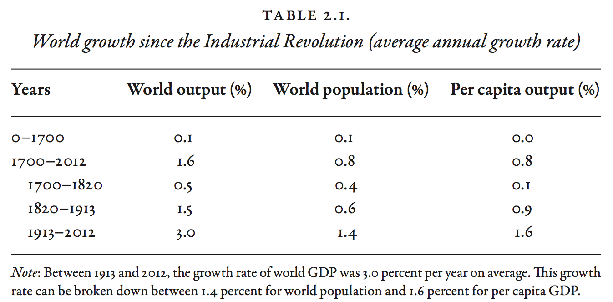
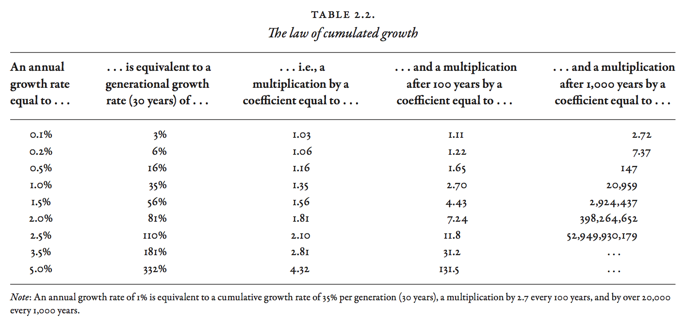
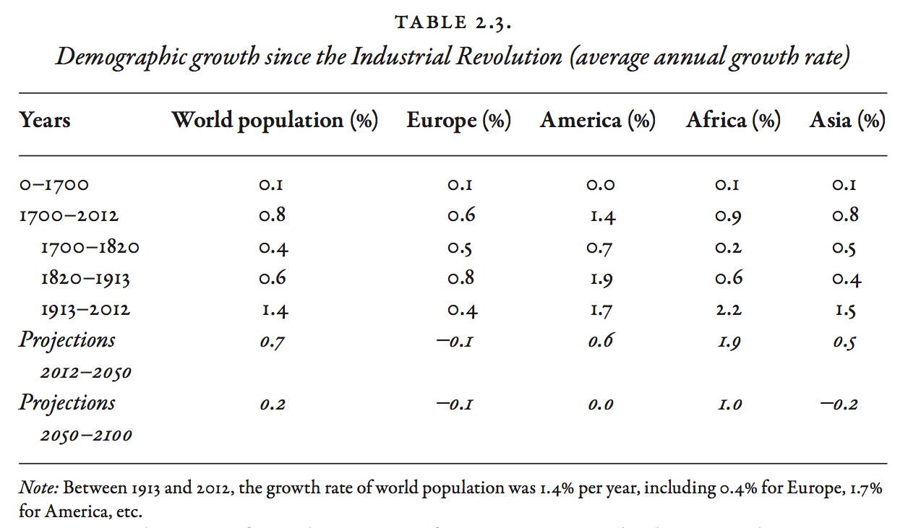
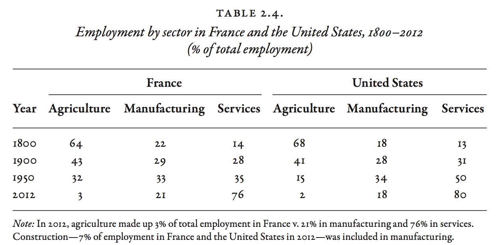

### Introduction  

- This set of slides surveys selected topics from *Capital in the Twenty-First Century*, a book written by economist Thomas Piketty, published in English in 2014 to great acclaim.
- All source files for this course are available for download by anyone without restrictions at https://github.com/ptoche/piketty
- The full course is expected to be completed by April 2015.
- Chapter 1 introduced the basic forces behind the evolution of income and wealth over the long term.
- Chapter 2 reviews the main stages of income and output growth since the Industrial Revolution.  

---

### World Growth

- The 21st century may see a return to low rates of economic growth.  
- Economic growth has always been relatively slow except in exceptional periods of catch-up or technological innovation. 
- It is useful to decompose economic growth: 
- **growth $=$ population growth $+$ per capita output growth**
- While population growth has declined dramatically, it is still an important engine of growth for the world as a whole. 
- In 2013–2014, world economic growth is about 3.5%, thanks to catch-up growth in emerging countries and world population growth of about 1%. World output per capita grew at about 2%.

---

<figure class = "centered">  

</figure> 

---

### Growth over the Very Long Run

- Table 2.1 shows growth rates over a very long period of time. 
- `1`. Annual growth rates during the growth 'takeoff' were modest. 
- `2`. The demographic and economic components of growth were similar. 
- Between 0 and 1700, world population growth was 0.06% per year and per capita output 0.02%. Population increased by a quarter between 0 and 1000; by a half between 1000 and 1500; by half again between 1500 and 1700, when population growth rate was 0.2%.
- Between 1700 and 2012, population growth was 0.8% per year and per capita output growth 0.8%, for a total output growth rate of 1.6%. 
- In 1700, world population was 600 million; in 2012, 7 billion. Over 300 years, population had increased 10-fold. If this pace continued for another 300 years, world population would exceed 70 billion in 2300!

---

<figure class = "centered">  

</figure> 

---

### The Law of Cumulative Growth

- Table 2.2 shows a correspondence between annual growth rate and long-term growth. A growth rate of 1% per year will multiply population by 1.35 after 30 years; by 3 after 100 years; by 20 after 300 years.
- The 'Law of Cumulative Growth' says that economic growth at small annual rates over long periods of time can result in large changes.
- Different choices of time frame lead to contradictory perceptions. After 1 year, 1% growth is imperceptible. Each year is virtually identical to the previous one. But over 1 generation (30 years), 1% growth results in an increase of output of one-third!
- An annual growth of 2.3% per year leads to a doubling in every generation!
- Piketty's central thesis is that a small gap between the return on capital and the rate of growth can have large effects on inequality in the long run. 

---

<figure class = "centered">  

</figure> 

---

### The Stages of Demographic Growth

- Table 2.3 illustrates the 'demographic transition.'
- Demographic growth accelerated after 1700, with average growth rates of 0.4% per year in the 18th century and 0.6% in the 19th. Europe and America experienced the most rapid demographic growth initially. 
- Population growth in Asia and Africa during the 20th century, at 1.5–2% per year, was similar to America in the 19th and 20th centuries. 
- U.S. population was less than 3 million in 1780; 100 million in 1910; more than 300 million in 2010 &mdash; a 100-fold increase in 2 centuries. 
- Population growth in the New World was largely due to immigration from other continents, especially Europe; in Asia and Africa, the cause is an excess of birth over mortality.

---

### The Demographic Transition

- We are emerging from this period of demographic acceleration. 
- Between 1970 and 1990, world population growth fell to 1.8%. Between 1990–2012, it fell further to 1.3%. 
- The UN forecasts a fall in the world population growth rate to 0.4% by the 2030s; 0.1% by the 2070s. 
- Population growth in the second half of the 21st century will be due entirely to Africa.
- The world will return to the low-growth regime of the years before 1700. 

---

### Demographic Stagnation

- The most spectacular reversal is Europe and America. 
- In 1780, the population of Western Europe was about 100 million; North America 3 million. In 2010, Western Europe was 410 million; North America 350 million! By 2050, Western Europe will be about 430 million; North America 450 million.
- Immigration and fertility rates explain the gap. 
- Immigration patterns are partly political, geographic, economic...
- Childbearing decisions are largely unpredictable, influenced by cultural, economic, psychological, and personal factors.

---

### The Demographic Transition

- There are spectacular demographic turnarounds within each continent. 
- France was the most populous country in Europe in the 18th century, but the demographic transition occurred early. The fall in the birth rate led to stagnation by the 19th century. More recently pro-natal policies caused a reversal: population in France may exceed Germany by 2050.
- The one-child policy in China, implemented in the 1970s, caused a major shift. Chinese population was 50% above India in 1970; it is similar today. 

---

### Demography and Inequality

- In a world in which each couple has 10 children, children cannot expect to inherit much wealth. Inherited wealth plays a small role in an individual's accumulation of wealth. 
- Likewise in a society attracting immigration from other countries, as was the case in America.
- Stagnant or decreasing population increases the importance of capital accumulated by previous generations. 
- Low economic growth structures hierarchies around inherited wealth.
- In a stagnant economy, jobs and social function are reproduced without much change from generation to generation. 
- In a growing economy, new skills and jobs appear with every generation. 

---

### Economic Growth & Purchasing Power

- In 1700, world per capita income was less than 70 euros per month, similar to income in the poorest countries of Sub-Saharan Africa today. In 2012, it was 760 euros per month.
- The growth of per capita output over the period 1700–2012 was 0.8% per year, implying a multiplication of output by 10 over 300 years. 
- Average growth of per capita output during 1700–2012 breaks down as follows: 0.1% in the 18th century, 0.9% in the 19th, and 1.6% in the 20th. 
- Average purchasing power barely increased at all from 1700 to 1820, then more than doubled between 1820 and 1913, and increased 6-fold between 1913 and 2010. 

---

### The Meaning of Economic Growth

- What does it mean for purchasing power to be multiplied by 10? 
- The concept of per capita output is more abstract than the concept of population. Economic growth involves changes in the organization of life and work, new types of goods and services, not just 'more stuff'. 
- Improvements in purchasing power over the long run involve a transformation of consumption, from basic needs to a diversified basket of manufactured products and services. 
- For instance, between 1900 and 2012, average working time decreased dramatically. This suggests an increased consumption of 'leisure services'.
- With the growth of services women became empowered. 
- With technological progress and innovation child labor was banished.

---

### The Diversity of Economic Growth

- Purchasing power has not increased 10-fold for all types of goods and services. Some prices have risen rapidly, others more slowly. In the short run, shifts in relative prices may be neglected. In the long run, relative price shifts alter the composition of consumption. 
- Many products experience dramatic improvements in quality. New goods and services are introduced. Consuming news is a completely different experience today, global, multimedia, quicker, omnipresent.
- Some services enjoyed no major innovation over centuries. A haircut takes just as long; its price has increased by as much as the barber's pay, at the same rate as the average wage rate. Purchasing power expressed in terms of haircuts has not changed over hundreds of years.

---

### Sectors and Sub-Sectors

- 3 types of goods and services. 
    - `1`. **Industrial products**: productivity growth has been more rapid in this sector and relative prices have fallen.
    - `2`. **Food & Beverages**: continuous increases in productivity have allowed a greater population to be fed by fewer workers. However, productivity growth has been less rapid in the agricultural sector than in the industrial sector. Food prices have increased at roughly the same rate as the price index. 
    - `3`. **Services**:  productivity growth has generally been low, employment share rising steadily, so that the price of services has increased more rapidly than the average of all prices.

---

<figure class = "centered">  

</figure> 

---

### Purchasing Power
    
- There is a great deal of diversity within each sector. 
- During 1900–2010, the price of 1 kg of carrots in France followed the price index. An average worker could afford about 10kg of carrots per day in 1900, and 60 kg in 2000. 
- For some food items like dairy products (milk, butter, eggs), major technological advances in processing, manufacturing, conservation led to a relative price decrease, and a 6-fold increase in purchasing power.
- Likewise for products that benefited from reductions in transport costs. 
- The purchasing power of bananas increased 20-fold; oranges 10-fold; computers, cell phones, tablets, 10-fold in a very short time (prices halved, performance rose 5-fold).
- The purchasing power of bread or meat rose only 4-fold.

---

### Growth of the Service Industry

- 70–80% of the workforce of rich countries is in the service sector.
    - `1`. services in health and education account for more than 20% of total employment.
    - `2`. retail (hotels, restaurants, leisure activities) account for 20%. 
    - `3`. services to firms (consulting, accounting, data), real estate and financial services (real estate agencies, banks, insurance, etc.), transportation, account for 20%. 
    - `4`. government and security services (administration, courts, police, armed forces) account for 10%.

---

### State Provision of Services

- Some services are financed by taxes and provided free of charge. 
- This complicates comparisons of standards of living in different countries. 
- At least half of health and education services are paid by taxes.
- Health and education account for more than 20% of output and employment in rich countries. 
- This subsector accounts for the most impressive improvement in standards of living over the past 200 years. 

---

### Accounting for State Provision

- In national accounts, public services are valued on the basis of production costs (wages paid to employees of hospitals, schools, public universities). 
- There is no measure of the quality of services.
- For example, if a private health insurance system costs more than a public system, but does not yield greater quality, the output of countries that rely on private insurance is artificially overvalued. A comparison of the United States with Europe suggests this has been the case.
- In national accounts, no remuneration is estimated for public capital. If health and education services were privatized, measured GDP would artificially increase even if services remained unchanged.

---

<figure class = "centered">  

</figure> 

---

###  The End of Growth?

- Will the rise in per capita output slow in the 21st century? Are we going to see the limits of technological growth? Is catch-up almost complete? Was the growth of the past environmentally unsustainable?
- Table 2.5 shows per capita output growth rates for each century and each continent separately. 
- In 1820–1913, it grew 1.0% in Europe; and 1.5% in America.
- In 1913–2012, it grew 1.9% in Europe; and 1.5% in America.
- No country at the world technological frontier with per capita output growth over 2% for a long period of time. 
- In 1990-2012, it grew 1.6% in Western Europe; 0.7% in North America; 1.4% in Japan; 1.6% for the wealthiest countries taken together.

---

### The Future of Growth

- Some economists suggest that per capita output growth in advanced countries will fall to 0.5% per year between 2050 and 2100.
- Robert Gordon suggests recent innovations have a lower growth potential.
- Future per capita output in the advanced countries may not exceed 1.5% per year. But predicting future innovations and fertility is very difficult!
- Low growth is not so bad over long periods. Growth of 1% per year yields 35% cumulated over 30 years; 1.5%  yields 50%. This still implies major changes in lifestyle and employment.
- In 1980, there was no Internet, no cell phone network, air travel was expensive, medical technologies were far less advanced than today, only a minority attended college. In the areas of communication, transportation, health, and education, the changes have been profound. 

---

### The Postwar Period and Beyond

- Europe fell behind the United States during 1914–1945, but rapidly caught up during 1945-1980. Both now stand at the technological frontier, growing slowly.
- Figure 2.3 shows per capita output growth in Europe and North America. 
- 1820–2012: growth was about the same at 2% per year. 
- 1930-1950: growth fell to about 1.5%, with Europe falling behind. 
- 1950-1970: growth rose to 2% in the US and 4% in Europe. Continental Europe (excluding the UK) grew at 5 percent. 
- 1990-2012: growth has now slowed to 1.5%.

---

### Blaming Government

- The 'conservative revolution' of Margaret Thatcher in the UK and Ronald Reagan in the US promised to 'roll back the welfare state.'
- Government generosity was perceived as a cause of the relative decline of the United Kingdom and the United States. Economist Milton Friedman was perceived as a proponent of that view.
- Milton Friedman: 'I am favor of cutting taxes under any circumstances and for any excuse, for any reason, whenever it's possible.'
- Margaret Thatcher: 'There is no such thing as society'.
- Conservatives see privatization, tax cuts, benefit cuts, as a reason for the growth revival of the 1990s. Others see it as a social disaster. 
- But the consensus among economists is that policies have had little or no impact on American or European economic growth. 

--- 

### Ronald Reagan

<figure class = "centered">  

<figcaption class = 'figcaption'>Ronald Reagan (1911-2004).
</figcaption>  
</figure> 

--- 

### Margaret Thatcher

<figure class = "centered">  

<figcaption class = 'figcaption'>Margaret Thatcher (1925-2013).
</figcaption>  
</figure> 

--- 

### Milton Friedman

<figure class = "centered">  

<figcaption class = 'figcaption'>Milton Friedman (1912-2006).
</figcaption>  
</figure> 

---

### Friederich Hayek

<figure class = "centered">  

<figcaption class = 'figcaption'>Friederich Hayek (1899-1992).
</figcaption>  
</figure> 

---

### The Time Profile of World Growth

- World growth rates depict a 'bell curve' with a very high 'hump'. 
- There are differences between the time profiles. Population growth started to rise earlier and has declined earlier. Per capita output growth stayed close to zero throughout the 18th century while population had started to grow. 
- The European catch-up in 1950-1970 and Asian catch-up in 1980-2015 are the main components of world growth since the second world war.

---

### Predicting Growth

- Figure 2.4 shows a 'median' growth prediction. It assumes Western Europe, North America, and Japan will grow at 1.2% over 2015-2100, while poor and emerging countries will grow at 5% per year over 2015-2030 and 4% over 2030-2050. 
- If the prediction is correct, per capita output in China, Eastern Europe, South America, North Africa, and the Middle East would match the wealthiest countries by 2050.
- The distribution of world output would approximate the distribution of world population.
- The median forecast is optimistic: it assumes productivity growth of 1% per year in the wealthy countries and continued convergence of emerging countries. 

---

### The Question of Inflation

- The growth rates are 'real' growth rates, obtained by adjusting 'nominal' growth rates for the effect of inflation of the price index. To a first approximation, 
- **real growth rate $=$ nominal growth rate $-$ inflation rate**
- If the nominal growth rate is 3% per year and prices rise by 2%, then the real growth rate is 1%.
- Changes in relative prices redistribute income and wealth across sectors.
- Inflation redistributes income and wealth across debtors and creditors.
- Inflation allowed wealthy countries to greatly reduce the value of their public debt after WWII. 
- Redistribution via inflation is chaotic and uncontrolled.

---

### The Great Monetary Stability

- Inflation is a 20th century phenomenon. Until WWI, inflation was close to zero. Prices sometimes rose or fell sharply for several years, but these price changes balanced out in the long run. 
- During 1700–1820 and 1820–1913, inflation was negligible in France, the United Kingdom, the United States, and Germany. 
- Late in 1789, the revolutionary government of France issued 'assignats', one of the first historical examples of paper money. This gave rise to high inflation until 1795. The return to metal coinage with the 'franc germinal' took place at the same parity as the 'livre tournois', the currency of the 'Ancien Régime' (4.5 grams of fine silver per franc or per livre).
- The assignats was a temporary disruption. The exchange rate between French and British currencies remained stable for 200 years.

---

### The Loss of Monetary Bearings

- Figure 2.6 shows inflation for 4 countries during 1700–2012. 
- Governments issued debt to pay for WWI (1914-1918). In 1914, the convertibility of currency to gold was suspended by the belligerents. 
- After the war, countries resorted to high inflation to reduce the real value of public debt, redistributing wealth on a grand scale.
- A return to the gold standard in the 1920s did not survive the crisis of the 1930s: the United Kingdom left in 1931, the United States in 1933, France in 1936. 
- The post–World War II gold standard established in 1946 ended in 1971.

---

### The Advent of Hard Money

- 1913-1950: inflation averaged 13% per year in France (prices were multiplied by 100); 17% in Germany (prices multiplied by more than 300); 3% in the UK and the US (prices multiplied by 3).
- 1950-1970: inflation between 2% and 6%.
- 1970–1990: inflation 10% in the UK; 8% in France.
- 1990–2012: inflation 2% (a little less in Germany and France, a little more in the UK and US)
- The most inflationary countries in 1913-1950, Germany and France, are now the least inflationary, now part of an anti-inflation monetary union.

<!---

### The growth of world population

<figure class = "captioned"> 
  
<figcaption class = 'figcaption'>Figure 2.1. World population rose from 600 million inhabitants in 1700 to 7 billion in 2012.
</figcaption>
</figure> 
<footer class = 'footnote'>Concept and data: Thomas Piketty. Chart created with ``ggplot2`` (author: Hadley Wickham)
</footer>  

-->

---

### The growth of world population

<iframe src = 'figures/Figure_2_1.html' alt = "Figure 2.1. The growth of world population, 1700-2012.">
</iframe><icaption class = 'icaption'>Figure 2.1. World population rose from 600 million inhabitants in 1700 to 7 billion in 2012.</icaption> 
<footer class = 'footnote'>Concept and data: Thomas Piketty. Chart created with ``rCharts`` (author: Ramnath Vaidyanathan)  
</footer>  

<!---

### The growth rate of world population

<figure class = "captioned">
  
<figcaption class = 'figcaption'>Figure 2.2. The growth rate of world population was above 1 percent per year from 1950 to 2012 and should return toward 0 percent by the end of the twenty-first century.</figcaption>  
</figure> 
<footer class = 'footnote'>Concept and data: Thomas Piketty. Chart created with ``ggplot2`` (author: Hadley Wickham)
</footer>  

-->

---

### The growth rate of world population

<iframe src = 'figures/Figure_2_2.html' alt = "Figure 2.2. The growth rate of world population from Antiquity to 2100.">
</iframe><icaption class = 'icaption'>Figure 2.2. The growth rate of world population was above 1 percent per year from 1950 to 2012 and should return toward 0 percent by the end of the twenty-first century.</icaption>
<footer class = 'footnote'>Concept and data: Thomas Piketty. Chart created with ``rCharts`` (author: Ramnath Vaidyanathan)  
</footer>  

<!---

### The growth rate of per capita output

<figure class = "captioned">  
  
<figcaption class = 'figcaption'>Figure 2.3. The growth rate of per capita output surpassed 4 percent per year in Europe between 1950 and 1970, before returning to American levels.</figcaption>  
</figure> 
<footer class = 'footnote'>Concept and data: Thomas Piketty. Chart created with ``ggplot2`` (author: Hadley Wickham)
</footer>  

-->

---

### The growth rate of per capita output

<iframe src = 'figures/Figure_2_3.html' alt = "Figure 2.3. Public wealth in the United Kingdom, 1700-2010.">
</iframe><icaption class = 'icaption'>Figure 2.3. The growth rate of per capita output surpassed 4 percent per year in Europe between 1950 and 1970, before returning to American levels.</icaption>
<footer class = 'footnote'>Concept and data: Thomas Piketty. Chart created with ``rCharts`` (author: Ramnath Vaidyanathan)  
</footer>  

<!---

### The growth rate of world per capita output

<figure class = "captioned">  
  
<figcaption class = 'figcaption'>Figure 2.4. The growth rate of per capita output surpassed 2 percent from 1950 to 2012. If the convergence process goes on, it will surpass 2.5 percent from 2012 to 2050, and then will drop below 1.5 percent.</figcaption>  
</figure> 
<footer class = 'footnote'>Concept and data: Thomas Piketty. Chart created with ``ggplot2`` (author: Hadley Wickham)
</footer>  

-->

---

### The growth rate of world per capita output

<iframe src = 'figures/Figure_2_4.html' alt = "Figure 2.4. The growth rate of world per capita output from Antiquity to 2100.">
</iframe><icaption class = 'icaption'>Figure 2.4. The growth rate of per capita output surpassed 2 percent from 1950 to 2012. If the convergence process goes on, it will surpass 2.5 percent from 2012 to 2050, and then will drop below 1.5 percent.</icaption>
<footer class = 'footnote'>Concept and data: Thomas Piketty. Chart created with ``rCharts`` (author: Ramnath Vaidyanathan)  
</footer>  

<!---

### The growth rate of world output

<figure class = "captioned">  
  
<figcaption class = 'figcaption'>Figure 2.5. The growth rate of world output surpassed 4 percent from 1950 to 1990. If the convergence process goes on, it will drop below 2 percent by 2050.</figcaption>  
</figure> 
<footer class = 'footnote'>Concept and data: Thomas Piketty. Chart created with ``ggplot2`` (author: Hadley Wickham)
</footer>  

-->

---

### The growth rate of world output

<iframe src = 'figures/Figure_2_5.html' alt = "Figure 2.5. The growth rate of world output from Antiquity to 2100.">
</iframe><icaption class = 'icaption'>Figure 2.5. The growth rate of world output surpassed 4 percent from 1950 to 1990. If the convergence process goes on, it will drop below 2 percent by 2050.</icaption>
<footer class = 'footnote'>Concept and data: Thomas Piketty. Chart created with ``rCharts`` (author: Ramnath Vaidyanathan)  
</footer>  

<!---

### Inflation since the Industrial Revolution

<figure class = "captioned">
  
<figcaption class = 'figcaption'>Figure 2.6. Inflation in the rich countries was zero in the eighteenth and nineteenth centuries, high in the twentieth century, and roughly 2 percent a year since 1990.</figcaption>  
</figure> 
<footer class = 'footnote'>Concept and data: Thomas Piketty. Chart created with ``ggplot2`` (author: Hadley Wickham)
</footer>  

-->

---

### Inflation since the Industrial Revolution

<iframe src = 'figures/Figure_2_6.html' alt = "Figure 2.6. Inflation since the Industrial Revolution.">
</iframe><icaption class = 'icaption'>Figure 2.6. Inflation in the rich countries was zero in the eighteenth and nineteenth centuries, high in the twentieth century, and roughly 2 percent a year since 1990.</icaption>
<footer class = 'footnote'>Concept and data: Thomas Piketty. Chart created with ``rCharts`` (author: Ramnath Vaidyanathan)  
</footer>  

