### Introduction  

- This set of slides surveys selected topics from *Capital in the Twenty-First Century*, a book written by economist Thomas Piketty, published in English in 2014 to great acclaim.
- All source files for this course are available for download by anyone without restrictions at https://github.com/ptoche/piketty
- The full course is expected to be completed by April 2015.
- Chapter 3 reviews the metamorphoses of capital in Britain and France since the eighteenth century.  
- Chapter 4 extends this review to Germany, the United States and Canada, and addresses the question of slavery.

---

### Germany

<figure class = "centered">  
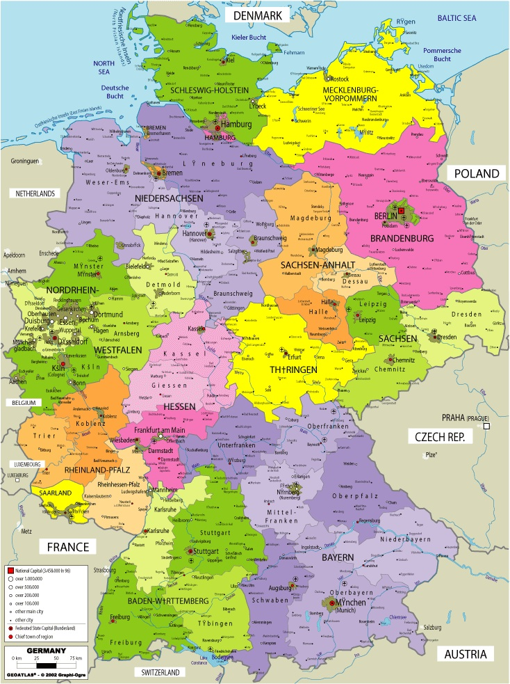
<figcaption class = 'figcaption'>Political Map of Germany Today.
</figcaption>  
</figure> 

---

### National Capital in Germany

- Figure 4.1 shows national capital by components. Historical data for Germany only goes back to 1870. 
- The overall evolution is similar to the United Kingdom and France: `1`. residential and commercial real estate, industrial and financial capital have replaced farmland; `2`. the capital/income ratio has recovered from the shocks of 1914–1945.
- In 1914, net foreign assets were 50% of national income in Germany, 100% in France, nearly 200% in the UK. Germany had no colonial empire. 
- In 2010, net foreign asset position are 50% of national income, most of which accumulated since 2000. The UK and France are close to zero. 

---

### Public Debt in Germany

- Figure 4.2 shows public debt and public assets in Germany.
- Public debt reached 100% of GDP in 1918–1920 and 150% in 1943–1944.
- Inflation averaged 17 percent between 1930 and 1950 (prices were multiplied by 300), greatly reducing the real value of the public debt. 
- The hyperinflation of the 1920s damaged the economy and destabilized society. Germany today is the most inflation-averse country.

---

### German Hyperinflation

<figure class = "centered">  

<figcaption class = 'figcaption'>German Hyperinflation of 1921-1923.
</figcaption>  
</figure> 

---

### Public Assets in Germany

- During 1950–1980, the state took large positions in the banking and industrial sectors. The state owned about 30% of national capital. 
- During 1980-2000, the trend was reversed. Today substantial holdings remain. 
- The state of Lower Saxony owns more than 15% of Volkswagen.
- Net public wealth is zero in 2010. Similar case as France.

---

### Private Capital in Germany

- Figure 4.3 shows private and public capital.
- Private capital was exceptionally low in 1950 but exceeds 400% of national income today. This is noticeably lower than the UK, France, and even Italy and Spain.
- German saving being high, there is an apparent paradox, explained by:
- `1`. low real estate prices compared to other European countries; `2`. low stock market valuation of German firms. 
- Lower prices can be explained by `1`. German unification in 1990; `2`. greater reliance on bank finance instead of the stock market; `3`. stagnation after 2000 while the UK, France and the periphery euro-zone countries (Spain, Ireland, Greece) were booming.

---

### Private Capital in Germany

- `2`. Stock market valuation of German firms:
- If the book value rather than the stock market value is used to estimate private wealth, German private wealth accounts for 600% of national income, the same as the UK and France.
- The book value is obtained by subtracting a firm's debt from the cumulative value of its investments. 
- The German 'stakeholder' model implies a lower market valuation but not a lower social valuation. 

---

### Shocks to Capital in the 20th Century

- Figures 4.4 and 4.5 show private, public, and national capital for 3 countries. The changes observed in the United Kingdom, France, and Germany (2/3 of national income of Western Europe and half of Europe) are typical. 
- The capital/income ratio in Italy, Spain, Belgium, the Netherlands, and Austria has inreased since 1970 more sharply than the UK and France. 
- The fall in the capital/income ratio during 1914-1945 is explained partly by the physical destruction of capital (buildings, factories, infrastructure) during the 2 world wars. Capital worth about 150% of national income was destroyed in Germany, 100% in France, 10% in the UK.

---

### Shocks to Capital in the 20th Century

- During 1913-1950, capital fell by 400% of national income. 
- The collapse of foreign portfolios and the very low savings rate explain 3/4 of the decline. The UK losses on international portfolio were greater than French or German losses.
- The decline of foreign capital was caused by expropriations due to revolution and decolonization (default on Russian debt in 1917, the nationalization of the Suez Canal in 1956), bankruptcies during the great depression, and very low savings rate.  
- The economic shocks were more destructive to capital than the physical destruction of the wars. 

---

### Shocks to Capital in the 20th Century

- Large public deficits absorbed private saving. 
- Price effects (low real estate and stock prices) account for 1/4 to 1/3 of the fall between 1913 and 1950, while Volume effects (low national savings rate, loss of foreign assets, destructions) account for 2/3 to 3/4.
- Real estate prices were low, owing to rent control policies dating to decades of high inflation.
- Price effects (high real estate and stock prices) explain a large part of the rise since the 1970s. 

---

<figure class = "centered">  

<figcaption class = 'figcaption'>Alexis de Tocqueville (1805-1859), author of "Democracy in America", portrait by Théodore Chassériau, 1850. In 1840, Tocqueville noted of the United States, "the number of large fortunes is quite small, and capital is still scarce."
</figcaption>  
</figure> 

---

### Capital in America

- Figure 4.6 shows US national capital and its components.
- America was the New World. On independence day, national capital was 300% of national income, including about 150% for farmland.
- The capital/income ratio was much lower than in the UK or France, where it was about 700%, including about 400% of farmland.
- There was so much land that its market value was very low. Accumulated wealth had less importance in the New World.
- The gap with old Europe shrunk by half in one century.
- The capital/income ratio remained stable at 400% to 500% of national income during 1910-2010, while it dropped in Europe. 

---

### Public Wealth in the United States

- Figure 4.7 and 4.8 show public wealth, public debt, private wealth.
- After World War II, real estate and stock prices stood at historic lows. 
- Inflation and growth reduced public debt to a modest level in the 1950s and 1960s.
- Private wealth fell from 500% of national income in 1930 to 300% in 1970.
- The capital/income ratio has been more stable than in Europe.

---

### Foreign Capital in the United States

- Foreign capital has always been limited &mdash; less than -10% between 1770 and 1920. The US never became a colonial power.
- In 1914, capital was 500% of national income, including net foreign assets of only 10%. Thus, 98% domestically-owned and 2% foreign-owned.
- Europeans held less than 5% of their foreign asset portfolios in the US.
- After 1914, the US financed the European wars and became a creditor, with net foreign assets at 10% of national income. US investments in Europe remained small compared to the investments of the European colonial powers around the globe a few decades earlier. 
- After the 1980s, persistent trade deficits resulted in negative net foreign assets. As US foreign investments earned a greater yield than foreign-held debt, the deficits were contained. Domestic capital is 450%, net foreign assets 20%, net national wealth 430%, less than 5% owned by foreigners.

---

### Canada

<figure class = "centered">  

<figcaption class = 'figcaption'>Political Map of Canada Today.
</figcaption>  
</figure> 

---

### Foreign Capital in Canada

- Figure 4.9 shows capital and its components.
- In 1910, domestic capital was 530% of national income, including net foreign assets of 120%, so net national wealth was 410%. a large share of domestic capital was owned by foreign investors, mainly British, especially in the natural resources sector (copper, zinc, and aluminum mines as well as hydrocarbons).
- Today domestic capital is 410% of national income, including net foreign assets of 10%, making 98% of capital owned by Canadians and less than 2% by foreign investors. As Europeans sold their foreign assets, foreign ownership fell. 
- Political factors explain the different history of the United States and Canada. Canada became independent in a series of peaceful steps in 1867, 1919, 1931, 1948 (de facto independence after that date), and 1982. 

---

### Cotton Fields

<figure class = "centered">  

<figcaption class = 'figcaption'>American slaves in a cotton field.
</figcaption>  
</figure> 

---

### Slavery

- 1542: Spain attempts to abolish slavery in its colonies, more success in 1811. 1590: Japan abolishes slavery. 1723: Russia, but it retains serfdom. 1761: Portugal. 1794: France, but Napoleon restores it in the colonies in 1802. 1807: British Empire. 1818: various Treaties abolish slavery across Europe. 1819: Canada. 1820: Mexico. 1827: New York State. 1830: Texas (Mexico). 1865: US. 
- George Washington, first president of the United States (1789-1797) did not legislate against slavery, but freed his slaves in his final will (1799). 
- Thomas Jefferson, third president, banned importation of new slaves after 1808. He owned hundreds of them until his death.
- Abraham Lincoln, 16th president, led the country into a civil war  over abolition against a Southern coalition of secessionist states (1861-1865).

---

### The American Civil War

<figure class = "centered">  

<figcaption class = 'figcaption'>Battle of Spottsylvania, 1864, by Thure de Thulstrup. More than 600,000 men lost their lives in the American civil war, more than the two world wars combined. 
</figcaption>  
</figure> 

---

### The American Civil War

<figure class = "centered">  

<figcaption class = 'figcaption'>Map of the American Civil War, 1861-1865, with confederate states in green and the union and territories in pale colors. 
</figcaption>  
</figure> 

---

### Slavery in the US

- The slave economy was growing rapidly when the Civil War broke out in 1861, leading to the abolition of slavery in 1865.
- The number of slaves rose from 400,000 in 1770 to 1 million in 1800, to 4 million in 1860. In 1800, the US had 1 million slaves, with total population 5 million. In the South, slaves were 40% of a population of 2.5 million.
- By 1860, the proportion of slaves in the overall population was 15% (about 4 million slaves, for a population of 30 million), owing to rapid population growth in the North and West. In the South, the proportion was still 40%, for a population of 10 million.
- The North was a relatively egalitarian society. In the South, one half of the population owned the other half. Southern blacks were deprived of civil rights until the 1960s. 

---

### Civil Rights 

<figure class = "centered">  

<figcaption class = 'figcaption'>Ida Bell Wells (1862-1931) in 1893. Born a slave, she was a journalist, newspaper editor, suffragist, sociologist, a leader of the civil rights movement.
</figcaption>  
</figure> 

---

### Civil Rights 

<figure class = "centered">  

<figcaption class = 'figcaption'>In 1955, Rosa Parks (1913-2005) refused to give her bus seat in the 'colored' section to a white passenger. Her act symbolized the civil rights movement.
</figcaption>  
</figure> 

---

### Slavery in the US

- Figures 4.10 and 4.11 shows capital and its components, including slaves.
- In 1800, the total market value of slaves was 150% of US national income, about the same value as farmland. Total US wealth, including slaves, remained stable at 450%. 
- In the South, slaves were nearly 300% of national income, with farmland over 100%. Southern slave owners had more wealth than the European landlords, with much of it from owning the laborers.
- The total value of southern capital exceeded 600% of southern income, similar to the British and French empires. 
- In the North, slaves were few, total wealth was 300% of northern income, half as much as in the South.

--- 

### Slave Capital and Human Capital

- In economies where slaves represent a large share of the population, their market value can be very high. Imagine a society where all workers are slaves. Suppose labor income is 60% of national income, capital income 40%, and the return on non-human capital is 5% a year.
- From the first fundamental law of capitalism, the value of national capital (excluding slaves) is 800% of national income:
$$
\beta = \alpha / r = 0.4 / 0.05 = 8
$$
- We can apply an analogous law to slave capital: 
$$
(1-\alpha) / r = 0.6 / 0.05 = 12
$$
The market value of slaves is equal to 1,200% of national income.
- Adding the value of slaves to the value of capital yields 2,000%.

--- 

### Slave Capital and Human Capital

- In the US during 1770–1810, slave capital was 150% of national income (not 1,200%) &mdash; the proportion of slaves in the population was 20% (not 100%); the average productivity of slaves was below free labor; and the rate of return on slave capital was generally closer to 7 or 8 percent, or even higher, than it was to 5 percent, leading to a lower capitalization.
- In 1860, the average price of a male slave of prime working age was roughly \\$2,000, while the average wage of a free farm laborer was \\$200 &mdash; a slave accounting for 10 to 12 years of a free worker's wages. 

<!---

### Capital in Germany

<figure class = "captioned">
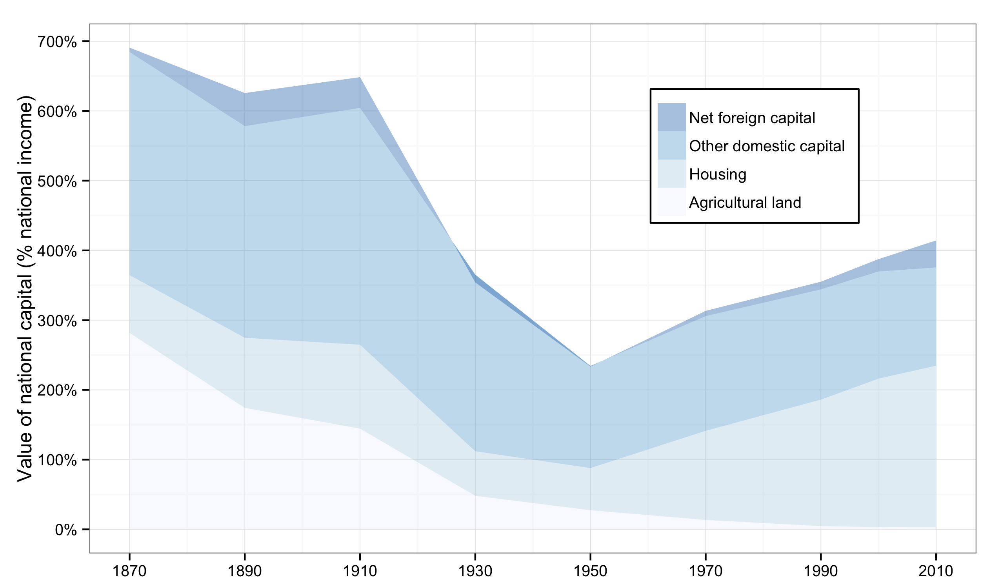  
<figcaption class = 'figcaption'>Figure 4.1. National capital is worth 6.5 years of national income in Germany in 1910 (including about 0.5 year invested abroad).</figcaption>  
</figure> 
<footer class = 'footnote'>
Concept and data: Thomas Piketty. Chart created with ``ggplot2`` (author: Hadley Wickham)
</footer>  

-->

---

### Capital in Germany

```{r 'Figure_4_1_rCharts',  message = FALSE, warning = FALSE, error = FALSE, echo = FALSE, tidy = FALSE, cache = FALSE}  
require(rCharts)
load("../../data/df_4_1.Rda") 
# To do: dynamic range selection
# round data for rChart tooltip display
df_4_1$value <- round(df_4_1$value, 3)
n <- nPlot(data = df_4_1, value ~ Year, group = 'variable', color = 'variable', shape = 'variable', type = 'stackedAreaChart') 
n$chart(xDomain = c(1870, 2010), clipEdge = TRUE)
n$chart(yDomain = c(0, 8))  # use yDomain instead of forceY
n$yAxis(axisLabel = 'Value of national capital (% national income)')
n$chart(margin = list(left = 80)) 
n$yAxis(tickFormat = "#! function(d) {return Math.round(d*100*100)/100 + '%'} !#")
n$xAxis(axisLabel = NULL)
n$chart(style = 'stack')
n$chart(showControls = FALSE)
n$chart(useInteractiveGuideline = TRUE)
n$chart(color = c('#EFF3FF', '#BDD7E7', '#6BAED6', '#2171B5'))  # To do: automate color selection
n$addParams(height = 450, width = 900)
n$save('figures/Figure_4_1.html', standalone = TRUE)
``` 
<iframe src = 'figures/Figure_4_1.html' alt = "Figure 4.1. Capital in Germany, 1870-2010.">
</iframe><icaption class = 'icaption'>Figure 4.1. National capital is worth 6.5 years of national income in Germany in 1910 (including about 0.5 year invested abroad).</icaption> 
<footer class = 'footnote'>Concept and data: Thomas Piketty. Chart created with ``rCharts`` (author: Ramnath Vaidyanathan)  
</footer>  

<!---

### Public wealth in Germany

<figure class = "captioned">
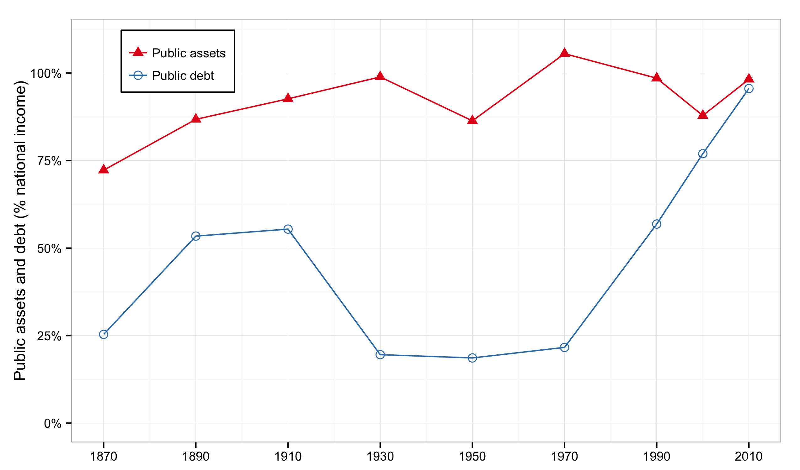  
<figcaption class = 'figcaption'>Figure 4.2. Public debt is worth almost one year of national income in Germany in 2010 (as much as assets).</figcaption>  
</figure> 
<footer class = 'footnote'>Concept and data: Thomas Piketty. Chart created with ``ggplot2`` (author: Hadley Wickham)
</footer>  

-->

---

### Public wealth in Germany

```{r 'Figure_4_2_rCharts',  message = FALSE, warning = FALSE, error = FALSE, echo = FALSE, tidy = FALSE, cache = FALSE}  
require(rCharts)
load("../../data/df_4_2.Rda") 
# round data for rChart tooltip display
df_4_2$value <- round(df_4_2$value, 3)
n <- nPlot(data = df_4_2, value ~ Year, group = 'variable', color = 'variable', shape = 'variable', type = 'lineChart') 
n$chart(forceY = c(.1, 1.1))
n$yAxis(axisLabel = 'Public assets and debt (% national income)')
n$chart(margin = list(left = 80)) 
n$yAxis(tickFormat = "#! function(d) {return Math.round(d*100*100)/100 + '%'} !#")
n$xAxis(axisLabel = NULL)
n$xAxis(showMaxMin = FALSE)  # MaxMin interefere with spacing
n$xAxis(tickValues = "#! function (x) {    
    tickvalues = [1870, 1880, 1890, 1900, 1910, 1920, 1930, 1940, 1950, 1960, 1970, 1980, 1990, 2000, 2010];
    return tickvalues;
} !#")
n$chart(useInteractiveGuideline = TRUE)
n$chart(color = colorPalette)
n$addParams(height = 450, width = 900)
n$setTemplate(afterScript = '<style>
  .nv-point {
    stroke-opacity: 1!important;
    stroke-width: 5px!important;
    fill-opacity: 1!important;
  } 
</style>')
n$save('figures/Figure_4_2.html', standalone = TRUE)
```
<iframe src = 'figures/Figure_4_2.html' alt = "Figure 4.2. Public wealth in Germany, 1870-2010.">
</iframe><icaption class = 'icaption'>Figure 4.2. Public debt is worth almost one year of national income in Germany in 2010 (as much as assets).</icaption>
<footer class = 'footnote'>Concept and data: Thomas Piketty. Chart created with ``rCharts`` (author: Ramnath Vaidyanathan)  
</footer>  

<!---

### Private and public capital in Germany

<figure class = "captioned">
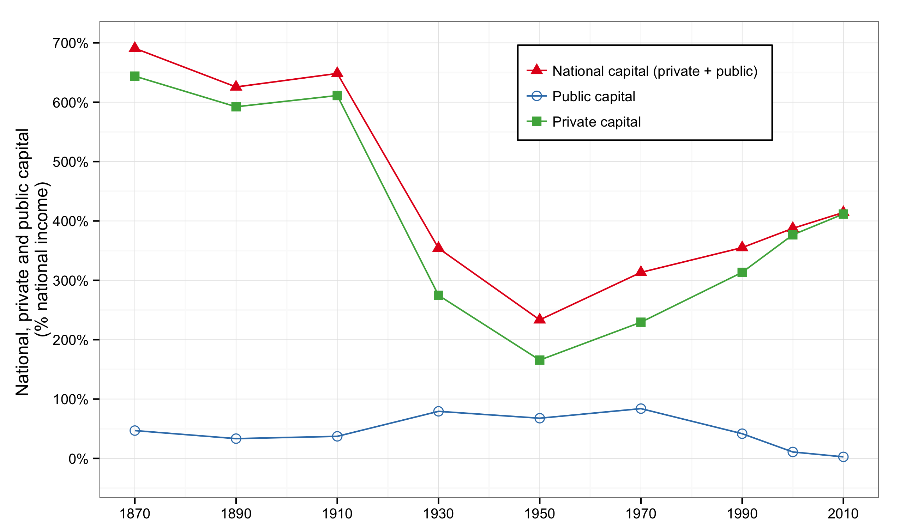  
<figcaption class = 'figcaption'>Figure 4.3. In 1970, public capital is worth almost one year of national income, versus slightly more than two for private capital.</figcaption>  
</figure> 
<footer class = 'footnote'>Concept and data: Thomas Piketty. Chart created with ``ggplot2`` (author: Hadley Wickham)
</footer>  

-->

---

### Private and public capital in Germany

```{r 'Figure_4_3_rCharts',  message = FALSE, warning = FALSE, error = FALSE, echo = FALSE, tidy = FALSE, cache = FALSE}  
require(rCharts)
load("../../data/df_4_3.Rda") 
# round data for rChart tooltip display
df_4_3$value <- round(df_4_3$value, 3)
n <- nPlot(data = df_4_3, value ~ Year, group = 'variable', color = 'variable', shape = 'variable', type = 'lineChart') 
n$chart(forceY = c(0, 7))
n$yAxis(axisLabel = 'National, private and public capital (% national income)')
n$chart(margin = list(left = 80)) 
n$yAxis(tickFormat = "#! function(d) {return Math.round(d*100*100)/100 + '%'} !#")
n$xAxis(axisLabel = NULL)
n$xAxis(showMaxMin = FALSE)  # MaxMin interefere with spacing
n$xAxis(tickValues = "#! function (x) {    
    tickvalues = [1870, 1880, 1890, 1900, 1910, 1920, 1930, 1940, 1950, 1960, 1970, 1980, 1990, 2000, 2010];
    return tickvalues;
} !#")
n$chart(useInteractiveGuideline = TRUE)
n$chart(color = colorPalette)
n$addParams(height = 450, width = 900)
n$setTemplate(afterScript = '<style>
  .nv-point {
    stroke-opacity: 1!important;
    stroke-width: 5px!important;
    fill-opacity: 1!important;
  } 
</style>')
n$save('figures/Figure_4_3.html', standalone = TRUE)
```
<iframe src = 'figures/Figure_4_3.html' alt = "Figure 4.3. Private and public capital in Germany, 1870-2010.">
</iframe><icaption class = 'icaption'>Figure 4.3. In 1970, public capital is worth almost one year of national income, versus slightly more than two for private capital.</icaption>
<footer class = 'footnote'>Concept and data: Thomas Piketty. Chart created with ``rCharts`` (author: Ramnath Vaidyanathan)  
</footer>  

---

### Private and public capital in Europe

<figure class = "captioned">
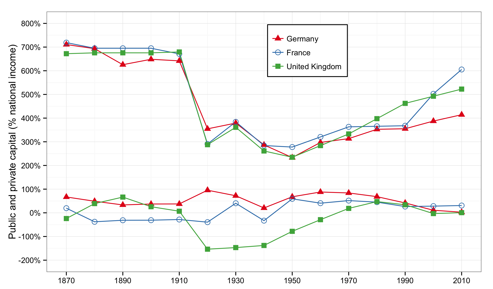  
<figcaption class = 'figcaption'>Figure 4.4. The fluctuations of national capital in Europe in the long run are mostly due to the fluctuations of private capital.</figcaption>  
</figure> 
<footer class = 'footnote'>Concept and data: Thomas Piketty. Chart created with ``ggplot2`` (author: Hadley Wickham)
</footer>  

<!---

### Private and public capital in Europe
```{r 'Figure_4_4_rCharts',  message = FALSE, warning = FALSE, error = FALSE, echo = FALSE, tidy = FALSE, cache = FALSE}  
require(rCharts)
load("../../data/df_4_4.Rda") 
# round data for rChart tooltip display
df_4_4$value <- round(df_4_4$value, 3)
group <- interaction(df_4_4$variable,df_4_4$Category)
n <- nPlot(data = df_4_4, value ~ Year, group = 'variable', type = 'lineChart') 
n$chart(forceY = c(-2, 8))
n$yAxis(axisLabel = 'Public and private capital (% national income)')
n$chart(margin = list(left = 80))
n$yAxis(tickFormat = "#! function(y) {return Math.round(y*100*100)/100 + '%'} !#")
n$xAxis(axisLabel = NULL)
n$xAxis(showMaxMin = FALSE)  # MaxMin interefere with spacing
n$xAxis(tickValues = "#! function (x) {    
    tickvalues = [1870, 1880, 1890, 1900, 1910, 1920, 1930, 1940, 1950, 1960, 1970, 1980, 1990, 2000, 2010];
    return tickvalues;
} !#")
n$chart(useInteractiveGuideline = TRUE)
n$chart(color = colorPalette)
n$addParams(height = 450, width = 900)
n$setTemplate(afterScript = afterScript1)  # common chart styles
n$save('figures/Figure_4_4.html', standalone = TRUE)
```
<iframe src = 'figures/Figure_4_4.html' alt = "Figure 4.4. Private and public capital in Europe, 1870-2010.">
</iframe><icaption class = 'icaption'>Figure 4.4. The fluctuations of national capital in Europe in the long run are mostly due to the fluctuations of private capital.</icaption>
<footer class = 'footnote'>Concept and data: Thomas Piketty. Chart created with ``rCharts`` (author: Ramnath Vaidyanathan)  
</footer>  

-->

<!---

### National capital in Europe

<figure class = "captioned">
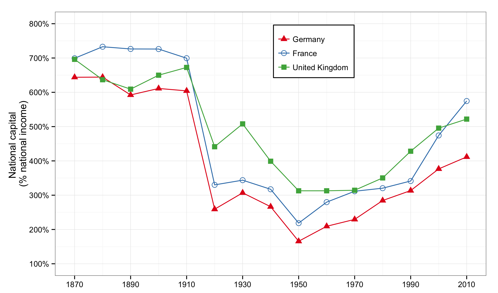  
<figcaption class = 'figcaption'>Figure 4.5. National capital (sum of public and private capital) is worth between two and three years of national income in Europe in 1950.</figcaption>  
</figure> 
<footer class = 'footnote'>Concept and data: Thomas Piketty. Chart created with ``ggplot2`` (author: Hadley Wickham)
</footer>  

-->

---

### National capital in Europe

```{r 'Figure_4_5_rCharts',  message = FALSE, warning = FALSE, error = FALSE, echo = FALSE, tidy = FALSE, cache = FALSE}  
require(rCharts)
load("../../data/df_4_5.Rda") 
# round data for rChart tooltip display
df_4_5$value <- round(df_4_5$value, 3)
n <- nPlot(data = df_4_5, value ~ Year, group = 'variable', color = 'variable', shape = 'variable', type = 'lineChart') 
n$chart(forceY = c(1, 8))
n$yAxis(axisLabel = 'National capital (% national income)')
n$chart(margin = list(left = 80)) 
n$yAxis(tickFormat = "#! function(d) {return Math.round(d*100*100)/100 + '%'} !#")
n$xAxis(axisLabel = NULL)
n$xAxis(showMaxMin = FALSE)  # MaxMin interefere with spacing
n$xAxis(tickValues = "#! function (x) {    
    tickvalues = [1870, 1880, 1890, 1900, 1910, 1920, 1930, 1940, 1950, 1960, 1970, 1980, 1990, 2000, 2010];
    return tickvalues;
} !#")
n$chart(useInteractiveGuideline = TRUE)
n$chart(color = colorPalette)
n$addParams(height = 450, width = 900)
n$setTemplate(afterScript = '<style>
  .nv-point {
    stroke-opacity: 1!important;
    stroke-width: 5px!important;
    fill-opacity: 1!important;
  } 
</style>')
n$save('figures/Figure_4_5.html', standalone = TRUE)
```
<iframe src = 'figures/Figure_4_5.html' alt = "Figure 4.5. National capital in Europe, 1870-2010.">
</iframe><icaption class = 'icaption'>Figure 4.5. National capital (sum of public and private capital) is worth between two and three years of national income in Europe in 1950.</icaption>
<footer class = 'footnote'>Concept and data: Thomas Piketty. Chart created with ``rCharts`` (author: Ramnath Vaidyanathan)  
</footer>  

<!---

### Capital in the United States

<figure class = "captioned">
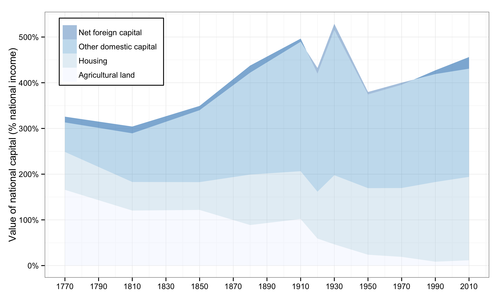  
<figcaption class = 'figcaption'>Figure 4.6. National capital is worth three years of national income in the United States in 1770 (including 1.5 years in agricultural land).</figcaption>  
</figure> 
<footer class = 'footnote'>Concept and data: Thomas Piketty. Chart created with ``ggplot2`` (author: Hadley Wickham)
</footer>  

-->

---

### Capital in the United States

```{r 'Figure_4_6_rCharts',  message = FALSE, warning = FALSE, error = FALSE, echo = FALSE, tidy = FALSE, cache = FALSE}  
require(rCharts)
load("../../data/df_4_6.Rda") 
# To do: dynamic range selection
# round data for rChart tooltip display
df_4_6$value <- round(df_4_6$value, 3)
n <- nPlot(data = df_4_6, value ~ Year, group = 'variable', color = 'variable', shape = 'variable', type = 'stackedAreaChart') 
n$chart(xDomain = c(1770, 2012), clipEdge = TRUE)
n$chart(yDomain = c(0, 8))  # use yDomain instead of forceY
n$yAxis(axisLabel = 'Value of national capital (% national income)')
n$chart(margin = list(left = 80)) 
n$yAxis(tickFormat = "#! function(d) {return Math.round(d*100*100)/100 + '%'} !#")
n$xAxis(axisLabel = NULL)
n$chart(style = 'stack')
n$chart(showControls = FALSE)
n$chart(useInteractiveGuideline = TRUE)
n$chart(color = c('#EFF3FF', '#BDD7E7', '#6BAED6', '#2171B5'))  # To do: automate color selection
n$addParams(height = 450, width = 900)
n$save('figures/Figure_4_6.html', standalone = TRUE)
```
<iframe src = 'figures/Figure_4_6.html' alt = "Figure 4.6. Capital in the United States, 1770-2010.">
</iframe><icaption class = 'icaption'>Figure 4.6. National capital is worth three years of national income in the United States in 1770 (including 1.5 years in agricultural land).</icaption>
<footer class = 'footnote'>Concept and data: Thomas Piketty. Chart created with ``rCharts`` (author: Ramnath Vaidyanathan)  
</footer>  

<!---

### Public wealth in the United States

<figure class = "captioned">
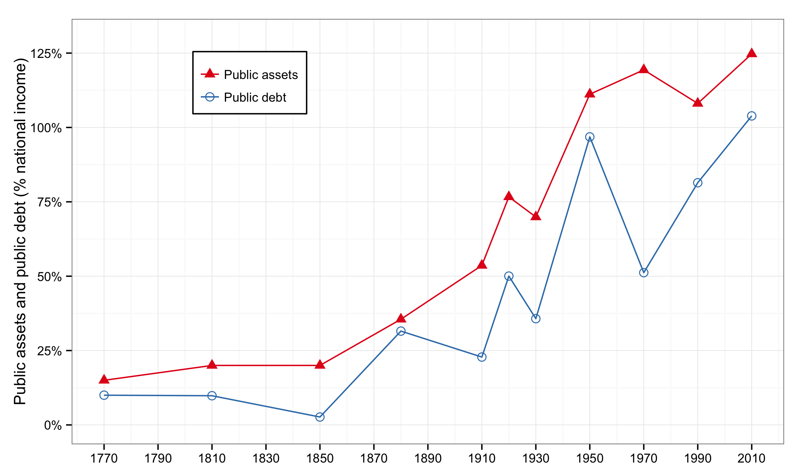  
<figcaption class = 'figcaption'>Figure 4.7. Public debt is worth one year of national income in the United States in 1950 (almost as much as assets).</figcaption>  
</figure> 
<footer class = 'footnote'>Concept and data: Thomas Piketty. Chart created with ``ggplot2`` (author: Hadley Wickham)
</footer>  

-->

---

### Public wealth in the United States

```{r 'Figure_4_7_rCharts',  message = FALSE, warning = FALSE, error = FALSE, echo = FALSE, tidy = FALSE, cache = FALSE}  
require(rCharts)
load("../../data/df_4_7.Rda") 
# round data for rChart tooltip display
df_4_7$value <- round(df_4_7$value, 3)
n <- nPlot(data = df_4_7, value ~ Year, group = 'variable', color = 'variable', shape = 'variable', type = 'lineChart') 
n$chart(forceY = c(0, 1.3))
n$yAxis(axisLabel = 'Public assets and public debt (% national income)')
n$chart(margin = list(left = 80)) 
n$yAxis(tickFormat = "#! function(d) {return Math.round(d*100*100)/100 + '%'} !#")
n$xAxis(axisLabel = NULL)
n$xAxis(showMaxMin = FALSE)  # MaxMin interefere with spacing
n$xAxis(tickValues = "#! function (x) {    
    tickvalues = [1780, 1800, 1820, 1840, 1860, 1880, 1900, 1920, 1940, 1960, 1980, 2000];
    return tickvalues;
} !#")
n$chart(useInteractiveGuideline = TRUE)
n$chart(color = colorPalette)
n$addParams(height = 450, width = 900)
n$setTemplate(afterScript = '<style>
  .nv-point {
    stroke-opacity: 1!important;
    stroke-width: 5px!important;
    fill-opacity: 1!important;
  } 
</style>')
n$save('figures/Figure_4_7.html', standalone = TRUE)
```
<iframe src = 'figures/Figure_4_7.html' alt = "Figure 4.7. Public wealth in the United States, 1770-2010.">
</iframe><icaption class = 'icaption'>Figure 4.7. Public debt is worth one year of national income in the United States in 1950 (almost as much as assets).</icaption>
<footer class = 'footnote'>Concept and data: Thomas Piketty. Chart created with ``rCharts`` (author: Ramnath Vaidyanathan)  
</footer>  

<!---

### Private and public capital in the United States

<figure class = "captioned">
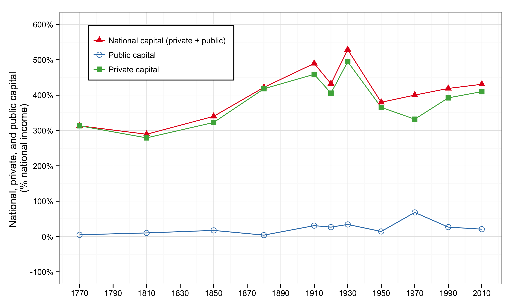  
<figcaption class = 'figcaption'>Figure 4.8. In 2010, public capital is worth 20 percent of national income, versus over 400 percent for private capital.</figcaption>  
</figure> 
<footer class = 'footnote'>Concept and data: Thomas Piketty. Chart created with ``ggplot2`` (author: Hadley Wickham)
</footer>  

-->

---

### Private and public capital in the United States

```{r 'Figure_4_8_rCharts',  message = FALSE, warning = FALSE, error = FALSE, echo = FALSE, tidy = FALSE, cache = FALSE}  
require(rCharts)
load("../../data/df_4_8.Rda") 
# round data for rChart tooltip display
df_4_8$value <- round(df_4_8$value, 3)
n <- nPlot(data = df_4_8, value ~ Year, group = 'variable', color = 'variable', shape = 'variable', type = 'lineChart') 
n$chart(forceY = c(0, 5.5))
n$yAxis(axisLabel = 'National, private, and public capital (% national income)')
n$chart(margin = list(left = 80)) 
n$yAxis(tickFormat = "#! function(d) {return Math.round(d*100*100)/100 + '%'} !#")
n$xAxis(axisLabel = NULL)
n$xAxis(showMaxMin = FALSE)  # MaxMin interefere with spacing
n$xAxis(tickValues = "#! function (x) {    
    tickvalues = [1780, 1800, 1820, 1840, 1860, 1880, 1900, 1920, 1940, 1960, 1980, 2000];
    return tickvalues;
} !#")
n$chart(useInteractiveGuideline = TRUE)
n$chart(color = colorPalette)
n$addParams(height = 450, width = 900)
n$setTemplate(afterScript = '<style>
  .nv-point {
    stroke-opacity: 1!important;
    stroke-width: 5px!important;
    fill-opacity: 1!important;
  } 
</style>')
n$save('figures/Figure_4_8.html', standalone = TRUE)
``` 
<iframe src = 'figures/Figure_4_8.html' alt = "Figure 4.8. Private and public capital in the United States, 1770-2010.">
</iframe><icaption class = 'icaption'>Figure 4.8. In 2010, public capital is worth 20 percent of national income, versus over 400 percent for private capital.</icaption> 
<footer class = 'footnote'>Concept and data: Thomas Piketty. Chart created with ``rCharts`` (author: Ramnath Vaidyanathan)  
</footer>  

<!---

### Capital in Canada

<figure class = "captioned">
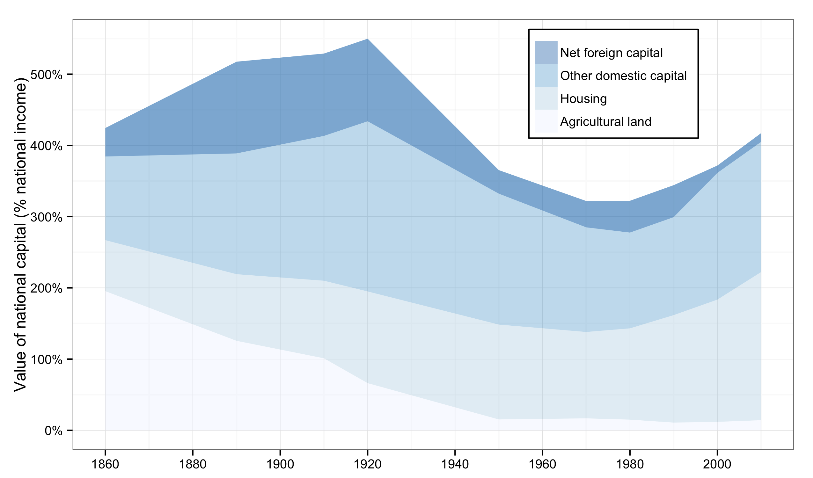  
<figcaption class = 'figcaption'>Figure 4.9. In Canada, a substantial part of domestic capital has always been held by the rest of the world, so that national capital has always been less than domestic capital.</figcaption>  
</figure> 
<footer class = 'footnote'>Concept and data: Thomas Piketty. Chart created with ``ggplot2`` (author: Hadley Wickham)
</footer>  

-->

---

### Capital in Canada

```{r 'Figure_4_9_rCharts',  message = FALSE, warning = FALSE, error = FALSE, echo = FALSE, tidy = FALSE, cache = FALSE}  
require(rCharts)
load("../../data/df_4_9.Rda") 
# To do: dynamic range selection
# round data for rChart tooltip display
df_4_9$value <- round(df_4_9$value, 3)
n <- nPlot(data = df_4_9, value ~ Year, group = 'variable', color = 'variable', shape = 'variable', type = 'stackedAreaChart') 
n$chart(xDomain = c(1860, 2010), clipEdge = TRUE)
n$chart(yDomain = c(0, 8))  # use yDomain instead of forceY
n$yAxis(axisLabel = 'Value of national capital (% national income)')
n$chart(margin = list(left = 80)) 
n$yAxis(tickFormat = "#! function(d) {return Math.round(d*100*100)/100 + '%'} !#")
n$xAxis(axisLabel = NULL)
n$chart(style = 'stack')
n$chart(showControls = FALSE)
n$chart(useInteractiveGuideline = TRUE)
n$chart(color = c('#EFF3FF', '#BDD7E7', '#6BAED6', '#2171B5'))  # To do: automate color selection
n$addParams(height = 450, width = 900)
n$save('figures/Figure_4_9.html', standalone = TRUE)
``` 
<iframe src = 'figures/Figure_4_9.html' alt = "Figure 4.9. Capital in Canada, 1860-2010.">
</iframe><icaption class = 'icaption'>Figure 4.9. In Canada, a substantial part of domestic capital has always been held by the rest of the world, so that national capital has always been less than domestic capital.</icaption> 
<footer class = 'footnote'>Concept and data: Thomas Piketty. Chart created with ``rCharts`` (author: Ramnath Vaidyanathan)  
</footer>  

<!---

### Capital and slavery in the United States

<figure class = "captioned">
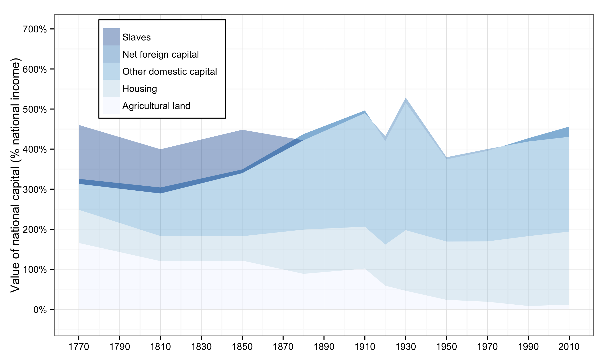  
<figcaption class = 'figcaption'>Figure 4.10. The market value of slaves was about 1.5 years of US national income around 1770 (as much as land).</figcaption>  
</figure> 
<footer class = 'footnote'>Concept and data: Thomas Piketty. Chart created with ``ggplot2`` (author: Hadley Wickham)
</footer>  

-->

---

### Capital and slavery in the United States

```{r 'Figure_4_10_rCharts',  message = FALSE, warning = FALSE, error = FALSE, echo = FALSE, tidy = FALSE, cache = FALSE}  
require(rCharts)
load("../../data/df_4_10.Rda") 
# To do: dynamic range selection
# round data for rChart tooltip display
df_4_10$value <- round(df_4_10$value, 3)
n <- nPlot(data = df_4_10, value ~ Year, group = 'variable', color = 'variable', shape = 'variable', type = 'stackedAreaChart') 
n$chart(xDomain = c(1770, 2010), clipEdge = TRUE)
n$chart(yDomain = c(0, 8))  # use yDomain instead of forceY
n$yAxis(axisLabel = 'Value of national capital (% national income)')
n$chart(margin = list(left = 80)) 
n$yAxis(tickFormat = "#! function(d) {return Math.round(d*100*100)/100 + '%'} !#")
n$xAxis(axisLabel = NULL)
n$chart(style = 'stack')
n$chart(showControls = FALSE)
n$chart(useInteractiveGuideline = TRUE)
n$chart(color = c('#EFF3FF', '#BDD7E7', '#6BAED6', '#3182BD', '#08519C'))  # To do: automate color selection
n$addParams(height = 450, width = 900)
n$save('figures/Figure_4_10.html', standalone = TRUE)
``` 
<iframe src = 'figures/Figure_4_10.html' alt = "Figure 4.10. Capital and slavery in the United States.">
</iframe><icaption class = 'icaption'>Figure 4.10. The market value of slaves was about 1.5 years of US national income around 1770 (as much as land).</icaption> 
<footer class = 'footnote'>Concept and data: Thomas Piketty. Chart created with ``rCharts`` (author: Ramnath Vaidyanathan)  
</footer>  

<!---

### Capital around 1770-1810: Old and New World.

<figure class = "captioned">
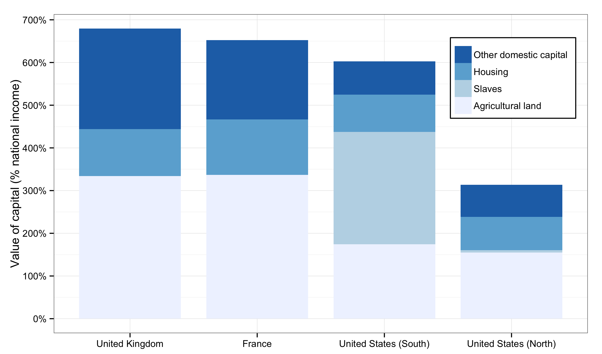  
<figcaption class = 'figcaption'>Figure 4.11. The combined value of agricultural land and slaves in the Southern United States surpassed four years of national income around 1770-1810.</figcaption>  
</figure> 
<footer class = 'footnote'>Concept and data: Thomas Piketty. Chart created with ``ggplot2`` (author: Hadley Wickham)
</footer>  

-->

---

### Capital around 1770-1810: Old and New World.

```{r 'Figure_4_11_rCharts',  message = FALSE, warning = FALSE, error = FALSE, echo = FALSE, tidy = FALSE, cache = FALSE}  
require(rCharts)
load("../../data/df_4_11.Rda") 
# round data for rChart tooltip display
df_4_11$value <- round(df_4_11$value, 3)
n <- nPlot(data = df_4_11, value ~ Country, group = 'variable', type = 'multiBarChart') 
n$yAxis(axisLabel = 'Value of capital (% national income)')
n$chart(margin = list(left = 80))
n$chart(color = colorPalette)
n$addParams(height = 450, width = 900)
n$save('figures/Figure_4_11.html', standalone = TRUE)
``` 
<iframe src = 'figures/Figure_4_11.html' alt = "Figure 4.11. Capital around 1770-1810: Old and New World.">
</iframe><icaption class = 'icaption'>Figure 4.11. The combined value of agricultural land and slaves in the Southern United States surpassed four years of national income around 1770-1810.</icaption> 
<footer class = 'footnote'>Concept and data: Thomas Piketty. Chart created with ``rCharts`` (author: Ramnath Vaidyanathan)  
</footer>  


