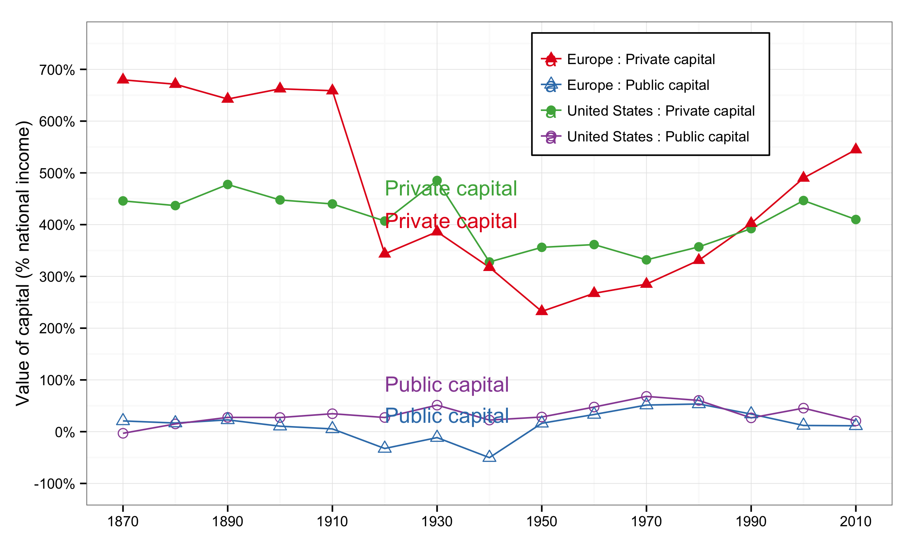
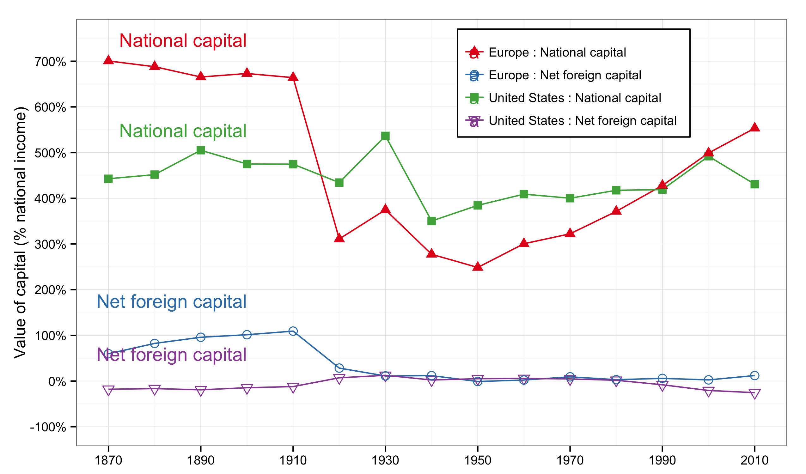
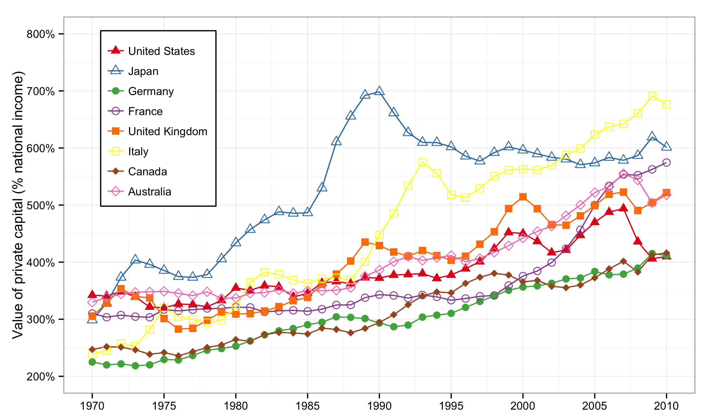
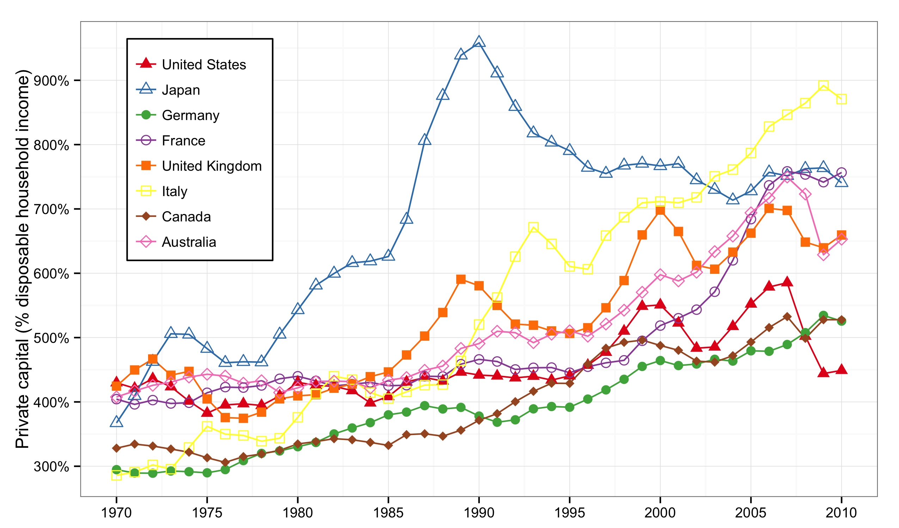
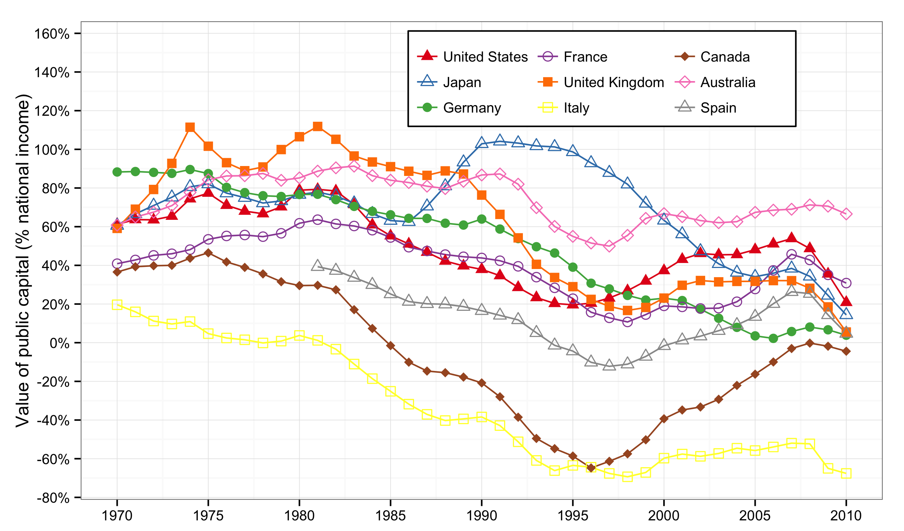
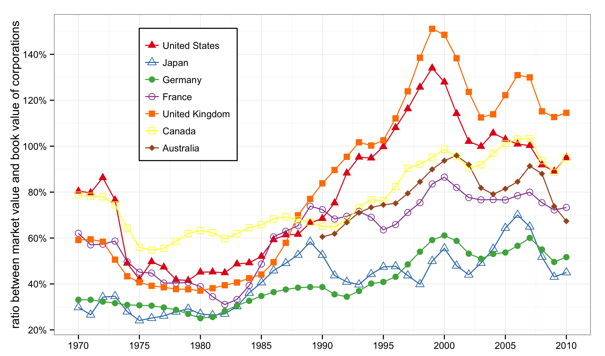
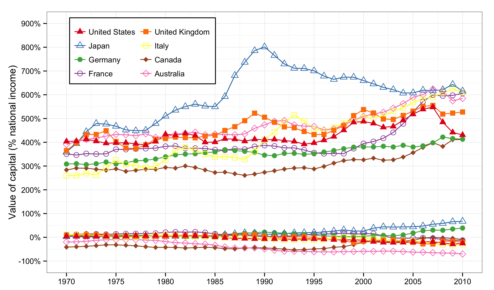
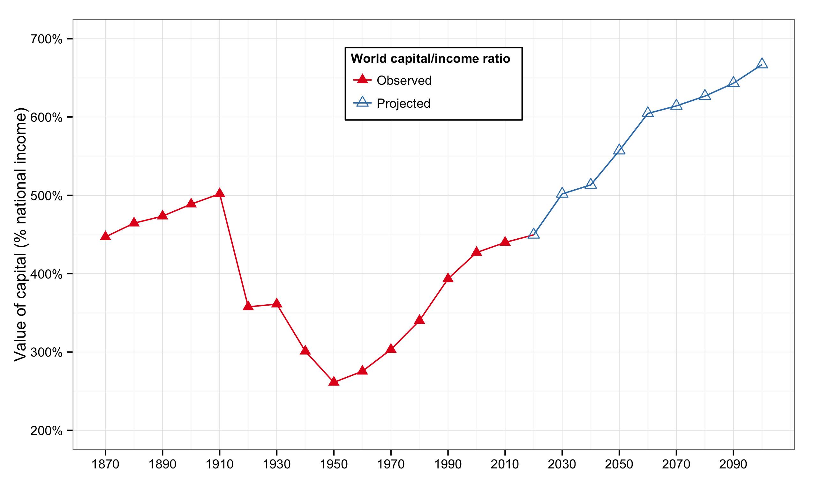

```{r 'preamble', message = FALSE, warning = FALSE, error = FALSE, echo = FALSE, tidy = FALSE, comment = NA, cache = FALSE}
require(knitr)
library(png)   # to display external png and control dimensions
library(grid)  # to display external png and control dimensions
opts_chunk$set(echo = FALSE, cache = FALSE)
source('../../shared/shared.R')
```

### Introduction  

- Chapter 4 analyzes 

- Chapter 5 analyzes the capital/income ratio.  

- The first fundamental law of capitalism:  
$$
\alpha = r \times \beta
$$
gives a correspondence between the capital/income ratio and the division of income between labor and capital.  

---

### Private & public capital in Europe & United States
<figure>
  
<figcaption class = 'figcaption'>Figure 5.1. The fluctuations of national capital in the long run correspond mostly to the fluctuations of private capital (both in Europe and in the United States).</figcaption>  
</figure>
<footer class = 'footnote'>
Concept and data: Thomas Piketty. Chart created with ``ggplot2`` (author: Hadley Wickham)
</footer>  

---

### Private & public capital in Europe & United States

```{r 'Figure_5_1_rCharts',  message = FALSE, warning = FALSE, error = FALSE, echo = FALSE, tidy = FALSE, cache = FALSE}  
require(rCharts)
load("../../data/df_5_1.Rda") 
# round data for rChart tooltip display
df_5_1$value <- round(df_5_1$value, 2)
n <- nPlot(data = df_5_1, value ~ Year, group = 'variable', color = 'variable', shape = 'variable', type = 'lineChart') 
n$chart(forceY = c(-1, 7))
n$yAxis(axisLabel = 'Value of capital (% national income)')
n$chart(margin = list(left = 100)) # margin makes room for label
n$yAxis(tickFormat = "#! function(d) {return Math.round(d*100*100)/100 + '%'} !#")
n$xAxis(axisLabel = 'Year')
n$chart(useInteractiveGuideline = TRUE)
n$chart(color = colorPalette)
n$addParams(height = 500, width = 800)
n$setTemplate(afterScript = '<style>
  .nv-point {
    stroke-opacity: 1!important;
    stroke-width: 5px!important;
    fill-opacity: 1!important;
  } 
</style>')
n$save('figures/Figure_5_1.html', standalone = TRUE)
```
<iframe src = "figures/Figure_5_1.html" alt = "Figure 5.1. Private & public capital in Europe & United States, 1870-2010.">
</iframe><icaption class = 'icaption'>Figure 5.1. The fluctuations of national capital in the long run correspond mostly to the fluctuations of private capital (both in Europe and in the United States).</icaption>
<footer class = 'footnote'>  
Concept and data: Thomas Piketty. Chart created with ``rCharts`` (author: Ramnath Vaidyanathan)  
</footer>  

---  

### National capital in Europe & United States

<figure>  
  
<figcaption class = 'figcaption'>Figure 5.2. National capital (public and private) is worth 6.5 years of national income in Europe in 1910, versus 4.5 years in the United States.</figcaption>  
</figure>
<footer class = 'footnote'>
Concept and data: Thomas Piketty. Chart created with ``ggplot2`` (author: Hadley Wickham)
</footer>  

---

### National capital in Europe & United States, 1870-2010.

```{r 'Figure_5_2_rCharts',  message = FALSE, warning = FALSE, error = FALSE, echo = FALSE, tidy = FALSE, cache = FALSE}  
require(rCharts)
load("../../data/df_5_2.Rda") 
# round data for rChart tooltip display
df_5_2$value <- round(df_5_2$value, 2)
n <- nPlot(data = df_5_2, value ~ Year, group = 'variable', color = 'variable', shape = 'variable', type = 'lineChart') 
n$chart(forceY = c(-1, 8))
n$yAxis(axisLabel = 'Value of capital (% national income)')
n$chart(margin = list(left = 100)) # margin makes room for label
n$yAxis(tickFormat = "#! function(d) {return Math.round(d*100*100)/100 + '%'} !#")
n$xAxis(axisLabel = 'Year')
n$chart(useInteractiveGuideline = TRUE)
n$chart(color = colorPalette)
n$addParams(height = 500, width = 800)
n$setTemplate(afterScript = '<style>
  .nv-point {
    stroke-opacity: 1!important;
    stroke-width: 5px!important;
    fill-opacity: 1!important;
  } 
</style>')
n$save('figures/Figure_5_2.html', standalone = TRUE)
```
<iframe src = 'figures/Figure_5_2.html' alt = "Figure 5.2. National capital in Europe & United States, 1870-2010.">
</iframe><icaption class = 'icaption'>Figure 5.2. National capital (public and private) is worth 6.5 years of national income in Europe in 1910, versus 4.5 years in the United States.</icaption>
<footer class = 'footnote'>  
Chart created with ``rCharts`` (author: Ramnath Vaidyanathan)  
</footer>  

---

### Private capital in rich countries

<figure>  
  
<figcaption class = 'figcaption'>Figure 5.3. Private capital is worth between 2 and 3.5 years of national income in rich countries in 1970, and between 4 and 7 years of national income in 2010.</figcaption>  
</figure> 
<footer class = 'footnote'>
Chart created with ``ggplot2`` (author: Hadley Wickham)
</footer>  

---

### Private capital in rich countries

```{r 'Figure_5_3_rCharts',  message = FALSE, warning = FALSE, error = FALSE, echo = FALSE, tidy = FALSE, cache = FALSE}  
require(rCharts)
load("../../data/df_5_3.Rda") 
# round data for rChart tooltip display
df_5_3$value <- round(df_5_3$value, 3)
n <- nPlot(data = df_5_3, value ~ Year, group = 'variable', color = 'variable', shape = 'variable', type = 'lineChart') 
n$chart(forceY = c(2, 7))
n$yAxis(axisLabel = 'Value of private capital (% national income)')
n$chart(margin = list(left = 100)) # margin makes room for label
n$yAxis(tickFormat = "#! function(d) {return Math.round(d*100*100)/100 + '%'} !#")
n$xAxis(axisLabel = 'Year')
n$chart(useInteractiveGuideline = TRUE)
n$chart(color = colorPalette)
n$addParams(height = 500, width = 800)
n$setTemplate(afterScript = '<style>
  .nv-point {
    stroke-opacity: 1!important;
    stroke-width: 5px!important;
    fill-opacity: 1!important;
  } 
</style>')
n$save('figures/Figure_5_3.html', standalone = TRUE)
```
<iframe src = 'figures/Figure_5_3.html' alt = "Figure 5.3. Private capital in rich countries, 1970-2010.">
</iframe><icaption class = 'icaption'>Figure 5.3. Private capital is worth between 2 and 3.5 years of national income in rich countries in 1970, and between 4 and 7 years of national income in 2010.</icaption>
<footer class = 'footnote'>  
Concept and data: Thomas Piketty. Chart created with ``rCharts`` (author: Ramnath Vaidyanathan)  
</footer>  

---

### Private capital measured in years of disposable income

<figure>  
  
<figcaption class = 'figcaption'>Figure 5.4. Expressed in years of household disposable income (about 70-80% of national income), the capital/income ratio appears to be larger than when it is expressed in years of national income.</figcaption>  
</figure> 
<footer class = 'footnote'>
Concept and data: Thomas Piketty. Chart created with ``ggplot2`` (author: Hadley Wickham)
</footer>  

---

### Private capital measured in years of disposable income

```{r 'Figure_5_4_rCharts',  message = FALSE, warning = FALSE, error = FALSE, echo = FALSE, tidy = FALSE, cache = FALSE}  
require(rCharts)
load("../../data/df_5_4.Rda") 
# round data for rChart tooltip display
df_5_4$value <- round(df_5_4$value, 3)
n <- nPlot(data = df_5_4, value ~ Year, group = 'variable', color = 'variable', shape = 'variable', type = 'lineChart') 
n$chart(forceY = c(2, 10))
n$yAxis(axisLabel = 'Private capital (% disposable household income)')
n$chart(margin = list(left = 100)) # margin makes room for label
n$yAxis(tickFormat = "#! function(d) {return Math.round(d*100*100)/100 + '%'} !#")
n$xAxis(axisLabel = 'Year')
n$chart(useInteractiveGuideline = TRUE)
n$chart(color = colorPalette)
n$addParams(height = 500, width = 800)
n$setTemplate(afterScript = '<style>
  .nv-point {
    stroke-opacity: 1!important;
    stroke-width: 5px!important;
    fill-opacity: 1!important;
  } 
</style>')
n$save('figures/Figure_5_4.html', standalone = TRUE)
```
<iframe src = 'figures/Figure_5_4.html' alt = "Figure 5.4. Private capital measured in years of disposable income, 1970-2010.">
</iframe><icaption class = 'icaption'>Figure 5.4. Expressed in years of household disposable income (about 70-80% of national income), the capital/income ratio appears to be larger than when it is expressed in years of national income.</icaption>
<footer class = 'footnote'>  
Concept and data: Thomas Piketty. Chart created with ``rCharts`` (author: Ramnath Vaidyanathan)  
</footer>  

---

### Public capital in rich countries

<figure>  
  
<figcaption class = 'figcaption'>Figure 5.5XS. In France, Britain, Germany, and the United States, government deficits exceeded public investment by 2-3% of national income on average over the period 1970-2010, compared with more than 6% in Italy.</figcaption>  
</figure> 
<footer class = 'footnote'>
Concept and data: Thomas Piketty. Chart created with ``ggplot2`` (author: Hadley Wickham)
</footer>  

---

### Public capital in rich countries

```{r 'Figure_5_5XS_rCharts',  message = FALSE, warning = FALSE, error = FALSE, echo = FALSE, tidy = FALSE, cache = FALSE}  
require(rCharts)
load("../../data/df_5_5XS.Rda") 
# round data for rChart tooltip display
df_5_5XS$value <- round(df_5_5XS$value, 3)
n <- nPlot(data = df_5_5XS, value ~ Year, group = 'variable', color = 'variable', shape = 'variable', type = 'lineChart') 
n$chart(forceY = c(-.8, 1.2))
n$yAxis(axisLabel = 'Value of public capital (% national income)')
n$chart(margin = list(left = 100)) # margin makes room for label
n$yAxis(tickFormat = "#! function(d) {return Math.round(d*100*100)/100 + '%'} !#")
n$xAxis(axisLabel = 'Year')
n$chart(useInteractiveGuideline = TRUE)
n$chart(color = colorPalette)
n$addParams(height = 500, width = 800)
n$setTemplate(afterScript = '<style>
  .nv-point {
    stroke-opacity: 1!important;
    stroke-width: 5px!important;
    fill-opacity: 1!important;
  } 
</style>')
n$save('figures/Figure_5_5XS.html', standalone = TRUE)
```
<iframe src = 'figures/Figure_5_5XS.html' alt = "Figure 5.5XS. Public capital in rich countries, 1970-2010.">
</iframe><icaption class = 'icaption'>Figure 5.5XS. In France, Britain, Germany, and the United States, government deficits exceeded public investment by 2-3% of national income on average over the period 1970-2010, compared with more than 6% in Italy.</icaption>
<footer class = 'footnote'>  
Concept and data: Thomas Piketty. Chart created with ``rCharts`` (author: Ramnath Vaidyanathan)  
</footer>  

---

### Private and public capital in rich countries

<figure>  
  
<figcaption class = 'figcaption'>Figure 5.5. In Italy, private capital rose from 240% to 680% in national income between 1970 and 2010, while public capital dropped from 20% to -70%.</figcaption>  
</figure> 
<footer class = 'footnote'>
Concept and data: Thomas Piketty. Chart created with ``ggplot2`` (author: Hadley Wickham)
</footer>  

---

### Private and public capital in rich countries

```{r 'Figure_5_5_rCharts',  message = FALSE, warning = FALSE, error = FALSE, echo = FALSE, tidy = FALSE, cache = FALSE}  
require(rCharts)
load("../../data/df_5_5.Rda") 
# round data for rChart tooltip display
df_5_5$value <- round(df_5_5$value, 2)
n <- nPlot(data = df_5_5, value ~ Year, group = 'variable', color = 'variable', shape = 'variable', type = 'lineChart') 
n$chart(forceY = c(-1, 8))
n$yAxis(axisLabel = 'Value of capital (% national income)')
n$chart(margin = list(left = 100)) # margin makes room for label
n$yAxis(tickFormat = "#! function(d) {return Math.round(d*100*100)/100 + '%'} !#")
n$xAxis(axisLabel = 'Year')
n$chart(useInteractiveGuideline = TRUE)
n$chart(color = colorPalette)
n$addParams(height = 500, width = 800)
n$setTemplate(afterScript = '<style>
  .nv-point {
    stroke-opacity: 1!important;
    stroke-width: 5px!important;
    fill-opacity: 1!important;
  } 
</style>')
n$save('figures/Figure_5_5.html', standalone = TRUE)
```
<iframe src = 'figures/Figure_5_5.html' alt = "Figure 5.5. Private and public capital in rich countries, 1970-2010.">
</iframe><icaption class = 'icaption'>Figure 5.5. In Italy, private capital rose from 240% to 680% in national income between 1970 and 2010, while public capital dropped from 20% to -70%.</icaption>
<footer class = 'footnote'>  
Concept and data: Thomas Piketty. Chart created with ``rCharts`` (author: Ramnath Vaidyanathan)  
</footer>  

---

### Market value and book value of corporations

<figure>  
  
<figcaption class = 'figcaption'>Figure 5.6. Tobin's Q (i.e. the ratio between market value and book value of corporations) has risen in rich countries since the 1970s-1980s.</figcaption>  
</figure>  
<footer class = 'footnote'>
Concept and data: Thomas Piketty. Chart created with ``ggplot2`` (author: Hadley Wickham)
</footer>  

---

### Market value and book value of corporations

```{r 'Figure_5_6_rCharts',  message = FALSE, warning = FALSE, error = FALSE, echo = FALSE, tidy = FALSE, cache = FALSE}  
require(rCharts)
load("../../data/df_5_6.Rda") 
# round data for rChart tooltip display
df_5_6$value <- round(df_5_6$value, 2)
n <- nPlot(data = df_5_6, value ~ Year, group = 'variable', color = 'variable', shape = 'variable', type = 'lineChart') 
n$chart(forceY = c(.2, 1.6))
n$yAxis(axisLabel = 'ratio between market value and book value of corporations')
n$chart(margin = list(left = 100)) # margin makes room for label
n$yAxis(tickFormat = "#! function(d) {return Math.round(d*100*100)/100 + '%'} !#")
n$xAxis(axisLabel = 'Year')
n$chart(useInteractiveGuideline = TRUE)
n$chart(color = colorPalette)
n$addParams(height = 500, width = 800)
n$setTemplate(afterScript = '<style>
  .nv-point {
    stroke-opacity: 1!important;
    stroke-width: 5px!important;
    fill-opacity: 1!important;
  } 
</style>')
n$save('figures/Figure_5_6.html', standalone = TRUE)
```
<iframe src = 'figures/Figure_5_6.html' alt = "Figure 5.6. Market value and book value of corporations, 1970-2010.">
</iframe><icaption class = 'icaption'>Figure 5.6. Tobin's Q (i.e. the ratio between market value and book value of corporations) has risen in rich countries since the 1970s-1980s.</icaption>
<footer class = 'footnote'>  
Concept and data: Thomas Piketty. Chart created with ``rCharts`` (author: Ramnath Vaidyanathan)  
</footer>  

---

### National capital in rich countries

<figure>  
  
<figcaption class = 'figcaption'>Figure 5.7. Net foreign assets held by Japan and Germany are worth between 6 months and one year of national income in 2010.</figcaption>  
</figure>  
<footer class = 'footnote'>
Concept and data: Thomas Piketty. Chart created with ``ggplot2`` (author: Hadley Wickham)
</footer>  

---

### National capital in rich countries

```{r 'Figure_5_7S_rCharts',  message = FALSE, warning = FALSE, error = FALSE, echo = FALSE, tidy = FALSE, cache = FALSE}  
require(rCharts)
load("../../data/df_5_7S.Rda") 
# round data for rChart tooltip display
df_5_7S$value <- round(df_5_7S$value, 3)
n <- nPlot(data = df_5_7S, value ~ Year, group = 'variable', color = 'variable', shape = 'variable', type = 'lineChart') 
n$chart(forceY = c(-2, 9))
n$yAxis(axisLabel = 'Value of capital (% national income)')
n$chart(margin = list(left = 100)) # margin makes room for label
n$yAxis(tickFormat = "#! function(d) {return Math.round(d*100*100)/100 + '%'} !#")
n$xAxis(axisLabel = 'Year')
n$chart(useInteractiveGuideline = TRUE)
n$chart(color = colorPalette)
n$addParams(height = 500, width = 800)
n$setTemplate(afterScript = '<style>
  .nv-point {
    stroke-opacity: 1!important;
    stroke-width: 5px!important;
    fill-opacity: 1!important;
  } 
</style>')
n$save('figures/Figure_5_7S.html', standalone = TRUE)
```
<iframe src = 'figures/Figure_5_7S.html' alt = "Figure 5.7. National capital in rich countries, 1970-2010.">
</iframe><icaption class = 'icaption'>Figure 5.7. Net foreign assets held by Japan and Germany are worth between 6 months and one year of national income in 2010.</icaption>
<footer class = 'footnote'>  
Concept and data: Thomas Piketty. Chart created with ``rCharts`` (author: Ramnath Vaidyanathan)  
</footer>  

---

### The world capital/income ratio

<figure>  
  
<figcaption class = 'figcaption'>Figure 5.8. According to simulations (central scenario), the world capital/income ratio could be close to 700 percent by the end of the twenty-first century.</figcaption>  
</figure> 
<footer class = 'footnote'>
Concept and data: Thomas Piketty. Chart created with ``ggplot2`` (author: Hadley Wickham)
</footer>  

---

### The world capital/income ratio

```{r 'Figure_5_8_rCharts',  message = FALSE, warning = FALSE, error = FALSE, echo = FALSE, tidy = FALSE, cache = FALSE}  
require(rCharts)
load("../../data/df_5_8.Rda") 
# round data for rChart tooltip display
df_5_8$value <- round(df_5_8$value, 3)
n <- nPlot(data = df_5_8, value ~ Year, group = 'Category', color = 'Category', shape = 'Category', type = 'lineChart') 
n$chart(forceY = c(2, 7))
n$yAxis(axisLabel = 'Value of capital (% national income)')
n$chart(margin = list(left = 100)) # margin makes room for label
n$yAxis(tickFormat = "#! function(d) {return Math.round(d*100*100)/100 + '%'} !#")
n$xAxis(axisLabel = 'Year')
n$chart(useInteractiveGuideline = TRUE)
n$chart(color = colorPalette)
n$addParams(height = 500, width = 800)
n$setTemplate(afterScript = '<style>
  .nv-point {
    stroke-opacity: 1!important;
    stroke-width: 5px!important;
    fill-opacity: 1!important;
  } 
</style>')
n$save('figures/Figure_5_8.html', standalone = TRUE)
``` 
<iframe src = 'figures/Figure_5_8.html' alt = "The world capital/income ratio, 1870-2100.">
</iframe><icaption class = 'icaption'>Figure 5.8. According to simulations (central scenario), the world capital/income ratio could be close to 700 percent by the end of the twenty-first century.</icaption> 
<footer class = 'footnote'>  
Concept and data: Thomas Piketty. Chart created with ``rCharts`` (author: Ramnath Vaidyanathan)  
</footer>  


