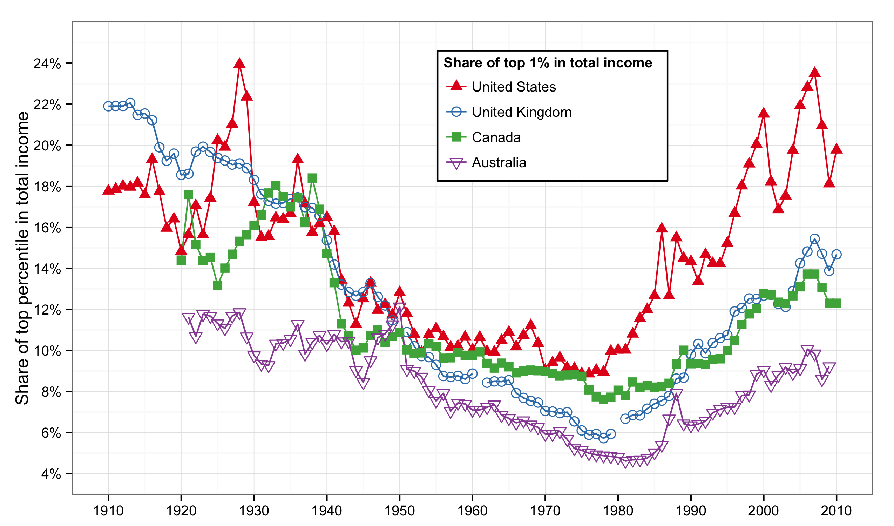
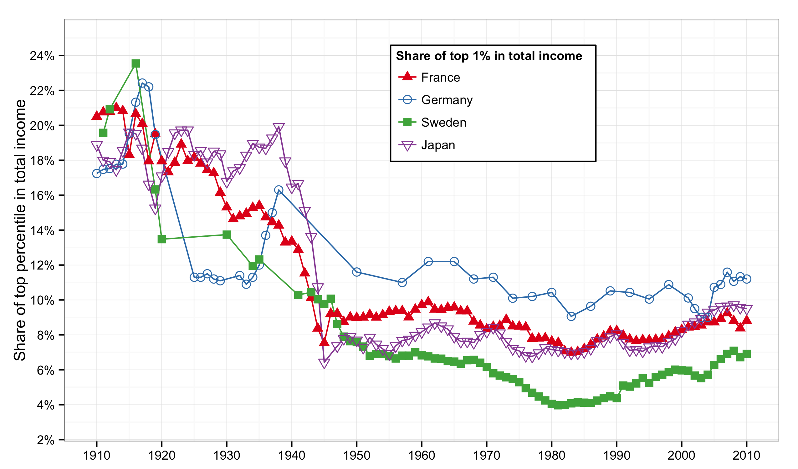
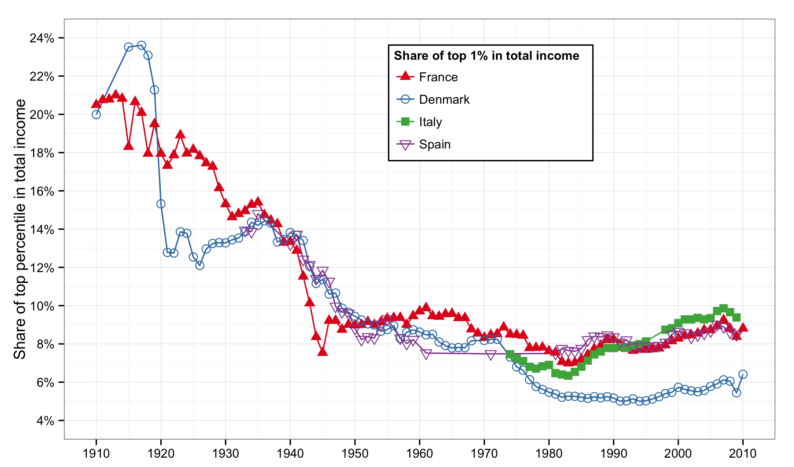
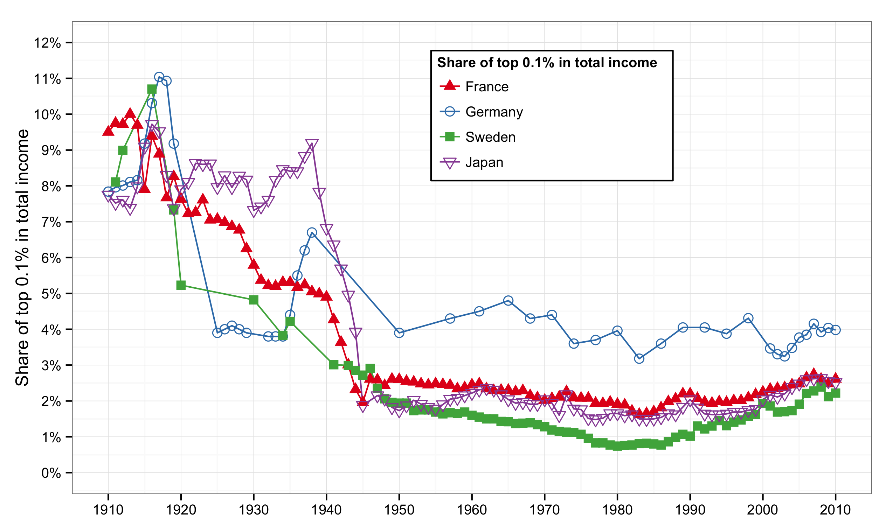
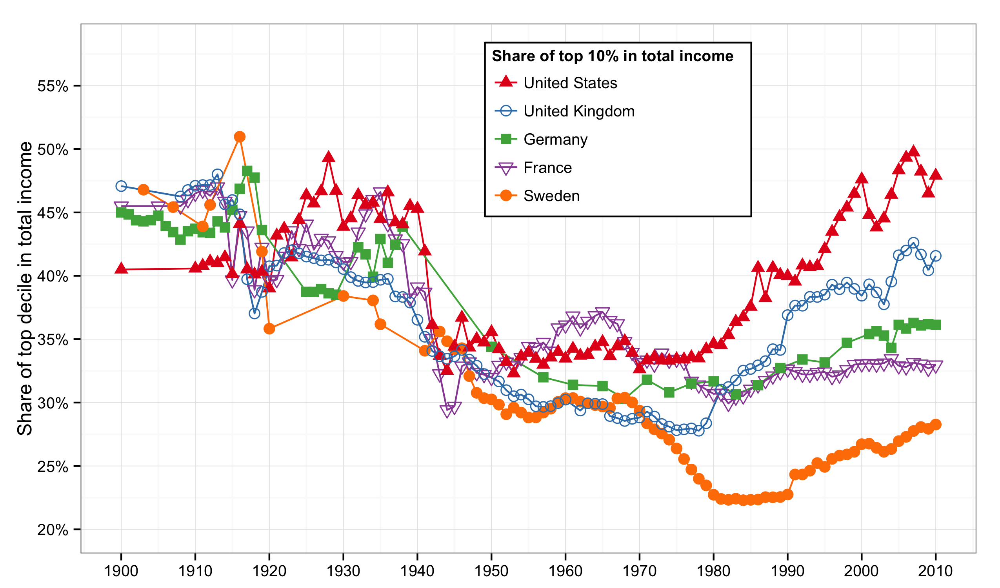
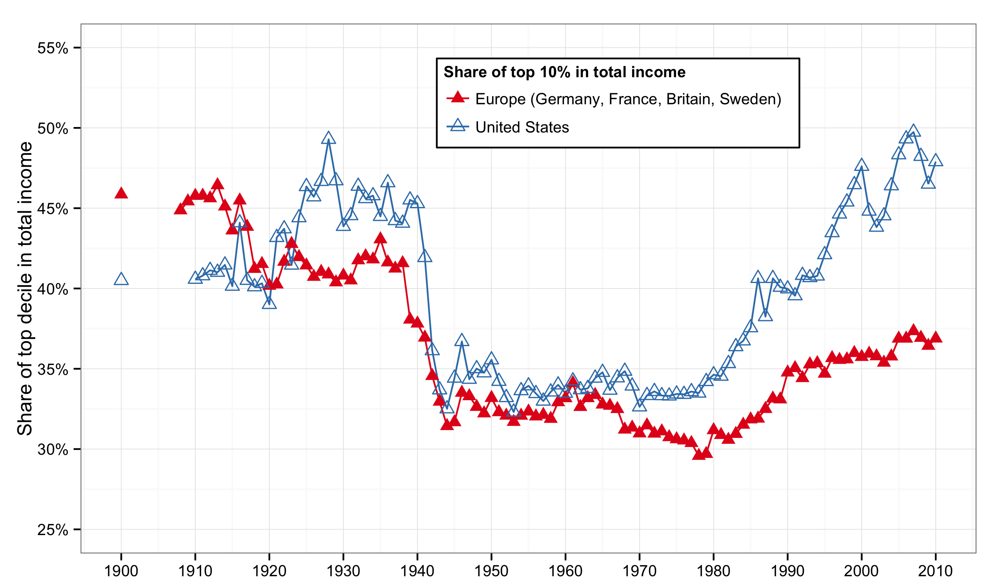
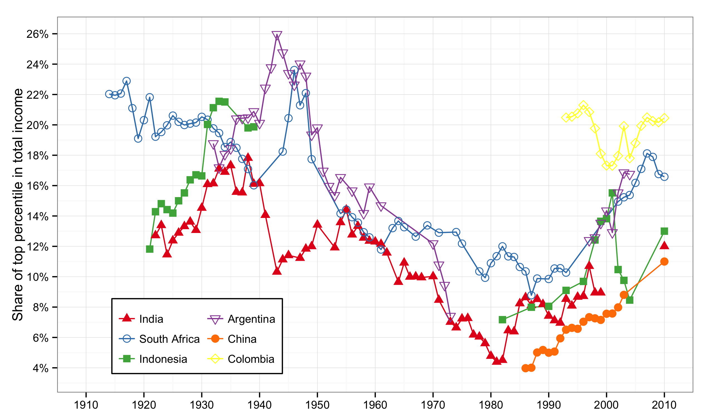

```{r 'preamble', message = FALSE, warning = FALSE, error = FALSE, echo = FALSE, tidy = FALSE, comment = NA, cache = FALSE}
require(knitr)
library(png)   # to display external png and control dimensions
library(grid)  # to display external png and control dimensions
opts_chunk$set(echo = FALSE, cache = FALSE)
source('../../shared/shared.R')
```

### Introduction  

- Chapter 8 reviews the historical evolution of inequality around the world.  

- Chapter 9 analyzes the dynamics of labor income inequality, in particular the recent explosion of wage inequalities and the rise of the supermanager.

---

### Minimum wage in France and the United States

<figure>  
  
<figcaption class = 'figcaption'>Figure 9.1. Expressed in 2013 purchasing power, the hourly minimum wage rose from \$3.80 to \$7.30 between 1950 and 2013 in the United States, and from €2.10 to €9.40 in France.</figcaption>  
</figure> 
<footer class = 'footnote'>
Concept and data: Thomas Piketty. Chart created with ``ggplot2`` (author: Hadley Wickham)
</footer>  

---

### Minimum wage in France and the United States

```{r 'Figure_9_1_rCharts',  message = FALSE, warning = FALSE, error = FALSE, echo = FALSE, tidy = FALSE, cache = FALSE}  
require(rCharts)
# Script for formatting multiChart's y-axes scale and tick mark format
dualAxisChartScript <- 
  "<script>
      $(document).ready(function(){
        draw{{chartId}}()
      });

      function draw{{chartId}}(){  
        var opts = {{{ opts }}},
        data = {{{ data }}}

        if (!(opts.type==='pieChart')) {
          var data = d3.nest()
          .key(function(d){
            return opts.group === undefined ? 'main' : d[opts.group]
          })
          .entries(data);
        }

        //loop through to give an expected x and y
        //then give the type and yAxis hopefully provided by R
        data.forEach(
          function(variables) {
            variables.values.forEach(
              function(values){
                values.x = values[opts.x];
                values.y = values[opts.y];
              }
            );
            variables.type = opts.multi[variables.key].type;
            variables.yAxis = opts.multi[variables.key].yAxis;
          }
        );

        nv.addGraph(function() {
          var chart = nv.models[opts.type]()
          //.x(function(d) { return d[opts.x] })
          //.y(function(d) { return d[opts.y] })
          // Shrink the width a bit such that both axes' tick marks can fit
          .width(opts.width - 20)
          .height(opts.height)

          {{{ chart }}}

          {{{ xAxis }}}

          {{{ x2Axis }}}

          // force the y Axis range or limits for both axes
          chart.yDomain1([0, 12]);
          chart.yDomain2([0, 10]);

          // format ticks so 10000 appears as 10,000
          chart.yAxis1.tickFormat(d3.format('0,0.0f '));
          chart.yAxis2.tickFormat(d3.format('0,0.0f '));
          
          // make space for axis labels
          chart.margin({top: 20, right: 100, bottom: 20, left: 100});

          // set axis labels
          chart.yAxis1.axisLabel('Hourly minimum wage (2013 dollars)');
          chart.yAxis2.axisLabel('Hourly minimum wage (2013 euros)');
          
          // show legend
          chart.showLegend(true);
          
          d3.select('#' + opts.id)
            .append('svg')
            .datum(data)
            .transition().duration(500)
            .call(chart);

          nv.utils.windowResize(chart.update);
          return chart;
        });
      };
  </script>"
load("../../data/df_9_1.Rda") 
# round data for rChart tooltip display
df_9_1 <- subset(df_9_1, variable %in% c('France (2013 euros)', 'United States (2013 dollars)'))
df_9_1$value <- round(df_9_1$value, 1)
# make multiChart to support dual axis
n <- nPlot(data = df_9_1, value ~ Year, group = 'variable', type = 'multiChart')
# Set which axes the item should follow
n$params$multi <- list(
  'France (2013 euros)' = list(type = "line", yAxis = 2),
  'United States (2013 dollars)' = list(type = "line", yAxis = 1))
n$setTemplate(script = dualAxisChartScript)
n$xAxis(axisLabel = 'Year')
n$chart(color = colorPalette)
n$addParams(height = 500, width = 800)
n$setTemplate(afterScript = '<style>
  .nv-point {
    stroke-opacity: 1!important;
    stroke-width: 5px!important;
    fill-opacity: 1!important;
  } 
</style>')
n$save('figures/Figure_9_1.html', standalone = TRUE)
```
<iframe src = "figures/Figure_9_1.html" alt = "Minimum wage in France and the United States, 1950-2013.">
</iframe><icaption class = 'icaption'>Figure 9.1. Expressed in 2013 purchasing power, the hourly minimum wage rose from \\$3.80 to \\$7.30 between 1950 and 2013 in the United States, and from €2.10 to €9.40 in France.</icaption>
<footer class = 'footnote'>  
Concept and data: Thomas Piketty. Chart created with ``rCharts`` (author: Ramnath Vaidyanathan)  
</footer>  

---  

### Income inequality in Anglo-Saxon countries

<figure>  
  
<figcaption class = 'figcaption'>Figure 9.2. The share of top percentile in total income rose since the 1970s in all Anglo-Saxon countries, but with different magnitudes.</figcaption>  
</figure> 
<footer class = 'footnote'>
Concept and data: Thomas Piketty. Chart created with ``ggplot2`` (author: Hadley Wickham)
</footer>  

---

### Income inequality in Anglo-Saxon countries

```{r 'Figure_9_2_rCharts',  message = FALSE, warning = FALSE, error = FALSE, echo = FALSE, tidy = FALSE, cache = FALSE}  
require(rCharts)
load("../../data/df_9_2.Rda") 
# round data for rChart tooltip display
df_9_2 <- na.omit(df_9_2)
df_9_2$value <- round(df_9_2$value, 3)
n <- nPlot(data = df_9_2, value ~ Year, group = 'variable', color = 'variable', shape = 'variable', type = 'lineChart') 
n$chart(forceY = c(.02, .26))
n$yAxis(axisLabel = 'Share of top percentile in total income')
n$chart(margin = list(left = 100)) # margin makes room for label
n$yAxis(tickFormat = "#! function(d) {return Math.round(d*100*100)/100 + '%'} !#")
n$xAxis(axisLabel = 'Year')
n$chart(useInteractiveGuideline = TRUE)
n$chart(color = colorPalette)
n$addParams(height = 500, width = 800)
n$setTemplate(afterScript = '<style>
  .nv-point {
    stroke-opacity: 1!important;
    stroke-width: 5px!important;
    fill-opacity: 1!important;
  } 
</style>')
n$save('figures/Figure_9_2.html', standalone = TRUE)
```
<iframe src = 'figures/Figure_9_2.html' alt = "Figure 9.2. Income inequality in Anglo-Saxon countries, 1910-2010.">
</iframe><icaption class = 'icaption'>Figure 9.2. The share of top percentile in total income rose since the 1970s in all Anglo-Saxon countries, but with different magnitudes.</icaption>
<footer class = 'footnote'>  
Chart created with ``rCharts`` (author: Ramnath Vaidyanathan)  
</footer>  

---

### Income inequality in Continental Europe and Japan

<figure>  
  
<figcaption class = 'figcaption'>Figure 9.3. As compared to Anglo-Saxon countries, the share of top percentile barely increased since the 1970s in Continental Europe and Japan.</figcaption>  
</figure> 
<footer class = 'footnote'>
Chart created with ``ggplot2`` (author: Hadley Wickham)
</footer>  

---

### Income inequality in Continental Europe and Japan

```{r 'Figure_9_3_rCharts',  message = FALSE, warning = FALSE, error = FALSE, echo = FALSE, tidy = FALSE, cache = FALSE}  
require(rCharts)
load("../../data/df_9_3.Rda")
# round data for rChart tooltip display
df_9_3$value <- round(df_9_3$value, 3)
n <- nPlot(data = df_9_3, value ~ Year, group = 'variable', color = 'variable', shape = 'variable', type = 'lineChart') 
n$chart(forceY = c(.02, .26))
n$yAxis(axisLabel = 'Share of top percentile in total income')
n$chart(margin = list(left = 100)) # margin makes room for label
n$yAxis(tickFormat = "#! function(d) {return Math.round(d*100*100)/100 + '%'} !#")
n$xAxis(axisLabel = 'Year')
n$chart(useInteractiveGuideline = TRUE)
n$chart(color = colorPalette)
n$addParams(height = 500, width = 800)
n$setTemplate(afterScript = '<style>
  .nv-point {
    stroke-opacity: 1!important;
    stroke-width: 5px!important;
    fill-opacity: 1!important;
  } 
</style>')
n$save('figures/Figure_9_3.html', standalone = TRUE)
```
<iframe src = 'figures/Figure_9_3.html' alt = "Figure 9.3. Income inequality in Continental Europe and Japan, 1910-2010.">
</iframe><icaption class = 'icaption'>Figure 9.3. As compared to Anglo-Saxon countries, the share of top percentile barely increased since the 1970s in Continental Europe and Japan.</icaption>
<footer class = 'footnote'>  
Concept and data: Thomas Piketty. Chart created with ``rCharts`` (author: Ramnath Vaidyanathan)  
</footer>  

---

### Income inequality in Northern and Southern Europe

<figure>  
  
<figcaption class = 'figcaption'>Figure 9.4. As compared to Anglo-Saxon countries, the top percentile income share barely increased in Northern and Southern Europe since the 1970s.</figcaption>  
</figure> 
<footer class = 'footnote'>
Concept and data: Thomas Piketty. Chart created with ``ggplot2`` (author: Hadley Wickham)
</footer>  

---

### Income inequality in Northern and Southern Europe

```{r 'Figure_9_4_rCharts',  message = FALSE, warning = FALSE, error = FALSE, echo = FALSE, tidy = FALSE, cache = FALSE}  
# highcharts alternative
# h <- hPlot(data = df_9_4, x = 'Quantile', y = 'value', group = 'variable', color = 'variable', shape = 'variable', type = 'line')
require(rCharts)
load("../../data/df_9_4.Rda")
# round data for rChart tooltip display
df_9_4$value <- round(df_9_4$value, 3)
n <- nPlot(data = df_9_4, value ~ Year, group = 'variable', color = 'variable', shape = 'variable', type = 'lineChart') 
n$chart(forceY = c(.04, .24))
n$yAxis(axisLabel = 'Share of top percentile in total income')
n$chart(margin = list(left = 100)) # margin makes room for label
n$yAxis(tickFormat = "#! function(d) {return Math.round(d*100*100)/100 + '%'} !#")
n$xAxis(axisLabel = 'Year')
n$chart(useInteractiveGuideline = TRUE)
n$chart(color = colorPalette)
n$addParams(height = 500, width = 800)
n$setTemplate(afterScript = '<style>
  .nv-point {
    stroke-opacity: 1!important;
    stroke-width: 5px!important;
    fill-opacity: 1!important;
  } 
</style>')
n$save('figures/Figure_9_4.html', standalone = TRUE)
```
<iframe src = 'figures/Figure_9_4.html' alt = "Figure 9.4. Income inequality in Northern and Southern Europe, 1910-2010.">
</iframe><icaption class = 'icaption'>Figure 9.4. As compared to Anglo-Saxon countries, the top percentile income share barely increased in Northern and Southern Europe since the 1970s.</icaption>
<footer class = 'footnote'>  
Concept and data: Thomas Piketty. Chart created with ``rCharts`` (author: Ramnath Vaidyanathan)  
</footer>  

---

### The top 0.1% income share in Anglo-Saxon countries

<figure>  
  
<figcaption class = 'figcaption'>Figure 9.5. The share of the top 0.1 percent highest incomes in total income rose sharply since the 1970s in all Anglo-Saxon countries, but with varying magnitudes.</figcaption>  
</figure> 
<footer class = 'footnote'>
Concept and data: Thomas Piketty. Chart created with ``ggplot2`` (author: Hadley Wickham)
</footer>  

---

### The top 0.1% income share in Anglo-Saxon countries

```{r 'Figure_9_5_rCharts',  message = FALSE, warning = FALSE, error = FALSE, echo = FALSE, tidy = FALSE, cache = FALSE}  
require(rCharts)
load("../../data/df_9_5.Rda") 
# round data for rChart tooltip display
df_9_5 <- na.omit(df_9_5)
df_9_5$value <- round(df_9_5$value, 3)
n <- nPlot(data = df_9_5, value ~ Year, group = 'variable', color = 'variable', shape = 'variable', type = 'lineChart') 
n$chart(forceY = c(0, .14))
n$yAxis(axisLabel = 'Share of top 0.1% in total income')
n$chart(margin = list(left = 100)) # margin makes room for label
n$yAxis(tickFormat = "#! function(d) {return Math.round(d*100*100)/100 + '%'} !#")
n$xAxis(axisLabel = 'Year')
n$chart(useInteractiveGuideline = TRUE)
n$chart(color = colorPalette)
n$addParams(height = 500, width = 800)
n$setTemplate(afterScript = '<style>
  .nv-point {
    stroke-opacity: 1!important;
    stroke-width: 5px!important;
    fill-opacity: 1!important;
  } 
</style>')
n$save('figures/Figure_9_5.html', standalone = TRUE)
```
<iframe src = 'figures/Figure_9_5.html' alt = "Figure 9.5. The top 0.1% income share in Anglo-Saxon countries, 1910-2010.">
</iframe><icaption class = 'icaption'>Figure 9.5. The share of the top 0.1 percent highest incomes in total income rose sharply since the 1970s in all Anglo-Saxon countries, but with varying magnitudes.</icaption>
<footer class = 'footnote'>  
Concept and data: Thomas Piketty. Chart created with ``rCharts`` (author: Ramnath Vaidyanathan)  
</footer>  

---

### The top 0.1% income share in Continental Europe and Japan

<figure>  
  
<figcaption class = 'figcaption'>Figure 9.6. As compared to Anglo-Saxon countries, the top 0.1 percent income share barely increased in Continental Europe and Japan.</figcaption>  
</figure> 
<footer class = 'footnote'>
Concept and data: Thomas Piketty. Chart created with ``ggplot2`` (author: Hadley Wickham)
</footer>  

---

### The top 0.1% income share in Continental Europe and Japan

```{r 'Figure_9_6_rCharts',  message = FALSE, warning = FALSE, error = FALSE, echo = FALSE, tidy = FALSE, cache = FALSE}  
require(rCharts)
load("../../data/df_9_6.Rda") 
# round data for rChart tooltip display
df_9_6$value <- round(df_9_6$value, 3)
n <- nPlot(data = df_9_6, value ~ Year, group = 'variable', color = 'variable', shape = 'variable', type = 'lineChart') 
n$chart(forceY = c(0, .12))
n$yAxis(axisLabel = 'Share of top 0.1% in total income')
n$chart(margin = list(left = 100)) # margin makes room for label
n$yAxis(tickFormat = "#! function(d) {return Math.round(d*100*100)/100 + '%'} !#")
n$xAxis(axisLabel = 'Year')
n$chart(useInteractiveGuideline = TRUE)
n$chart(color = colorPalette)
n$addParams(height = 500, width = 800)
n$setTemplate(afterScript = '<style>
  .nv-point {
    stroke-opacity: 1!important;
    stroke-width: 5px!important;
    fill-opacity: 1!important;
  } 
</style>')
n$save('figures/Figure_9_6.html', standalone = TRUE)
```
<iframe src = 'figures/Figure_9_6.html' alt = "Figure 9.6. The top 0.1% income share in Continental Europe and Japan, 1910-2010.">
</iframe><icaption class = 'icaption'>Figure 9.6. As compared to Anglo-Saxon countries, the top 0.1 percent income share barely increased in Continental Europe and Japan.</icaption>
<footer class = 'footnote'>  
Concept and data: Thomas Piketty. Chart created with ``rCharts`` (author: Ramnath Vaidyanathan)  
</footer>  

---

### The top decile income share in Europe and the United States

<figure>  
  
<figcaption class = 'figcaption'>Figure 9.7. In the 1950s-1970s, the top decile income share was about 30-35 percent of total income in Europe as in the United States.</figcaption>  
</figure> 
<footer class = 'footnote'>
Concept and data: Thomas Piketty. Chart created with ``ggplot2`` (author: Hadley Wickham)
</footer>  

---

### The top decile income share in Europe and the United States

```{r 'Figure_9_7_rCharts',  message = FALSE, warning = FALSE, error = FALSE, echo = FALSE, tidy = FALSE, cache = FALSE}  
require(rCharts)
load("../../data/df_9_7.Rda") 
# round data for rChart tooltip display
df_9_7$value <- round(df_9_7$value, 3)
n <- nPlot(data = df_9_7, value ~ Year, group = 'variable', color = 'variable', shape = 'variable', type = 'lineChart') 
n$chart(forceY = c(.2, .55))
n$yAxis(axisLabel = 'Share of top decile in total income')
n$chart(margin = list(left = 100)) # margin makes room for label
n$yAxis(tickFormat = "#! function(d) {return Math.round(d*100*100)/100 + '%'} !#")
n$xAxis(axisLabel = 'Year')
n$chart(useInteractiveGuideline = TRUE)
n$chart(color = colorPalette)
n$addParams(height = 500, width = 800)
n$setTemplate(afterScript = '<style>
  .nv-point {
    stroke-opacity: 1!important;
    stroke-width: 5px!important;
    fill-opacity: 1!important;
  } 
</style>')
n$save('figures/Figure_9_7.html', standalone = TRUE)
```
<iframe src = 'figures/Figure_9_7.html' alt = "Figure 9.7. The top decile income share in Europe and the United States, 1900-2010.">
</iframe><icaption class = 'icaption'>Figure 9.7. In the 1950s-1970s, the top decile income share was about 30-35 percent of total income in Europe as in the United States.</icaption>
<footer class = 'footnote'>  
Concept and data: Thomas Piketty. Chart created with ``rCharts`` (author: Ramnath Vaidyanathan)  
</footer>  

---

### Income inequality: Europe vs. United States

<figure>  
  
<figcaption class = 'figcaption'>Figure 9.8. The top decile income share was higher in Europe than in the U.S. in 1900-2010. It is much higher in the U.S. in 2000-2010.</figcaption>  
</figure> 
<footer class = 'footnote'>
Concept and data: Thomas Piketty. Chart created with ``ggplot2`` (author: Hadley Wickham)
</footer>  

---

### Income inequality: Europe vs. United States

```{r 'Figure_9_8_rCharts',  message = FALSE, warning = FALSE, error = FALSE, echo = FALSE, tidy = FALSE, cache = FALSE}  
require(rCharts)
load("../../data/df_9_8.Rda") 
# round data for rChart tooltip display
df_9_8$value <- round(df_9_8$value, 3)
n <- nPlot(data = df_9_8, value ~ Year, group = 'variable', color = 'variable', shape = 'variable', type = 'lineChart') 
n$chart(forceY = c(.26, .5))
n$yAxis(axisLabel = 'Share of top decile in total income')
n$chart(margin = list(left = 100)) # margin makes room for label
n$yAxis(tickFormat = "#! function(d) {return Math.round(d*100*100)/100 + '%'} !#")
n$xAxis(axisLabel = 'Year')
n$chart(useInteractiveGuideline = TRUE)
n$chart(color = colorPalette)
n$addParams(height = 500, width = 800)
n$setTemplate(afterScript = '<style>
  .nv-point {
    stroke-opacity: 1!important;
    stroke-width: 5px!important;
    fill-opacity: 1!important;
  } 
</style>')
n$save('figures/Figure_9_8.html', standalone = TRUE)
``` 
<iframe src = 'figures/Figure_9_8.html' alt = "Figure 9.8. Income inequality: Europe vs. United States, 1900-2010.">
</iframe><icaption class = 'icaption'>Figure 9.8. The top decile income share was higher in Europe than in the U.S. in 1900-2010. It is much higher in the U.S. in 2000-2010.</icaption> 
<footer class = 'footnote'>  
Concept and data: Thomas Piketty. Chart created with ``rCharts`` (author: Ramnath Vaidyanathan)  
</footer>  

---

### Income inequality in emerging countries

<figure>  
  
<figcaption class = 'figcaption'>Figure 9.9. Measured by the top percentile income share, income inequality rose in emerging countries since the 1980s, but ranks below the US level in 2000-2010.</figcaption>  
</figure> 
<footer class = 'footnote'>
Concept and data: Thomas Piketty. Chart created with ``ggplot2`` (author: Hadley Wickham)
</footer>  

---

### Income inequality in emerging countries

```{r 'Figure_9_9_rCharts',  message = FALSE, warning = FALSE, error = FALSE, echo = FALSE, tidy = FALSE, cache = FALSE}  
require(rCharts)
load("../../data/df_9_9.Rda") 
# round data for rChart tooltip display
df_9_9 <- na.omit(df_9_9)
df_9_9$value <- round(df_9_9$value, 3)
n <- nPlot(data = df_9_9, value ~ Year, group = 'variable', color = 'variable', shape = 'variable', type = 'lineChart') 
n$chart(forceY = c(.02, .26))
n$yAxis(axisLabel = 'Share of top percentile in total income')
n$chart(margin = list(left = 100)) # margin makes room for label
n$yAxis(tickFormat = "#! function(d) {return Math.round(d*100*100)/100 + '%'} !#")
n$xAxis(axisLabel = 'Year')
n$chart(useInteractiveGuideline = TRUE)
n$chart(color = colorPalette)
n$addParams(height = 500, width = 800)
n$setTemplate(afterScript = '<style>
  .nv-point {
    stroke-opacity: 1!important;
    stroke-width: 5px!important;
    fill-opacity: 1!important;
  } 
</style>')
n$save('figures/Figure_9_9.html', standalone = TRUE)
``` 
<iframe src = 'figures/Figure_9_9.html' alt = "Figure 9.9. Income inequality in emerging countries, 1910-2010.">
</iframe><icaption class = 'icaption'>Figure 9.9. Measured by the top percentile income share, income inequality rose in emerging countries since the 1980s, but ranks below the US level in 2000-2010.</icaption> 
<footer class = 'footnote'>  
Concept and data: Thomas Piketty. Chart created with ``rCharts`` (author: Ramnath Vaidyanathan)  
</footer>  
