### Introduction  

- Chapter 10 reviewed the historical evolution of wealth inequality and the factors behind the historic compression of inequality.

- Chapter 11 analyzes the relative roles of inheritance and saving in capital formation in the long term.

---

### The annual inheritance flow as a fraction of national income
<figure class = "captioned">  
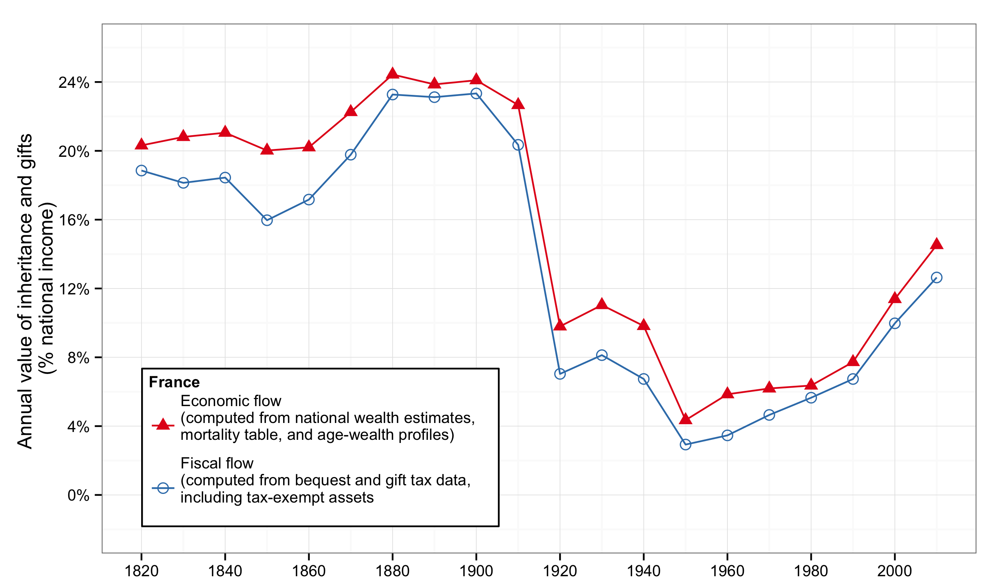  
<figcaption class = 'figcaption'>Figure 11.1. The annual inheritance flow was about 20–25 percent of national income during the nineteenth century and until 1914; it then fell to less than 5 percent in the 1950s, and returned to about 15 percent in 2010.</figcaption>  
</figure> 
<footer class = 'footnote'>Concept and data: Thomas Piketty. Chart created with ``ggplot2`` (author: Hadley Wickham)
</footer>  

---

### The annual inheritance flow as a fraction of national income

<iframe src = "figures/Figure_11_1.html" alt = "Figure 11.1. The annual inheritance flow as a fraction of national income, France, 1820-2010.">
</iframe><icaption class = 'icaption'>Figure 11.1. The annual inheritance flow was about 20–25 percent of national income during the nineteenth century and until 1914; it then fell to less than 5 percent in the 1950s, and returned to about 15 percent in 2010.</icaption>
<footer class = 'footnote'>Concept and data: Thomas Piketty. Chart created with ``rCharts`` (author: Ramnath Vaidyanathan)  
</footer>  

---  

### The mortality rate in France

<figure class = "captioned">  
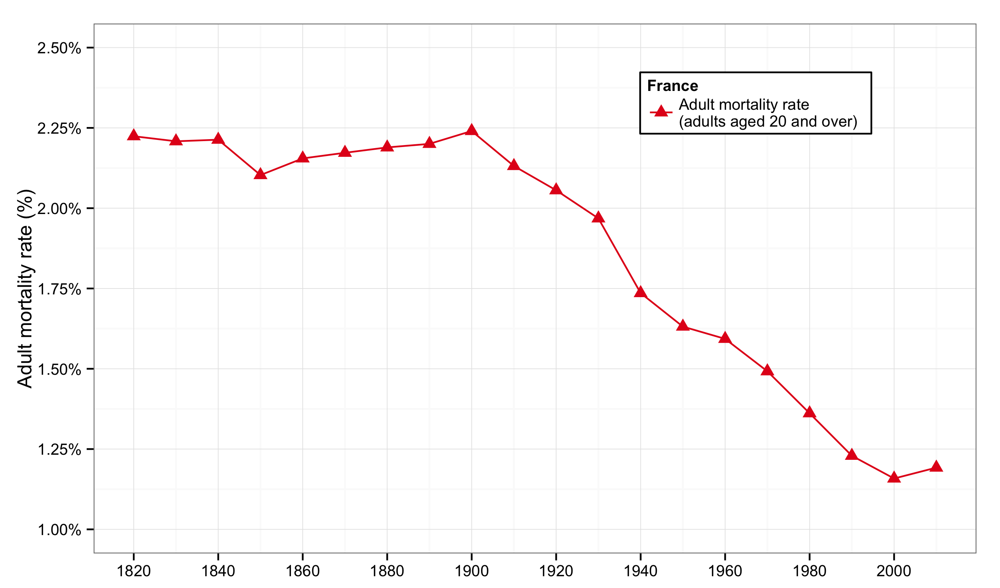  
<figcaption class = 'figcaption'>Figure 11.2. The mortality rate fell in France during the twentieth century (rise of life expectancy), and should increase somewhat during the twenty-first century (baby-boom effect).</figcaption>  
</figure> 
<footer class = 'footnote'>Concept and data: Thomas Piketty. Chart created with ``ggplot2`` (author: Hadley Wickham)
</footer>  

---

### The mortality rate in France

<iframe src = 'figures/Figure_11_2.html' alt = "Figure 11.2. The mortality rate in France, 1820-2100.">
</iframe><icaption class = 'icaption'>Figure 11.2. The mortality rate fell in France during the twentieth century (rise of life expectancy), and should increase somewhat during the twenty-first century (baby-boom effect).</icaption>
<footer class = 'footnote'>Concept and data: Thomas Piketty. Chart created with ``rCharts`` (author: Ramnath Vaidyanathan)  
</footer>  

---

### Average age of decedents and inheritors

<figure class = "captioned">  
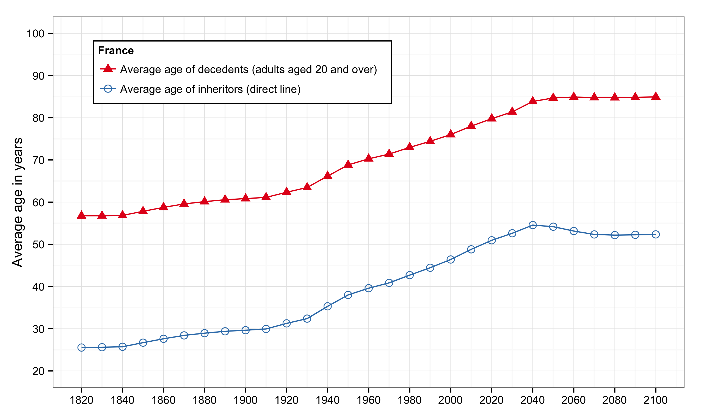  
<figcaption class = 'figcaption'>Figure 11.3. The average of (adult) decedents rose from less than 60 years to almost 80 years during the twentieth century, and the average age at the time of inheritance rose from 30 years to 50 years.</figcaption>  
</figure> 
<footer class = 'footnote'>Concept and data: Thomas Piketty. Chart created with ``ggplot2`` (author: Hadley Wickham)
</footer>  

---

### Average age of decedents and inheritors

<iframe src = 'figures/Figure_11_3.html' alt = "Figure 11.3. Average age of decedents and inheritors: France, 1820-2100.">
</iframe><icaption class = 'icaption'>Figure 11.3. The average of (adult) decedents rose from less than 60 years to almost 80 years during the twentieth century, and the average age at the time of inheritance rose from 30 years to 50 years.</icaption>
<footer class = 'footnote'>Concept and data: Thomas Piketty. Chart created with ``rCharts`` (author: Ramnath Vaidyanathan)  
</footer>  

---

### Inheritance flow versus mortality rate

<figure class = "captioned">  
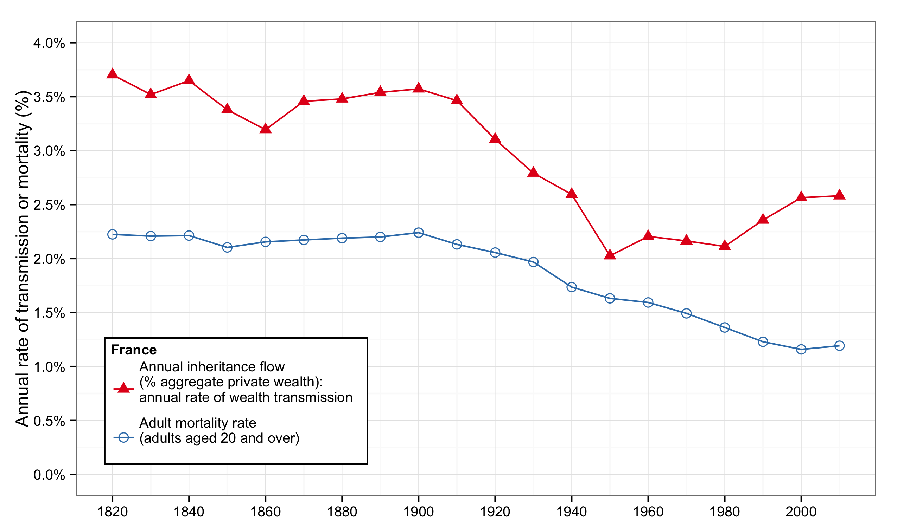  
<figcaption class = 'figcaption'>Figure 11.4. The annual flow of inheritance (bequests and gifts) is equal to about 2.5 percent of aggregate wealth in 2000-2010 versus 1.2 percent for the mortality rate.</figcaption>  
</figure> 
<footer class = 'footnote'>Concept and data: Thomas Piketty. Chart created with ``ggplot2`` (author: Hadley Wickham)
</footer>  

---

### Inheritance flow versus mortality rate

<iframe src = 'figures/Figure_11_4.html' alt = "Figure 11.4. Inheritance flow versus mortality rate: France, 1820-2010.">
</iframe><icaption class = 'icaption'>Figure 11.4. The annual flow of inheritance (bequests and gifts) is equal to about 2.5 percent of aggregate wealth in 2000-2010 versus 1.2 percent for the mortality rate.</icaption>
<footer class = 'footnote'>Concept and data: Thomas Piketty. Chart created with ``rCharts`` (author: Ramnath Vaidyanathan)  
</footer>  

---

### Average wealth at death and average wealth of the living

<figure class = "captioned">  
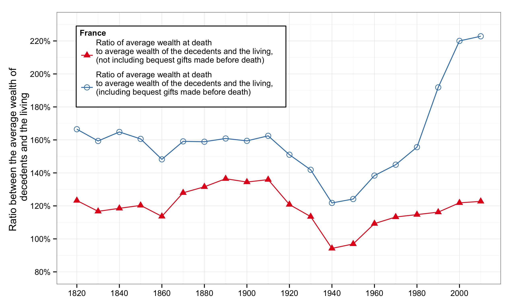  
<figcaption class = 'figcaption'>Figure 11.5. In 2000-2010, the average wealth at death is 20 percent higher than that of the living if one omits the gifts that were made before death, but more than twice as large if one re-integrates gifts.</figcaption>  
</figure> 
<footer class = 'footnote'>Concept and data: Thomas Piketty. Chart created with ``ggplot2`` (author: Hadley Wickham)
</footer>  

---

### Average wealth at death and average wealth of the living

<iframe src = 'figures/Figure_11_5.html' alt = "Figure 11.5. The ratio between average wealth at death and average wealth of the living: France, 1820-2010.">
</iframe><icaption class = 'icaption'>Figure 11.5. In 2000-2010, the average wealth at death is 20 percent higher than that of the living if one omits the gifts that were made before death, but more than twice as large if one re-integrates gifts.</icaption>
<footer class = 'footnote'>Concept and data: Thomas Piketty. Chart created with ``rCharts`` (author: Ramnath Vaidyanathan)  
</footer>  

---

### Observed and simulated inheritance flow

<figure class = "captioned">  
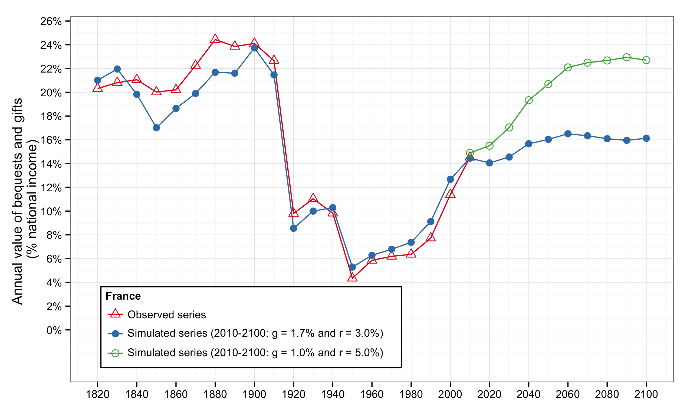  
<figcaption class = 'figcaption'>Figure 11.6. Simulations based upon the theoretical model indicate that the level of the inheritance flow in the twenty-first century will depend upon the growth rate and the net rate of return to capital.</figcaption>  
</figure> 
<footer class = 'footnote'>Concept and data: Thomas Piketty. Chart created with ``ggplot2`` (author: Hadley Wickham)
</footer>  

---

### Observed and simulated inheritance flow

<iframe src = 'figures/Figure_11_6.html' alt = "Figure 11.6. Observed and simulated inheritance flow: France, 1820-2100.">
</iframe><icaption class = 'icaption'>Figure 11.6. Simulations based upon the theoretical model indicate that the level of the inheritance flow in the twenty-first century will depend upon the growth rate and the net rate of return to capital.</icaption>
<footer class = 'footnote'>Concept and data: Thomas Piketty. Chart created with ``rCharts`` (author: Ramnath Vaidyanathan)  
</footer>  

---

### The share of inherited wealth in total wealth

<figure class = "captioned">  
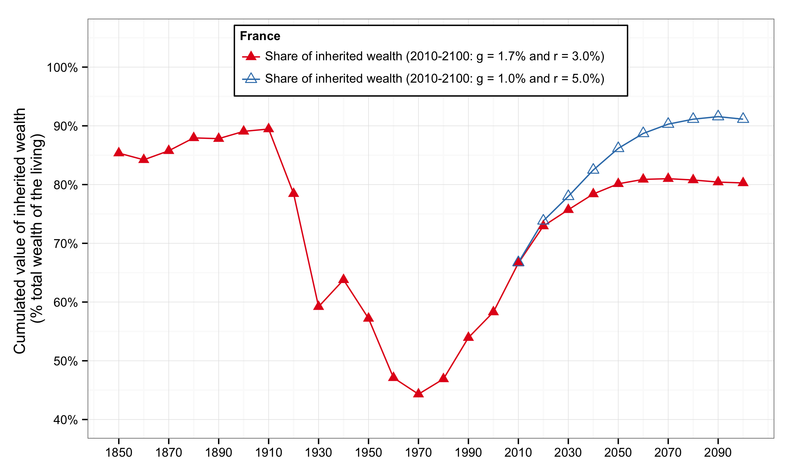  
<figcaption class = 'figcaption'>Figure 11.7. Inherited wealth represents 80-90 percent of total wealth in France in the nineteenth century; this share fell to 40-50 percent during the twentieth century, and might return to 80-90 percent during the twenty-first century.
</figcaption>  
</figure> 
<footer class = 'footnote'>Concept and data: Thomas Piketty. Chart created with ``ggplot2`` (author: Hadley Wickham)
</footer>  

---

### The share of inherited wealth in total wealth

<iframe src = 'figures/Figure_11_7.html' alt = "Figure 11.7. The share of inherited wealth in total wealth: France, 1850-2100.">
</iframe><icaption class = 'icaption'>Figure 11.7. Inherited wealth represents 80-90 percent of total wealth in France in the nineteenth century; this share fell to 40-50 percent during the twentieth century, and might return to 80-90 percent during the twenty-first century.
</icaption>
<footer class = 'footnote'>Concept and data: Thomas Piketty. Chart created with ``rCharts`` (author: Ramnath Vaidyanathan)  
</footer>  

---

### Annual inheritance flow and household disposable income

<figure class = "captioned">  
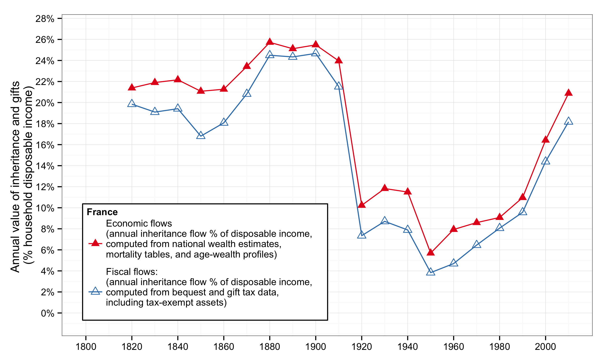  
<figcaption class = 'figcaption'>Figure 11.8. Expressed as a fraction of household disposable income (rather than national income), the annual inheritance flow is about 20 percent in 2010, in other words, close to its nineteenth-century level.</figcaption>  
</figure> 
<footer class = 'footnote'>Concept and data: Thomas Piketty. Chart created with ``ggplot2`` (author: Hadley Wickham)
</footer>  

---

### Annual inheritance flow and household disposable income

<iframe src = 'figures/Figure_11_8.html' alt = "Figure 11.8. The annual inheritance flow as a fraction of household disposable income: France, 1820-2010.">
</iframe><icaption class = 'icaption'>Figure 11.8. Expressed as a fraction of household disposable income (rather than national income), the annual inheritance flow is about 20 percent in 2010, in other words, close to its nineteenth-century level.</icaption> 
<footer class = 'footnote'>Concept and data: Thomas Piketty. Chart created with ``rCharts`` (author: Ramnath Vaidyanathan)  
</footer>  

---

### The share of inheritance in the total resources

<figure class = "captioned">  
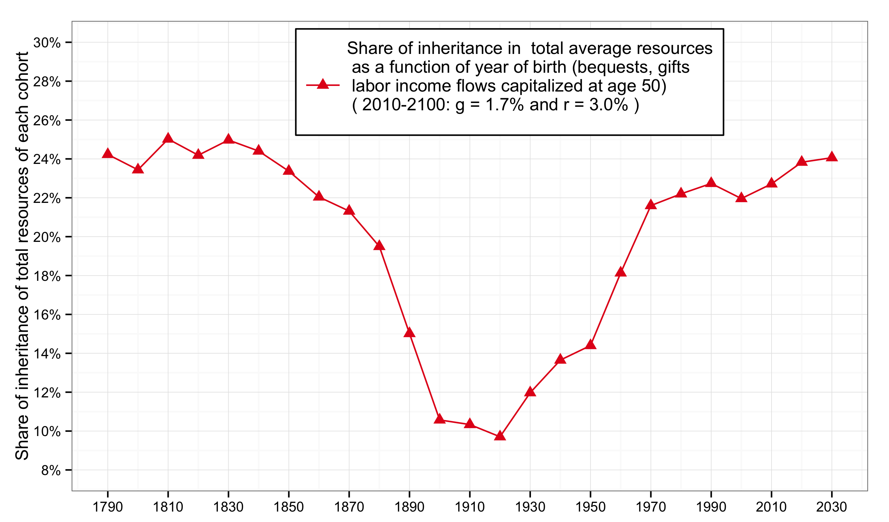  
<figcaption class = 'figcaption'>Figure 11.9. Inheritance made about 25 percent of the resources of nineteenth-century cohorts, down to less than 10 percent for cohorts born in 1910-1920 (who should have inherited in 1950-1960).</figcaption>  
</figure> 
<footer class = 'footnote'>Concept and data: Thomas Piketty. Chart created with ``ggplot2`` (author: Hadley Wickham)
</footer>  

---

### The share of inheritance in the total resources

<iframe src = 'figures/Figure_11_9.html' alt = "Figure 11.9. The share of inheritance in the total resources (inheritance and work) of cohorts born in 1790-2030.">
</iframe><icaption class = 'icaption'>Figure 11.9. Inheritance made about 25 percent of the resources of nineteenth-century cohorts, down to less than 10 percent for cohorts born in 1910-1920 (who should have inherited in 1950-1960).</icaption> 
<footer class = 'footnote'>Concept and data: Thomas Piketty. Chart created with ``rCharts`` (author: Ramnath Vaidyanathan)  
</footer>  

---

### The dilemma of Rastignac

<figure class = "captioned">  
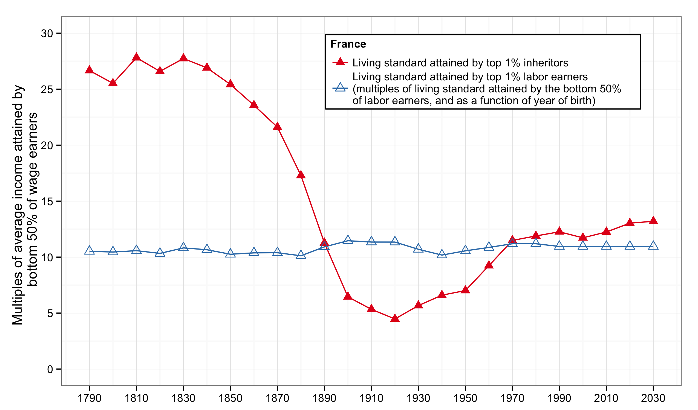  
<figcaption class = 'figcaption'>Figure 11.10. In the nineteenth century, the living standards that could be attained by the top 1 percent inheritors were a lot higher than those that could be attained by the top 1 percent labor earners.</figcaption>  
</figure> 
<footer class = 'footnote'>Concept and data: Thomas Piketty. Chart created with ``ggplot2`` (author: Hadley Wickham)
</footer>  

---

### The dilemma of Rastignac

<iframe src = 'figures/Figure_11_10.html' alt = "Figure 11.10. The dilemma of Rastignac for cohorts born in 1790-2030.">
</iframe><icaption class = 'icaption'>Figure 11.10. In the nineteenth century, the living standards that could be attained by the top 1 percent inheritors were a lot higher than those that could be attained by the top 1 percent labor earners.</icaption> 
<footer class = 'footnote'>Concept and data: Thomas Piketty. Chart created with ``rCharts`` (author: Ramnath Vaidyanathan)  
</footer>  

---

### Inheritance in units of lifetime labor income

<figure class = "captioned">  
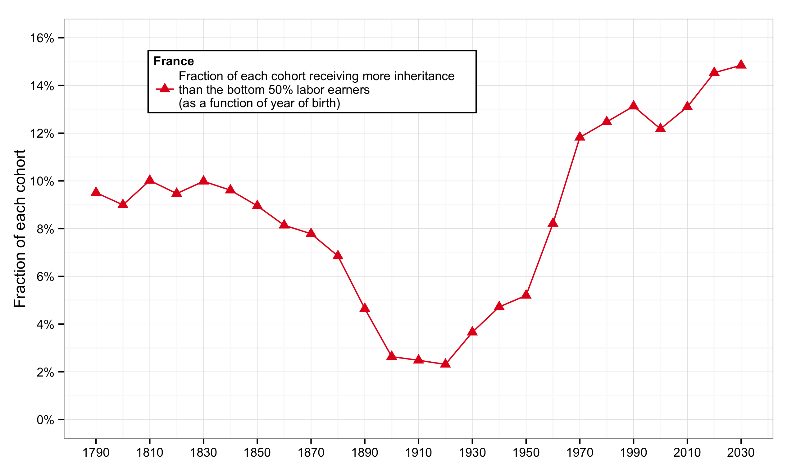  
<figcaption class = 'figcaption'>Figure 11.11. Within the cohorts born around 1970-1980, 12-14 percent of individuals receive in inheritance the equivalent of the lifetime labor income received by the bottom 50 percent less well paid workers.</figcaption>  
</figure> 
<footer class = 'footnote'>Concept and data: Thomas Piketty. Chart created with ``ggplot2`` (author: Hadley Wickham)
</footer>  

---

### Inheritance in units of lifetime labor income

<iframe src = 'figures/Figure_11_11.html' alt = "Figure 11.11. Which fraction of a cohort receives in inheritance the equivalent of a lifetime labor income?">
</iframe><icaption class = 'icaption'>Figure 11.11. Within the cohorts born around 1970-1980, 12-14 percent of individuals receive in inheritance the equivalent of the lifetime labor income received by the bottom 50 percent less well paid workers.</icaption> 
<footer class = 'footnote'>Concept and data: Thomas Piketty. Chart created with ``rCharts`` (author: Ramnath Vaidyanathan)  
</footer>  

---

### The inheritance flow in Europe

<figure class = "captioned">  
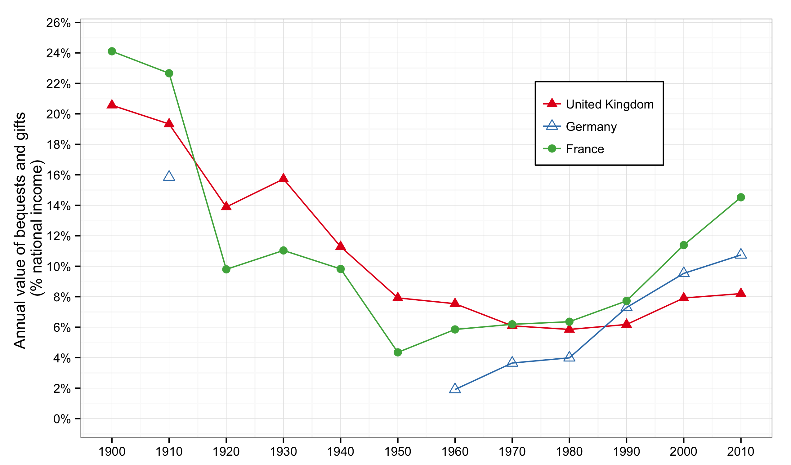  
<figcaption class = 'figcaption'>Figure 11.12. The inheritance flow follows a U-shape in curve in France as well as in the United Kingdom and Germany. It is possible that gifts are underestimated in the United Kingdom at the end of the period.</figcaption>  
</figure> 
<footer class = 'footnote'>Concept and data: Thomas Piketty. Chart created with ``ggplot2`` (author: Hadley Wickham)
</footer>  

---

### The inheritance flow in Europe

<iframe src = 'figures/Figure_11_12.html' alt = "Figure 11.12. The inheritance flow in Europe, 1900-2010.">
</iframe><icaption class = 'icaption'>Figure 11.12. The inheritance flow follows a U-shape in curve in France as well as in the United Kingdom and Germany. It is possible that gifts are underestimated in the United Kingdom at the end of the period.</icaption> 
<footer class = 'footnote'>Concept and data: Thomas Piketty. Chart created with ``rCharts`` (author: Ramnath Vaidyanathan)  
</footer>  
