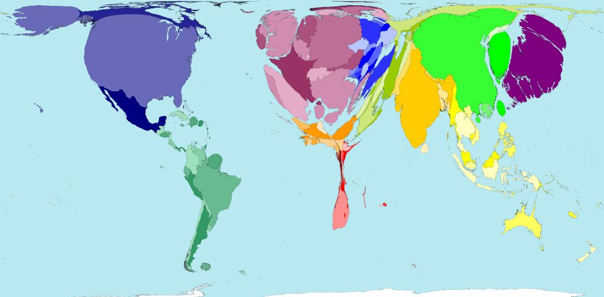
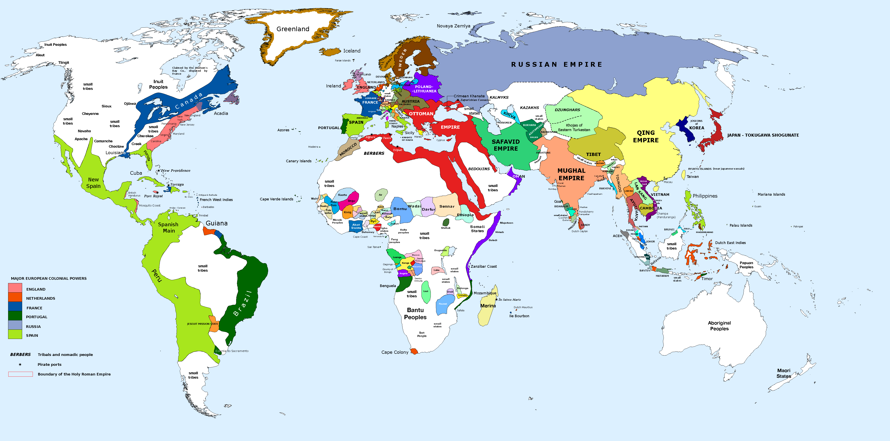
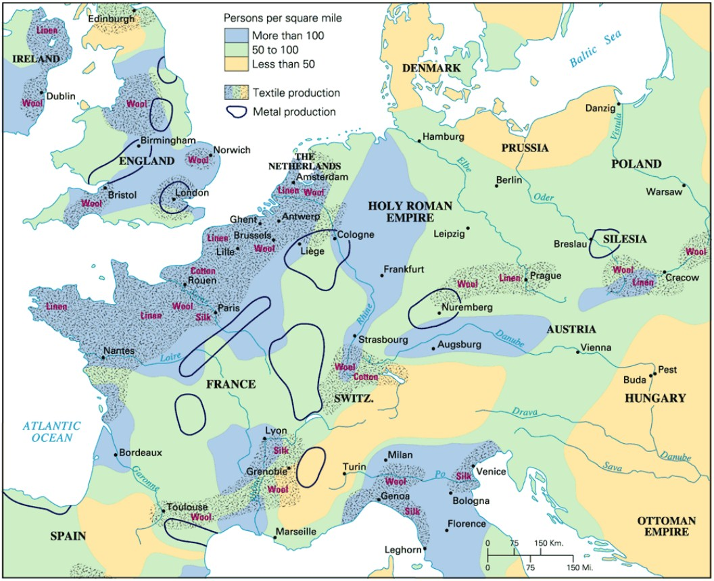
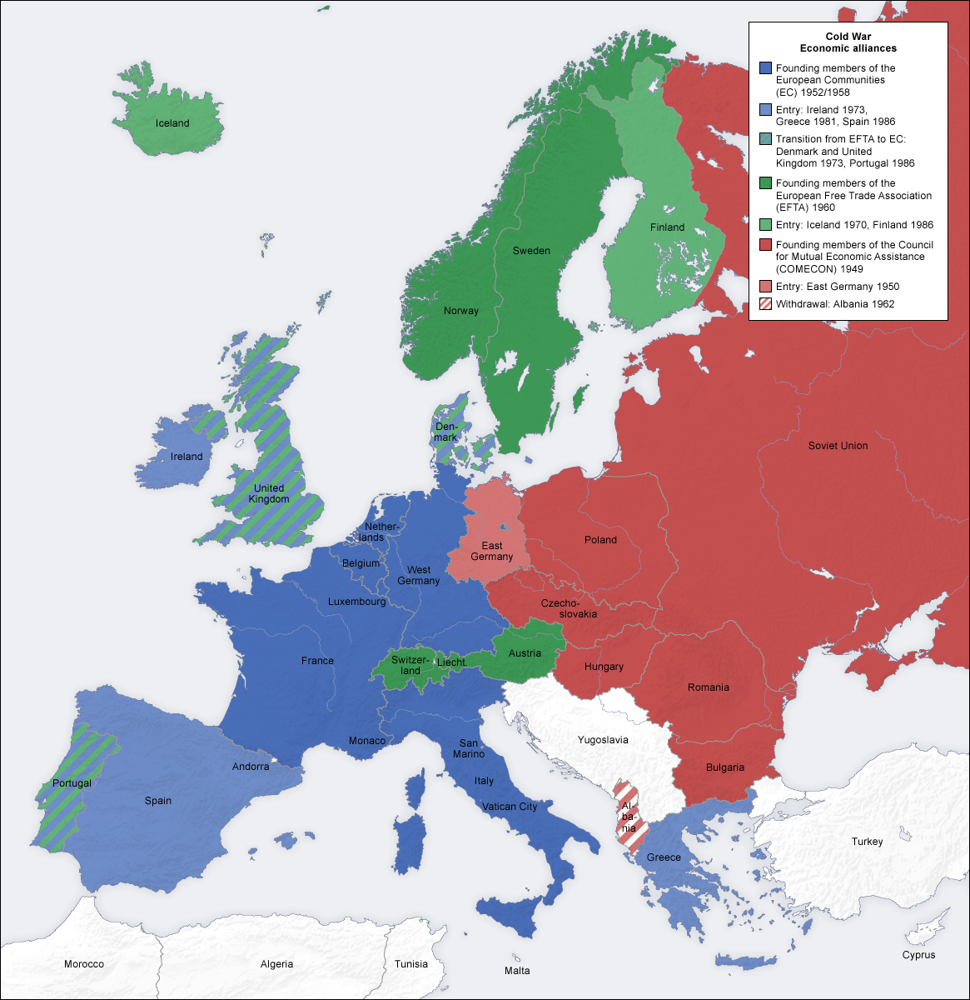

### Introduction

- This set of slides surveys selected topics from *Capital in the Twenty-First Century*, a book written by economist Thomas Piketty, published in English in 2014 to great acclaim.
- All source files for this course are available for download by anyone without restrictions at https://github.com/ptoche/piketty
- The full course is expected to be completed by April 2015.
- Chapter 1 lays out some basic facts about population and income, reviews the basic concepts of national income accounting, and sketches the basic forces behind the evolution of income and wealth over the long term.

---

### Capital and Labor in the Long Run

- The nature of capital has changed over time, from land and real estate in the 18th century to industrial and financial capital in the 21st.
- The rise of 'human capital' suggests that labor should claim a growing share of national income. But the data does not bear this out.
- The rise of private capital in recent years is primarily due to a slowdown of population growth and productivity growth, together with political stability, property rights and tax policies that favor private capital.
- One measure of the evolution of the capital-labor split (the relative income shares) is the capital/income ratio (the ratio of the total stock of capital to the annual flow of income).
- Let's clarify the meaning of income, capital, and wealth.

---

### The Concept of National Income

- *National income* is closely related to *Gross Domestic Product* (GDP).
- GDP measures the market value of all goods and services produced in a given year within the borders of a given country. 
- This excludes last year's goods, non-market goods, wealth, natural resources, truth and beauty. The treatment of housing services is special.
- Two differences between GDP and national income:

    `1`. Deduct the depreciation of the capital stock. 
    
    `2`. Add income earned abroad, subtract income paid to non-residents. 

---

### The Concept of National Income

`1`. Deduct the depreciation of the capital stock

- To compute national income we deduct wear and tear on buildings, infrastructure, machinery, vehicles, computers, and other items.
- Different capital goods depreciate at different rates. The average depreciation is about 10 percent of GDP in most countries. 
- Just as investment adds to the capital stock, depreciation subtracts &mdash; investment is priced by the market, depreciation by accountants. 
- To see why deducting depreciation makes sense, think of it as a 'disinvestment' caused by the act of production. 

- Investment includes 'fixed capital formation', residential construction and inventories. Depreciation is known as 'fixed capital consumption.'

---

### The Concept of National Income

`2`. Add income received from abroad and subtract income paid to foreigners. 

- In the US, UK, France, Germany, Italy, China, Brazil, Japan, national income is within 1 or 2 percent of domestic product. 
- In all these countries, the inflow of profits, interest, dividends, rent, and so on is approximately balanced by a comparable outflow. 
- In wealthy countries, net income from abroad is generally slightly positive.
- Popular perception is very different &mdash; Europeans often incorrectly believe their capital is largely 'owned' by the Japanese, Chinese, Saudis...

---

### Related Income Concepts

- Related concepts are *Gross National Product* (GNP), *Gross National Income* (GNI), *Net Domestic Product* (NDP), *Net National Product* (NNP), and *Net National Income* (NNI). To see how they are related, contrast 'national' with 'domestic'; 'product' with 'income'; and 'gross' with 'net'.
- **From GDP to GNP:**
- While GDP measures output within the borders of a country, GNP measures output produced by citizens of the country, whether it is produced within or outside of the country. 
- To obtain GNP from GDP, add income earned abroad by residents and subtract income earned at home by non-residents. 
- In a country where firms are owned by foreigners, GDP may be greater than GNP. In a country where many citizens work abroad, the opposite.

---

### Related Income Concepts

- In common parlance, 'income', 'product', 'output', 'revenue', 'expenditure' are often used interchangeably. In national accounting, not so.
- **From GDP to NDP:**
- To obtain NDP from GDP, subtract capital depreciation. 
- National Income (NI) is short for Net National Product (NNP).
- **From GDP to NNP:**
- To obtain NI (=NNP) from GDP, apply both adjustments: add net income from abroad and subtract depreciation.

---

### Related Income Concepts

- When economists refer to a country's 'output', 'income', or 'production', they usually refer to real GDP (GDP adjusted for inflation). 
- When they refer to 'average income' they usually refer to GDP per capita (= per head = per person).
- When they compare countries, economists either convert at current market exchange rates or at Purchasing Power Parity rates (PPP).
- When Piketty refers to 'national income', he refers to *Real Net National Product* and compares countries on a *PPP* basis.
- When he refers to economic growth, he refers to the growth rate of real net national product. Because depreciation and inflation are deducted, this growth rate is smaller than that usually reported in the media.
- This has confused some early, hasty readers of the book.

---

### The NIPA 

<figure class = "centered">  

<figcaption class = 'figcaption'>National Income and Product Accounts (NIPA).  <br>Source: NIPA Handbook (2014), <a href="http://www.bea.gov">Bureau of Economic Analysis</a>.
</figcaption>  
</figure> 

--- 

### Global Income Identities

- A country's national income may be greater or smaller than its domestic product, as net foreign income is positive or negative:

    **National Income = Domestic Output + Net Foreign Income**

- At the global level, income received from abroad and paid abroad must balance:

    **Global Income = Global Output**

- National output and income can be decomposed as the sum of income to capital and income to labor:

    **National Income = Capital Income + Labor Income**

--- 

### Capital and Wealth

-  Capital is defined as the sum of all non-human assets that can be owned and exchanged on some market, including:
    - all forms of real property (residential real estate);
    - financial assets (bank accounts, mutual funds, bonds, stocks, insurance policies, pension funds, net of debt);
    - business fixed investments (non-residential real estate, plants, infrastructure, machinery, patents) used by firms and government.
- Human Capital (an individual's labor power, skills, training, and abilities) is ***not*** included. Slaves are included.
- Immaterial Capital (patents, other intellectual property) are included.

---

### Private and Public Capital

- Private Capital is capital owned by individuals and firms.
- Public Capital is capital owned by government agencies.
- By definition: 

    **National Wealth = Private Wealth + Public Wealth**
    
- Public wealth in rich countries is negligible or negative.
- The boundary between public and private is not always clear: some sectors depend greatly on public subsidies (education, health), on public purchases (military–industrial complex). The public may share ownership and control with private entities (tolls, railways, dams).

---

### Capital and Wealth

- Economists usually call capital the wealth accumulated by human beings (buildings, machinery, infrastructure) and exclude land and natural resources. But it is difficult to distinguish the value of buildings from the value of the land on which they are built. 
- Economists usually exclude residential real estate from capital because they  focus on 'productive' capital' (industrial plants, office buildings, machinery). But only the value and rate of return matter to the capitalist. 
- Piketty includes both land and housing services, and uses the words 'capital' and 'wealth' interchangeably. Get used to it.

---

### Net Foreign Capital

- Net Foreign Capital is the difference between assets owned by the country's citizens in the rest of the world and assets in the country owned by citizens of other countries. 

    **National Capital = Domestic Capital + Net Foreign Capital**

- Economists usually use the term Net Foreign Assets (NFA).
- In 1900 the UK and France both enjoyed significant net positive asset positions with the rest of the world. In 2010 many countries have approximately balanced net asset positions.
- At the global level, all net positions must add up to zero.

---

### The Capital/Income Ratio

- Income $Y$ is a flow. It corresponds to the quantity of goods produced and distributed in a given period (one year).
- Capital $K$ is a stock. It corresponds to the total wealth owned at a given point in time. This stock comes from the wealth appropriated or accumulated in the past (several years).
- The capital/income ratio is a stock divided by a flow:
$$
\beta = K/Y
$$
- In the developed countries today, the capital/income ratio generally varies between 5 and 6. That's 5 and 6 years &mdash; or 500% and 600%.
- The $\beta$ ratio is sensitive to short-run fluctuations in asset prices.
- The $\beta$ ratio is independent of the units used by different currencies.

---

### The Capital/Income Ratio

- The capital stock consists of two roughly equal shares: residential capital and professional capital used by firms and government. 
- In Germany, France, the UK, Italy, US, and Japan, national income was roughly 30,000–35,000 euros per capita in 2010, while total private wealth (net of debt) was typically on the order of 150,000–200,000 euros per capita, or 5 to 6 times annual national income.
- Residents of wealthy countries owned approximately 90,000 euros in the form of housing and another 90,000 in stocks, bonds, savings, and other financial assets.
- These average figures hide enormous disparities. Income disparities are caused by inequalities in the labor market and inequalities in wealth holdings. Much of the population has very little wealth.

---

### The First Fundamental Law of Capitalism 

- Piketty's 'first fundamental law of capitalism' links 3 central concepts of the capitalist system &mdash; the capital/income ratio, the rate of return on capital, and the share of capital in income:
$$
\alpha = r \times \beta
$$
where $\alpha$ is the share of income from capital in national income and $r$ the rate of return on capital. 
- **The 'first law' is an accounting identity**.
- For example, if $\beta = 600\%$ and $r = 5\%$, then $\alpha$ $=$ $r \times \beta$ $=$ $.05 \times 6$ $=$ $30\%$.
- If national wealth is 600% of national income and the rate of return on capital 5% per year, then the capital income share *must be* 30%.

---

### The First Fundamental Law of Capitalism 

- In 2010 in wealthy countries capital income was about 30% of national income. With a capital/income ratio of about 600%, the rate of return on capital must have been around 5%.
- Per capita national income is 30,000 euros per year, with 21,000 euros per year income from labor (70%) and 9,000 euros income from capital (30%). 
- Each citizen owns an average of 180,000 euros of capital, and the 9,000 euros of income from capital thus corresponds to an average annual return on capital of 5%.
- One way to think of the 'first law' is as a definition of the capital income share $\alpha$ for given values of $r$ and $\beta$.

---

### The Rate of Return on Capital

- The rate of return on capital measures the yield on capital over the course of a year regardless of its legal form (profits, rents, dividends, interest, royalties, capital gains), expressed as a percentage of the value of capital invested. It is therefore a broader notion than the 'rate of profit', and broader still than the 'rate of interest'.
- The rate of return can vary widely with the type of investment.
- The average long-run rate of return on stocks is 7–8%; ot land in rural societies, about 4–5%; on real estate and bonds, about 3–4%; on public debt, it varies from country to country, with governments of wealthy countries usually paying low rates.  

---

### The Global Distribution of Production

- From 1900 to 1980, 70–80% of the global production of goods and services was concentrated in Europe and America. By 2010, the European–American share had declined to roughly 50%, approximately the same level as in 1860. 
- It will probably continue to fall, perhaps to 20–30% in a few decades, a level consistent with the current population share.
- The lead that Europe and America achieved during the Industrial Revolution allowed them to claim a share of global output 2 to 3 times greater than the world population share.
- Many countries are now closing the gap.

---

<figure class = "centered">  

</figure> 

---

### Inequality in the World Regions

- Table 1.1 shows the distribution of global output in 2012.
- Global inequality is best analyzed in terms of regional blocs. 
- The population of the planet is about 7 billion. 
- Global output is greater than 70 trillion euros
- Global output per capita is thus almost exactly 10,000 euros. 
- Average per capita monthly income is 760 euros (subtract 10% for capital depreciation and divide by 12).
- If global income were equally divided, each person would receive about 760 euros per month.

---

### Inequality in Population

<figure class = "centered">  

<figcaption class = 'figcaption'>World Map Distorted by Population in 2050 (Estimates). <br>Source: <a href="http://www.worldmapper.org">worldmapper.org</a>
</figcaption>  
</figure> 

---

### Inequality in Incomes

<figure class = "centered">  

<figcaption class = 'figcaption'>World Map Distorted by Total Incomes of Men in 2002.  <br>Source: <a href="http://www.worldmapper.org">worldmapper.org</a>
</figcaption>  
</figure> 

---

### Inequality in the World: Europe

- The population of Europe is 740 million. The most populated countries are Russia 150M and Germany 80M (1/4 of Russians live in Asia).
- About 540 million live in the European Union where per capita output is over 27,000 euros per year. 
- The remaining 200 million people live in Russia and Ukraine, where per capita output is about €15,000 per year.
- Three-quarters of citizens of the EU live in the five most populous countries, Germany 80M, France 66M, United Kingdom 64M, Italy 60M, and Spain 47M, with an average per capita output of €30,000 per year.
- The remaining 130 million live in what used to be Eastern Europe, with an average per capita output around €16,000 per year.

---

### Inequality in the World: Asia

- The total Asian population is about 4 billion.
- The largest are China 1.4B, India 1.3B, Indonesia 255M, Pakistan 190M, Bangladesh 160M, Russia 150M, Japan 130M, Philippines 100M, Vietnam 90M, Turkey 80M, Thailand 65M, Burma 50M, South Korea 50M. 
- Japan's annual per capita output is equal to that of the wealthiest countries, but its population is too small to have much influence on the continental average, which is a little below the world average.
- China's annual per capita GDP is 8,000 euros &mdash; below the world average. 
- The Indian sub-continent is poorer still, but India is growing fast.
- Parts of Russia are situated in Europe (3/4 of population, 1/4 of land). 

---

### Inequality in the World: America

- The Americas can be divided into distinct regions that are even more unequal than the European center and periphery. 
- The total population of the Americas is about 1 billion, with about 40% in the north, 40% in the south and the rest in central America. In the north, the United States has a population of 320 million, Mexico 120M, Canada 35M.  In the south, Brazil has 205M, Colombia 50M, Argentina 45M, Peru 30M, Venezuela 30M.
- The US-Canada bloc has 350 million people with a per capita output of €40,000 (North America also includes Mexico).
- Latin America (including Mexico and central America) has 600 million people with a per capita output of €10,000 (the world average).

---

### Inequality in the World: Africa

- The total population of Africa is about 1.1 billion.
- Total annual output is 1.8 trillion euros, less than the French GDP!
- Sub-Saharan Africa has a population of 900 million with a per capita output of only 2,000 euros per year. 
- Population in North Africa is 210 million.
- Nigeria has 185 million, Ethiopia 90M, Egypt nearly 90M, the Congo 70M, South Africa 55M, Tanzania 50M, Kenya 45M, Algeria 40M.

---

### Inequality in the World: Middle East

- The Middle East is a region of Asia. The total population of the Middle East is about 410 million and total output about 1.4 billion euros.
- The population of Iran is 80M, Turkey 80M, Irak 35M, Saudi Arabia 30M.
- The largest economy is Turkey at 1 trillion euros, then Iran €800B, Saudi Arabia €500B, Egypt €400B, Israel €200B. 
- The per capita output of oil-rich countries ranges from €3,000 in Iraq to €90,000 in Quatar. Iran €10,000, Saudi Arabia €18,000, Israel €27,000.
- Parts of Turkey, including the largest city Istanbul, are situated in Europe.

---

### World Overview

- The biggest economies in the world are the United States, China, Japan, Germany, France, United Kingdom, Brazil, Italy, Russia, India, Canada, Australia, Spain...
- Of these, China and India have per capita output below the world average. Russia about the same as Portugal. Brazil about the same as Mexico or Iran. Germany, Australia, Canada, Japan, France, United Kingdom, Italy, Spain are in the same ball park.
- Per capita income is 150–250 euros per month in sub-Saharan Africa, India, Pakistan, Vietnam, Phillipines, Nigeria.
- Per capita income is about 2,500–3,000 euros per month in Western Europe, North America, and Japan, that is 20 times higher! 
- The global average is around 600–800 euros per month.

---

### PPP Versus Current Exchange Rates

<figure class = "centered">  

<figcaption class = 'figcaption'>The Big Mac Index (<em>The Economist</em>, 2010).  <br>Source: <a href="http://www.economist.com/content/big-mac-index">www.economist.com</a>
</figcaption>  
</figure> 

---

### PPP Versus Current Exchange Rates

- The margin of error in these figures is considerable.
- Global inequality would be markedly higher if we used current exchange rates rather than purchasing power parities as above.
- Consider the euro/dollar exchange rate. In 2012, €1.00 was worth about \\$1.30 on the foreign exchange market. A European with an income of 1,000 euros per month has therefore an income of 1,300 dollars. 
- But European prices are about 10 percent higher than US prices, so the purchasing power is about \\$1,170 in Europe instead of \\$1,300 in the US. 
- Thus \\$1.20 has 'purchasing power parity' with €1.00.

---

### PPP Versus Current Exchange Rates

- An advantage of using purchasing power parities is that they are more stable than market exchange rates. 
- Exchange rates are extremely volatile. Exchange rates reflect not only the supply and demand for the goods and services of different countries, but also international investors' strategies and their volatile estimates of economic, monetary, and political outlook of the relevant countries. 
- The dollar/euro rate went from \\$1.30 per euro in the 1990s to less than \\$0.90 in 2001 before rising to around \\$1.50 in 2008 and then falling back to \\$1.30 in 2012, and to \\$1.10 in 2015.
- During that time, the PPP of the euro rose gently from about \\$1 per euro in the early 1990s to \\$1.20 in 2010.

---

### PPP Versus Current Exchange Rates

- In poorer countries, the corrections introduced by purchasing power parity are even larger: in Africa and Asia, prices are roughly half what they are in the rich countries, so that GDP roughly doubles when purchasing power parity is used instead of market exchange rates. 
- The main reason is that the prices of goods and services that cannot be traded internationally are lower, because they are usually relatively labor intensive and involve relatively unskilled labor (a relatively abundant factor of production in less developed countries).
- In 2012, the correction coefficient was 1.6 in China and 2.5 in India.

---

### What Forces Favor Convergence?

- In theory, foreign ownership of capital can help convergence. 
- If rich countries have excess savings and capital and the 'marginal productivity of capital' is low, it could be attractive and efficient to invest in poorer countries abroad. 
- Wealthy investors would obtain a higher return. The influx of capital would raise the productivity of poor countries, helping to close the gap between rich and poor. 
- In Africa, a substantial share of capital is owned by foreigners. The income of Africans is on average 5% less than the continent’s output. With a capital income share of 30%, this means that nearly 20% of African capital is owned by foreigners.

---

### What Forces Favor Convergence?

- The theory has two major problems: 
    `1`. 'Factor Price Equalization' is not sufficient for global convergence of per capita incomes.
    `2`. Convergence of output per capita does not imply convergence of income per capita. 
- Wealthy countries may continue to own large shares of the poor countries' capital stocks indefinitely, so that the per capita national income of the wealthy countries remain permanently above poorer countries
- Capital mobility has not been central to convergence. None of the Asian 'tigers' has benefited from large foreign investments. These countries self-financed investments in physical capital and human capital. 

---

### Knowledge Diffusion

- The key mechanism for convergence at the international and at the domestic level is the diffusion of knowledge. 
- Knowledge diffusion depends on a country's ability to encourage large-scale investment in education and training of the population while guaranteeing stable property rights. 
- Knowledge diffusion increases with legitimate and efficient government. 
- Knowledge diffusion increases with international trade. 

---

### The World in 1700

<figure class = "centered">  

<figcaption class = 'figcaption'>Source: <a href="http://commons.wikimedia.org/">Wiki Media Commons</a>.
</figcaption> 
</figure> 

---

### Western Europe in 1700

<figure class = "centered">  

</figure> 

---

### Europe in the 'Cold War'

<figure class = "centered">  

</figure> 
<figcaption class = 'figcaption'>Source: <a href="http://commons.wikimedia.org/">Wiki Media Commons</a>.
</figcaption> 

---

### World Distribution of Population

<figure class = "centered">  

<figcaption class = 'figcaption'>In 2015, 4 of 7 billion live in Asia. <br>Source: <a href="http://www.reddit.com/r/MapPorn/comments/1dqh7d/after_seeing_a_recent_post_about_the_population/">Valerie Pieris</a>.
</figcaption>  
</figure> 

---

### World Distribution of Output

<figure class = "centered"> 
<div style="height: 440px; overflow: hidden">

</div>
<figcaption class = 'figcaption'>The Earth at Night in 2000.
<br>Source: <a href="http://www.nasa.gov/">NASA, Picture of the Day</a>.
</figcaption>  
</figure> 


<!--- Comment out this slide

### The distribution of world output

<figure class = "captioned">  
  
<figcaption class = 'figcaption'>Figure 1.1. Europe's GDP made 47 percent of world GDP in 1913, down to 25 percent in 2012.
</figcaption>  
</figure> 
<footer class = 'footnote'>Concept and data: Thomas Piketty. Chart created with ``ggplot2`` (author: Hadley Wickham)
</footer>  

-->

---

### The distribution of world output

```{r 'Figure_1_1_rCharts',  message = FALSE, warning = FALSE, error = FALSE, echo = FALSE, tidy = FALSE, cache = FALSE}  
require(rCharts)
load("../../data/df_1_1.Rda") 
# round data for rChart tooltip display
df_1_1$value <- round(df_1_1$value, 3)
n <- nPlot(data = df_1_1, value ~ Year, group = 'variable', type = 'stackedAreaChart') 
n$chart(xDomain = c(1700, 2012), clipEdge = TRUE)
n$chart(yDomain = c(0, 1))  # use yDomain instead of forceY
n$yAxis(axisLabel = 'Share in world output (% of total)')
n$chart(margin = list(left = 80)) 
n$yAxis(tickFormat = "#! function(d) {return Math.round(d*100*100)/100 + '%'} !#")
n$xAxis(axisLabel = NULL)
n$chart(style = 'stack')
n$chart(showControls = FALSE)
n$chart(useInteractiveGuideline = TRUE)
n$chart(color = c('#EFF3FF', '#BDD7E7', '#6BAED6', '#2171B5'))  # To do: automate color selection
n$addParams(height = 450, width = 900)
n$save('figures/Figure_1_1.html', standalone = TRUE)
``` 
<iframe src = 'figures/Figure_1_1.html' alt = "Figure 1.1. The distribution of world output, 1700-2012.">
</iframe><icaption class = 'icaption'>Figure 1.1. Europe's GDP made 47 percent of world GDP in 1913, down to 25 percent in 2012.</icaption> 
<footer class = 'footnote'>Concept and data: Thomas Piketty. Chart created with ``rCharts`` (author: Ramnath Vaidyanathan)  
</footer>  

<!--- Comment out this slide

### The distribution of world population

<figure class = "captioned">  
  
<figcaption class = 'figcaption'>Figure 1.2. Europe's population made 26 percent of world population in 1913, down to 10 percent in 2012.</figcaption>  
</figure> 
<footer class = 'footnote'>Concept and data: Thomas Piketty. Chart created with ``ggplot2`` (author: Hadley Wickham)
</footer>  

-->

---

### The distribution of world population

```{r 'Figure_1_2_rCharts',  message = FALSE, warning = FALSE, error = FALSE, echo = FALSE, tidy = FALSE, cache = FALSE}  
require(rCharts)
load("../../data/df_1_2.Rda") 
# round data for rChart tooltip display
df_1_2$value <- round(df_1_2$value, 3)
n <- nPlot(data = df_1_2, value ~ Year, group = 'variable', type = 'stackedAreaChart') 
n$chart(xDomain = c(1700, 2012), clipEdge = TRUE)
n$chart(yDomain = c(0, 1))  # use yDomain instead of forceY
n$yAxis(axisLabel = 'Share in world output (% of total)')
n$chart(margin = list(left = 80)) 
n$yAxis(tickFormat = "#! function(d) {return Math.round(d*100*100)/100 + '%'} !#")
n$xAxis(axisLabel = NULL)
n$chart(style = 'stack')
n$chart(showControls = FALSE)
n$chart(useInteractiveGuideline = TRUE)
n$chart(color = c('#EFF3FF', '#BDD7E7', '#6BAED6', '#2171B5'))  # To do: automate color selection
n$addParams(height = 450, width = 900)
n$save('figures/Figure_1_2.html', standalone = TRUE)
```
<iframe src = 'figures/Figure_1_2.html' alt = "Figure 1.2. The growth rate of world population from Antiquity to 2100.">
</iframe><icaption class = 'icaption'>Figure 1.2. Europe's population made 26 percent of world population in 1913, down to 10 percent in 2012.</icaption>
<footer class = 'footnote'>Chart created with ``rCharts`` (author: Ramnath Vaidyanathan)  
</footer>  

<!--- Comment out this slide

### Global Inequality

<figure class = "captioned">  
  
<figcaption class = 'figcaption'>Figure 1.3. Per capita GDP in Asia-Africa went from 37 percent of world average in 1950 to 61 percent in 2012. Divergence then convergence?</figcaption>  
</figure> 
<footer class = 'footnote'>Chart created with ``ggplot2`` (author: Hadley Wickham)
</footer>  

-->

---

### Global Inequality

```{r 'Figure_1_3_rCharts',  message = FALSE, warning = FALSE, error = FALSE, echo = FALSE, tidy = FALSE, cache = FALSE}  
require(rCharts)
load("../../data/df_1_3.Rda") 
# round data for rChart tooltip display
df_1_3$value <- round(df_1_3$value, 2)
n <- nPlot(data = df_1_3, value ~ Year, group = 'variable', color = 'variable', shape = 'variable', type = 'lineChart') 
n$chart(xDomain = c(1700, 2012), clipEdge = TRUE)
n$chart(forceY = c(.2, 2.6))
n$yAxis(axisLabel = 'Per capital GDP (% of world average)')
n$chart(margin = list(left = 80)) 
n$yAxis(tickFormat = "#! function(d) {return Math.round(d*100*100)/100 + '%'} !#")
n$xAxis(axisLabel = NULL)
n$chart(useInteractiveGuideline = TRUE)
n$chart(color = colorPalette)
n$addParams(height = 450, width = 900)
n$setTemplate(afterScript = '<style>
  .nv-point {
    stroke-opacity: 1!important;
    stroke-width: 5px!important;
    fill-opacity: 1!important;
  } 
</style>')
n$save('figures/Figure_1_3.html', standalone = TRUE)
```
<iframe src = 'figures/Figure_1_3.html' alt = "Figure 1.3. Global Inequality, 1700-2012.">
</iframe><icaption class = 'icaption'>Figure 1.3. Per capita GDP in Asia-Africa went from 37 percent of world average in 1950 to 61 percent in 2012. Divergence then convergence?</icaption>
<footer class = 'footnote'>Concept and data: Thomas Piketty. Chart created with ``rCharts`` (author: Ramnath Vaidyanathan)  
</footer>  

<!--- Comment out this slide

### Global Inequality

<figure class = "captioned">  
  
<figcaption class = 'figcaption'>Figure 1.4. In 2012, 1 euro was worth \$1.30 according to current exchange rate, but \$1.20 in purchasing power parity.</figcaption>  
</figure> 
<footer class = 'footnote'>Concept and data: Thomas Piketty. Chart created with ``ggplot2`` (author: Hadley Wickham)
</footer>  

-->

---

### Global Inequality

```{r 'Figure_1_4_rCharts',  message = FALSE, warning = FALSE, error = FALSE, echo = FALSE, tidy = FALSE, cache = FALSE}  
require(rCharts)
load("../../data/df_1_4.Rda") 
# round data for rChart tooltip display
df_1_4$value <- round(df_1_4$value, 2)
n <- nPlot(data = df_1_4, value ~ Year, group = 'variable', color = 'variable', shape = 'variable', type = 'lineChart') 
n$chart(forceY = c(.8, 1.5))
n$yAxis(axisLabel = 'Exchange rate Euro/Dollar (in dollars)')
n$chart(margin = list(left = 80))
n$xAxis(axisLabel = NULL)
n$yAxis(tickFormat = "#! function(y) {return '$' + y;} !#")
n$chart(useInteractiveGuideline = TRUE)
n$chart(color = colorPalette)
n$addParams(height = 450, width = 900)
n$setTemplate(afterScript = '<style>
  .nv-point {
    stroke-opacity: 1!important;
    stroke-width: 5px!important;
    fill-opacity: 1!important;
  } 
</style>')
n$save('figures/Figure_1_4.html', standalone = TRUE)
```
<iframe src = 'figures/Figure_1_4.html' alt = "Figure 1.4. Global Inequality, 1700-2012.">
</iframe><icaption class = 'icaption'>Figure 1.4. In 2012, 1 euro was worth \\$1.30 according to current exchange rate, but \\$1.20 in purchasing power parity.</icaption>
<footer class = 'footnote'>Concept and data: Thomas Piketty. Chart created with ``rCharts`` (author: Ramnath Vaidyanathan)  
</footer>  

<!--- Comment out this slide

### Exchange rate and purchasing power parity: euro/yuan.

<figure class = "captioned">  
  
<figcaption class = 'figcaption'>Figure 1.5. In 2012, 1 euro was worth 8 yuan according to current exchange rate, but 5 yuan in purchasing power parity.</figcaption>  
</figure> 
<footer class = 'footnote'>Concept and data: Thomas Piketty. Chart created with ``ggplot2`` (author: Hadley Wickham)
</footer>  

-->

---

### Exchange rate and purchasing power parity: euro/yuan.

```{r 'Figure_1_5_rCharts',  message = FALSE, warning = FALSE, error = FALSE, echo = FALSE, tidy = FALSE, cache = FALSE}  
require(rCharts)
load("../../data/df_1_5.Rda") 
# round data for rChart tooltip display
df_1_5$value <- round(df_1_5$value, 2)
n <- nPlot(data = df_1_5, value ~ Year, group = 'variable', color = 'variable', shape = 'variable', type = 'lineChart') 
n$chart(forceY = c(1, 12))
n$yAxis(axisLabel = 'Exchange rate Euro/Yuan (in yuans)')
n$chart(margin = list(left = 80)) 
n$xAxis(axisLabel = NULL)
n$yAxis(tickFormat = "#! function(y) {return '¥' + y;} !#")
n$chart(useInteractiveGuideline = TRUE)
n$chart(color = colorPalette)
n$addParams(height = 450, width = 900)
n$setTemplate(afterScript = '<style>
  .nv-point {
    stroke-opacity: 1!important;
    stroke-width: 5px!important;
    fill-opacity: 1!important;
  } </style>')
n$save('figures/Figure_1_5.html', standalone = TRUE)
```
<iframe src = 'figures/Figure_1_5.html' alt = "Figure 1.5. Exchange rate and purchasing power parity: euro v. yuan.">
</iframe><icaption class = 'icaption'>Figure 1.5. In 2012, 1 euro was worth 8 yuan according to current exchange rate, but 5 yuan in purchasing power parity.</icaption>
<footer class = 'footnote'>Concept and data: Thomas Piketty. Chart created with ``rCharts`` (author: Ramnath Vaidyanathan)  
</footer>  

