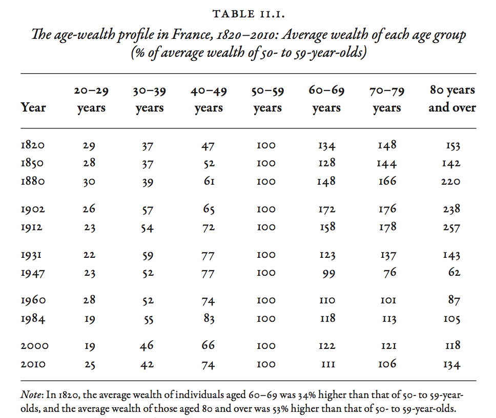

### Introduction  

- This set of slides surveys selected topics from *Capital in the Twenty-First Century*, a book written by economist Thomas Piketty, published in English in 2014 to great acclaim.
- All source files for this course are available for download by anyone without restrictions at https://github.com/ptoche/piketty
- The full course is expected to be completed by April 2015.
- Chapter 10 reviewed the historical evolution of wealth inequality and the factors behind the historic compression of inequality.
- Chapter 11 analyzes the role of inheritance and saving in wealth accumulation and wealth concentration. 

---

### Saving Versus Inheritance

- Any level of wealth concentration reflects the pattern of inheritance and the pattern of savings and wealth accumulation within a lifetime. Determining the relative importance of each is central to policy. 
- `1`. Life-cycle motive: A rise in life expectancy induces wealth accumulation for retirement *within a generation*. 
- `2`. Bequest motive: A fall in family size induces wealth concentration *across generations*.
- Piketty's claim: **If the return on wealth exceeds economic growth rate, inheritance predominates over saving.**
- The claim is based on historical experience and calibrated model, not a matter of simple logic.

---

### Wealth Concentration Within and Across Generations

- The 21st century is likely to feature low economic growth &mdash; especially low population growth &mdash; and high return on wealth.
- Growth has already slowed in Europe and Japan. 
- The United Nations median forecast suggests it will slow throughout the world.
- Aside from the forces of $r>g$, there are mitigating factors: the explosion of top labor incomes (supermanagers and superstars) is likely to strengthen the 'medium rentier'
- Two channels of wealth accumulation wealth: work and inheritance.
- What are their relative importance in the top wealth deciles and centiles?

---

### Inheritance Flows over the Long Run

- Figure 11.1 shows the annual amount of wealth transmitted (bequests and gifts) as a fraction of total annual income &mdash; the annual flow of aggregate inheritance &mdash; in France for 1820-2010. 
- French estate tax data is comprehensive &mdash; in 1791, French revolutionaries established a universal estate tax still in place today. The estate tax applies to both bequests and inter-vivos gifts, to any level of wealth, and to both tangible and financial assets.
- In the 19th century, the inheritance flow accounts for about 20% of annual income. The flow peaked at 25% in 1910, then fell sharply to 4%. After 1945, the flow rises, and even faster after 1980.
- The compression of the inheritance flow caused by the shocks of 1914-1945 was twice as great as the fall in private wealth &mdash; the 'end of inheritance' is more than the consequence of wealth destruction. 

---

### Fiscal Flow and Economic Flow

- `1`. Gifts between living individuals have always played a very important role in France and elsewhere. The relative magnitude of gifts and bequests has varied greatly over time, and must be somewhat underestimated.
- `2`. French historical sources permit two independent ways to compute inheritance flows &mdash; the 'fiscal flow' and 'economic flow' &mdash; are consistent.
- The 'fiscal flow' approach records observed flows of bequests and gifts, based on tax records (and corrected to account of small bequests that do not have to be declared to tax authorities). 
- The 'economic flow' approach computes a model-based theoretical flow.
- The difference between the two approaches give an estimate of tax fraud and other problems with the probate record-keeping system.

---

### 3 Forces of Inheritance

- The annual 'economic flow' of inheritances and gifts:

$$
B/Y = \mu \times m \times \beta
$$

- This 3-way decomposition is a pure accounting identity.
- $\beta$ is the ratio of total private wealth &mdash; the higher $\beta$, the higher the flow of inherited wealth.
- $m$ is the mortality rate &mdash; the higher $m$, the higher the inheritance flow.
- $\mu$ is the ratio of average wealth at time of death to average wealth of the living &mdash; the higher $\mu$, the higher the inheritance flow. 
- If  $\beta = 6$, $m = 0.02$, $\mu = 2$, then $B = 0.24 Y$, approximately the level observed in the 19th and early 20th centuries.

---

### 3 Forces of Inheritance

- The U-shaped $B/Y$ curve results from the 3 U-shaped curves associated with the 3 forces of $\beta$, $m$, $\mu$. 
- `1`. $\mu$: In a society where the primary purpose of wealth is to finance retirement and elderly individuals consume the wealth accumulated during their working lives &mdash; the 'life-cycle theory' of Franco Modigliani &mdash; then $\mu$ would be very small. Individuals derive no utility in dying with positive wealth and would even aim for $\mu < 0$ if allowed to.
- `2`. $m$: Typical mortality rates fell from 2% of the adult population in the 1850 to 1% in 2010.
- `3`. $\beta$: The level of 'human wealth' has risen over time, but the importance of non-human wealth has risen in proportion, and inherited wealth has retained its importance.

---

### Mortality over the Long Run

- Figure 11.2 shows the adult mortality rate in France since 1800.
- The mortality rate in France fell from about 2.2% in 1800 to 1.2% in 2000, is expected to rise until 2050 and stabilize at about 1.5%, as baby boomers (born in 1945-1965) reach the end of their lifespans.
- In the 19th century, life expectancy was 60 years &mdash; with about 45 years of adult life, the mortality rate was $1/45 \simeq 2.2%$. 
- In the 21st century, life expectancy will be 85 years &mdash; with 65 years of adult life, the long-run mortality rate would be $1/65 \simeq 1.5%$. 
- However, in countries where population is falling  &mdash; Germany, Italy, Spain, Japan &mdash; the mortality rate will rise during the transition, and so too will inheritance flows &mdash; if couples have only one child instead of two, the cohort size is cut in half and the inheritance flow doubles.

---

### The Effect of Life Expectancy

- Figure 11.3 shows the average age of death and the average age of inheritors. 
- The difference has always been about 30 years, because the average age of child-birth has been 30.
- The rise in the average age of death raises the average age of inheritors &mdash; in 1850, the average age was 30, in 2050 it will be 50. 
- In the very long run, with a fixed cohort size, a rise in life expectancy raises the mortality rate and thus the inheritance flow. 
- In France, the adult mortality rate will stabilize at 1.5 percent a year in the 21st century, with a life expectancy of 85 years, compared with 2.2 percent in the 19th century, when life expectancy was 60 years. 

---

### The Effect of Ageing 

- Figure 11.4 shows the mortality rate and inheritance flow together.
- The annual rate of transmission by inheritance was stable at 3.5% throughout the 19th century. It fell sharply to 2% during 1910-1950 before rising to 2.5% in 2010.
- Two effects have partly offset ageing, resulting in a rise in the product $\mu \times m$, despite the fall in mortality $m$.
- `1`. The average size of gifts from parents to children has risen.
- `2`. The average size of inheritance has risen, as wealth increases with age. 
- In ageing societies, inheritance occurs later, but wealth also ages.

---

### Wealth of the Dead, Wealth of the Living

- Figure 11.5 shows the evolution of $\mu$, the ratio of average wealth at death to average wealth of the living, for France over 1820-2010. 
- On average, the dead have always been wealthier than the living.
- $\mu$ has almost always been greater than 100%. This is in contradiction with the pure life-cycle Modigliani model of saving, where $\mu \simeq 0$. The bequest motive is far more important. Especially where pay-as-you-go public pension systems guarantee a decent standard of living in retirement. Annuitized wealth accounts for a small percentage of total wealth. 

---

### Gifts Across Generations

- Between 1820 and 1870, gifts accounted for 30-40 percent of the annual value of inheritances &mdash; mainly in the form of dowries. 
- Between 1870 and 1970, gifts fell to 20-30 percent.
- After 1980, gifts rose sharply to 40% in the 1980s, 60% in the 1990s, 80% in the 2000s. Today, gifts are nearly as large as inheritance! 
- On average, parents pass on half of their assets before their death. The 21st century is the golden age of gift giving.
- Most gifts take the form of real estate investment, and are received 10 years before the death of the donor &mdash; today, the average age of an heir is 45-50, the age of a gift recipient 35-40. 
- The rise in gift giving predates fiscal incentives introduced in 1990–2000.

---

### Age and Wealth in the Belle Époque

- Table 11.1 shows wealth-age profiles for a number of years between 1820 and 2010. The elderly are typically wealthier than people in their 50s (the reference group).
- In the 19th century, as wealth became concentrated, it also aged. In 1820, people in their 60s were 34% wealthier, people in their 80s were 53% wealthier. In 1912, people in their 60s were 58% wealthier, people in their 80s, 157% wealthier. 
- In Paris, where the largest fortunes were concentrated, the situation is even more extreme. In 1910 people in their 70s and 80s were 3-4 times as wealthy as people in their 50s.
- This enrichment of the elderly explains the rise in the ratio of average wealth at time of death to average wealth of the living, $\mu$, in the late 19th century &mdash; and follows from $r > g$.

---

<figure class = "centered">  

</figure> 

---

### Age and Wealth in the War

- The shocks associated with 1914-1945 explain the low inheritance flows of 1950-1960 &mdash; parents did not have much wealth to bequeathe. 
- The collapse of inheritance flows was nearly twice as large as the collapse of wealth itself.
- After 1960 private wealth started to rise, as wealth started to age &mdash; both $\beta$ and $\mu$ rose &mdash; explaining the increased importance of inherited wealth. 
- By 2010, the average wealth of people in their 80s was more than 30% higher than that of people in their 50s. 

---

### Age and Wealth in the 21st Century

- Figure 11.6 shows two possible forecasts for the 21st century. 
- The central scenario assumes an annual growth rate $g = 1.7%$ for 2010–2100 and a net return on capital $r = 3%$. 
- The alternative scenario assumes $g = 1%$ and $r = 5%$. This high rate of return could occur if all taxes on wealth and capital income were eliminated.
- In the central scenario, the inheritance flow would continue to rise until 2040 before stabilizing at about 16% percent of national income.
- In the alternative scenario, the inheritance flow would rise more until 2070 before stabilizing at about 25%, the level of 1900. 

---

### The Stock of Inherited Wealth

- Figure 11.7 show the stock of inherited wealth &mdash; the sum of past inheritance flows &mdash; according to the two scenarios.
- In the 19th century, the annual inheritance flows were 20–25 percent of national income, and inherited wealth accounted for nearly all private wealth. 
- The collapse of inheritance flows changed the stock dramatically, with a low point in 1960-1980: wealth accumulated during a lifetime accounted for more than half of all private wealth for the first and last time.
- The share of inherited wealth has since grown steadily to about 2/3 today, and is expected to reach 80-90 percent by 2040. 
- The U-shaped curve of the share of inherited wealth reflects the U-shaped of annual inheritance flows, with a delay of a few years.

---

### The Stock of Inherited Wealth

- Figure 11.8 shows inheritances and gifts received each year as a percentage of disposable income. Today these amount to 20% &mdash; 1/5 of household mon- etary resources &mdash; comparable to 1820-1910.
- Figure 11.9 shows the share of inheritance in the total resources available to generations born in France in the period 1790-2030. Available resources include bequests, gifts and labor income net of taxes, capitalized over the individual's lifetime using the average net return on capital in each year. 
- For all generations born in France between 1790 and 1910, inheritance accounts for about 25% of total lifetime resources. 
- Generations born in 1910-1920 received the lowest inheritance. The rebound began with generations born in 1930-1950, who inherited 12–14% in 1970–1990. Generations born in 1970-1980 inherited around 22–24% in 2000–2010.

---

### The Dilemma Faced by the Upwardly Mobile

- Inherited wealth is distributed unequally, so it is important to go beyond averages. In Figure 11.10, Piketty simulates a model with observed levels of inequality of inheritance and inequality of labor income. 
- In the 19th century, the lifetime resources of the wealthiest 1 percent inheritors were 25-30 times greater than the resources of the 'working lower class' (average of lifetime labor incomes below the median income). That kind of inheritance could afford a staff of 25-30 domestic servants for a lifetime. 
- By contrast, the top 1 percent of earned incomes (judges, attorneys) received 'only' 10 times the resources of the working lower class. 
- The surest path to great wealth was inheritance.

---

### The Dilemma Faced by the Upwardly Mobile

- The living standard of the top 1% inheritors started to fall after 1850, reaching a minimum in 1920.
- The Rastignac born in 1920 faced a different dilemma. The top 1 percent inheritors received 5 times the resources of the working lower class, while the top 1 labor earners received 10-12 times those resources. It was not too different for generations born in 1940-1950.
- In the 20th century, Rastignac would be better off in the top centile of jobs than in the top centile of inheritance.
- The top centile plays a central role in shaping the economic and political structure of society.

---

### Inherited Wealth Around the World

- Figure 11.12 shows inheritance flows in Germany and the United Kingdom, where the data is more patchy. As with France, inheritance flows follow a U-shaped curve.
- In Germany, inheritance flows collapsed even more than in France following the shocks of 1914-1945, from 16% of national income in 1910 to 2% in 1960.
- The smaller flow in Germany in 1910 relative to France was largely a result of more rapid demographic growth in Germany.
- The recent rebound has been stronger than in France. The current difference between flows in France and Germany is entirely due to the difference in the capital/income ratio $\beta$.

---

### Inherited Wealth Around the World

- In the United Kingdom, inheritance flows were similar to France in the 19th century, but did not fall as far as in France or Germany after 1914-1945, which is consistent with differences in changes in $\beta$.
- In the United States, the share of inherited wealth follows a less pronounced U-shaped curve.
- The main difference between America and Europe is the higher rate of population growth in the United States, the smaller capital/income ratio ($\beta$ effect), and less pronounced ageing of wealth ($m$ and $\mu$ effects). 

<!---

### The annual inheritance flow as a fraction of national income

<figure class = "captioned">  
  
<figcaption class = 'figcaption'>Figure 11.1. The annual inheritance flow was about 20–25 percent of national income during the nineteenth century and until 1914; it then fell to less than 5 percent in the 1950s, and returned to about 15 percent in 2010.</figcaption>  
</figure> 
<footer class = 'footnote'>Concept and data: Thomas Piketty. Chart created with ``ggplot2`` (author: Hadley Wickham)
</footer>  

-->

---

### The annual inheritance flow as a fraction of national income

<iframe src = "figures/Figure_11_1.html" alt = "Figure 11.1. The annual inheritance flow as a fraction of national income, France, 1820-2010.">
</iframe><icaption class = 'icaption'>Figure 11.1. The annual inheritance flow was about 20–25 percent of national income during the nineteenth century and until 1914; it then fell to less than 5 percent in the 1950s, and returned to about 15 percent in 2010.</icaption>
<footer class = 'footnote'>Concept and data: Thomas Piketty. Chart created with ``rCharts`` (author: Ramnath Vaidyanathan)  
</footer>  

<!---  

### The mortality rate in France

<figure class = "captioned">  
  
<figcaption class = 'figcaption'>Figure 11.2. The mortality rate fell in France during the twentieth century (rise of life expectancy), and should increase somewhat during the twenty-first century (baby-boom effect).</figcaption>  
</figure> 
<footer class = 'footnote'>Concept and data: Thomas Piketty. Chart created with ``ggplot2`` (author: Hadley Wickham)
</footer>  

-->

---

### The mortality rate in France

<iframe src = 'figures/Figure_11_2.html' alt = "Figure 11.2. The mortality rate in France, 1820-2100.">
</iframe><icaption class = 'icaption'>Figure 11.2. The mortality rate fell in France during the twentieth century (rise of life expectancy), and should increase somewhat during the twenty-first century (baby-boom effect).</icaption>
<footer class = 'footnote'>Concept and data: Thomas Piketty. Chart created with ``rCharts`` (author: Ramnath Vaidyanathan)  
</footer>  

<!---

### Average age of decedents and inheritors

<figure class = "captioned">  
  
<figcaption class = 'figcaption'>Figure 11.3. The average of (adult) decedents rose from less than 60 years to almost 80 years during the twentieth century, and the average age at the time of inheritance rose from 30 years to 50 years.</figcaption>  
</figure> 
<footer class = 'footnote'>Concept and data: Thomas Piketty. Chart created with ``ggplot2`` (author: Hadley Wickham)
</footer>  

-->

---

### Average age of decedents and inheritors

<iframe src = 'figures/Figure_11_3.html' alt = "Figure 11.3. Average age of decedents and inheritors: France, 1820-2100.">
</iframe><icaption class = 'icaption'>Figure 11.3. The average of (adult) decedents rose from less than 60 years to almost 80 years during the twentieth century, and the average age at the time of inheritance rose from 30 years to 50 years.</icaption>
<footer class = 'footnote'>Concept and data: Thomas Piketty. Chart created with ``rCharts`` (author: Ramnath Vaidyanathan)  
</footer>  

<!---

### Inheritance flow versus mortality rate

<figure class = "captioned">  
  
<figcaption class = 'figcaption'>Figure 11.4. The annual flow of inheritance (bequests and gifts) is equal to about 2.5 percent of aggregate wealth in 2000-2010 versus 1.2 percent for the mortality rate.</figcaption>  
</figure> 
<footer class = 'footnote'>Concept and data: Thomas Piketty. Chart created with ``ggplot2`` (author: Hadley Wickham)
</footer>  

-->

---

### Inheritance flow versus mortality rate

<iframe src = 'figures/Figure_11_4.html' alt = "Figure 11.4. Inheritance flow versus mortality rate: France, 1820-2010.">
</iframe><icaption class = 'icaption'>Figure 11.4. The annual flow of inheritance (bequests and gifts) is equal to about 2.5 percent of aggregate wealth in 2000-2010 versus 1.2 percent for the mortality rate.</icaption>
<footer class = 'footnote'>Concept and data: Thomas Piketty. Chart created with ``rCharts`` (author: Ramnath Vaidyanathan)  
</footer>  

<!---

### Average wealth at death and average wealth of the living

<figure class = "captioned">  
  
<figcaption class = 'figcaption'>Figure 11.5. In 2000-2010, the average wealth at death is 20 percent higher than that of the living if one omits the gifts that were made before death, but more than twice as large if one re-integrates gifts.</figcaption>  
</figure> 
<footer class = 'footnote'>Concept and data: Thomas Piketty. Chart created with ``ggplot2`` (author: Hadley Wickham)
</footer>  

-->

---

### Average wealth at death and average wealth of the living

<iframe src = 'figures/Figure_11_5.html' alt = "Figure 11.5. The ratio between average wealth at death and average wealth of the living: France, 1820-2010.">
</iframe><icaption class = 'icaption'>Figure 11.5. In 2000-2010, the average wealth at death is 20 percent higher than that of the living if one omits the gifts that were made before death, but more than twice as large if one re-integrates gifts.</icaption>
<footer class = 'footnote'>Concept and data: Thomas Piketty. Chart created with ``rCharts`` (author: Ramnath Vaidyanathan)  
</footer>  

<!---

### Observed and simulated inheritance flow

<figure class = "captioned">  
  
<figcaption class = 'figcaption'>Figure 11.6. Simulations based upon the theoretical model indicate that the level of the inheritance flow in the twenty-first century will depend upon the growth rate and the net rate of return to capital.</figcaption>  
</figure> 
<footer class = 'footnote'>Concept and data: Thomas Piketty. Chart created with ``ggplot2`` (author: Hadley Wickham)
</footer>  

-->

---

### Observed and simulated inheritance flow

<iframe src = 'figures/Figure_11_6.html' alt = "Figure 11.6. Observed and simulated inheritance flow: France, 1820-2100.">
</iframe><icaption class = 'icaption'>Figure 11.6. Simulations based upon the theoretical model indicate that the level of the inheritance flow in the twenty-first century will depend upon the growth rate and the net rate of return to capital.</icaption>
<footer class = 'footnote'>Concept and data: Thomas Piketty. Chart created with ``rCharts`` (author: Ramnath Vaidyanathan)  
</footer>  

<!---

### The share of inherited wealth in total wealth

<figure class = "captioned">  
  
<figcaption class = 'figcaption'>Figure 11.7. Inherited wealth represents 80-90 percent of total wealth in France in the nineteenth century; this share fell to 40-50 percent during the twentieth century, and might return to 80-90 percent during the twenty-first century.
</figcaption>  
</figure> 
<footer class = 'footnote'>Concept and data: Thomas Piketty. Chart created with ``ggplot2`` (author: Hadley Wickham)
</footer>  

-->

---

### The share of inherited wealth in total wealth

<iframe src = 'figures/Figure_11_7.html' alt = "Figure 11.7. The share of inherited wealth in total wealth: France, 1850-2100.">
</iframe><icaption class = 'icaption'>Figure 11.7. Inherited wealth represents 80-90 percent of total wealth in France in the nineteenth century; this share fell to 40-50 percent during the twentieth century, and might return to 80-90 percent during the twenty-first century.
</icaption>
<footer class = 'footnote'>Concept and data: Thomas Piketty. Chart created with ``rCharts`` (author: Ramnath Vaidyanathan)  
</footer>  

<!---

### Annual inheritance flow and household disposable income

<figure class = "captioned">  
  
<figcaption class = 'figcaption'>Figure 11.8. Expressed as a fraction of household disposable income (rather than national income), the annual inheritance flow is about 20 percent in 2010, in other words, close to its nineteenth-century level.</figcaption>  
</figure> 
<footer class = 'footnote'>Concept and data: Thomas Piketty. Chart created with ``ggplot2`` (author: Hadley Wickham)
</footer>  

-->

---

### Annual inheritance flow and household disposable income

<iframe src = 'figures/Figure_11_8.html' alt = "Figure 11.8. The annual inheritance flow as a fraction of household disposable income: France, 1820-2010.">
</iframe><icaption class = 'icaption'>Figure 11.8. Expressed as a fraction of household disposable income (rather than national income), the annual inheritance flow is about 20 percent in 2010, in other words, close to its nineteenth-century level.</icaption> 
<footer class = 'footnote'>Concept and data: Thomas Piketty. Chart created with ``rCharts`` (author: Ramnath Vaidyanathan)  
</footer>  

<!---

### The share of inheritance in total resources

<figure class = "captioned">  
  
<figcaption class = 'figcaption'>Figure 11.9. Inheritance made about 25 percent of the resources of nineteenth-century cohorts, down to less than 10 percent for cohorts born in 1910-1920 (who should have inherited in 1950-1960).</figcaption>  
</figure> 
<footer class = 'footnote'>Concept and data: Thomas Piketty. Chart created with ``ggplot2`` (author: Hadley Wickham)
</footer>  

-->

---

### The share of inheritance in total resources

<iframe src = 'figures/Figure_11_9.html' alt = "Figure 11.9. The share of inheritance in the total resources (inheritance and work) of cohorts born in 1790-2030.">
</iframe><icaption class = 'icaption'>Figure 11.9. Inheritance made about 25 percent of the resources of nineteenth-century cohorts, down to less than 10 percent for cohorts born in 1910-1920 (who should have inherited in 1950-1960).</icaption> 
<footer class = 'footnote'>Concept and data: Thomas Piketty. Chart created with ``rCharts`` (author: Ramnath Vaidyanathan)  
</footer>  

<!---

### The dilemma of Rastignac

<figure class = "captioned">  
  
<figcaption class = 'figcaption'>Figure 11.10. In the nineteenth century, the living standards that could be attained by the top 1 percent inheritors were a lot higher than those that could be attained by the top 1 percent labor earners.</figcaption>  
</figure> 
<footer class = 'footnote'>Concept and data: Thomas Piketty. Chart created with ``ggplot2`` (author: Hadley Wickham)
</footer>  

-->

---

### The dilemma of Rastignac

<iframe src = 'figures/Figure_11_10.html' alt = "Figure 11.10. The dilemma of Rastignac for cohorts born in 1790-2030.">
</iframe><icaption class = 'icaption'>Figure 11.10. In the nineteenth century, the living standards that could be attained by the top 1 percent inheritors were a lot higher than those that could be attained by the top 1 percent labor earners.</icaption> 
<footer class = 'footnote'>Concept and data: Thomas Piketty. Chart created with ``rCharts`` (author: Ramnath Vaidyanathan)  
</footer>  

<!---

### Inheritance in units of lifetime labor income

<figure class = "captioned">  
  
<figcaption class = 'figcaption'>Figure 11.11. Within the cohorts born around 1970-1980, 12-14 percent of individuals receive in inheritance the equivalent of the lifetime labor income received by the bottom 50 percent less well paid workers.</figcaption>  
</figure> 
<footer class = 'footnote'>Concept and data: Thomas Piketty. Chart created with ``ggplot2`` (author: Hadley Wickham)
</footer>  

-->

---

### Inheritance in units of lifetime labor income

<iframe src = 'figures/Figure_11_11.html' alt = "Figure 11.11. Which fraction of a cohort receives in inheritance the equivalent of a lifetime labor income?">
</iframe><icaption class = 'icaption'>Figure 11.11. Within the cohorts born around 1970-1980, 12-14 percent of individuals receive in inheritance the equivalent of the lifetime labor income received by the bottom 50 percent less well paid workers.</icaption> 
<footer class = 'footnote'>Concept and data: Thomas Piketty. Chart created with ``rCharts`` (author: Ramnath Vaidyanathan)  
</footer>  

<!---

### The inheritance flow in Europe

<figure class = "captioned">  
  
<figcaption class = 'figcaption'>Figure 11.12. The inheritance flow follows a U-shape in curve in France as well as in the United Kingdom and Germany. It is possible that gifts are underestimated in the United Kingdom at the end of the period.</figcaption>  
</figure> 
<footer class = 'footnote'>Concept and data: Thomas Piketty. Chart created with ``ggplot2`` (author: Hadley Wickham)
</footer>  

-->

---

### The inheritance flow in Europe

<iframe src = 'figures/Figure_11_12.html' alt = "Figure 11.12. The inheritance flow in Europe, 1900-2010.">
</iframe><icaption class = 'icaption'>Figure 11.12. The inheritance flow follows a U-shape in curve in France as well as in the United Kingdom and Germany. It is possible that gifts are underestimated in the United Kingdom at the end of the period.</icaption> 
<footer class = 'footnote'>Concept and data: Thomas Piketty. Chart created with ``rCharts`` (author: Ramnath Vaidyanathan)  
</footer>  

