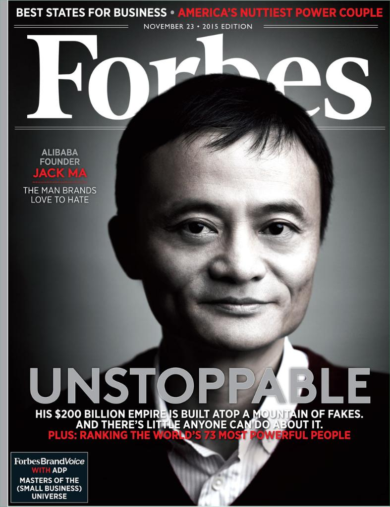
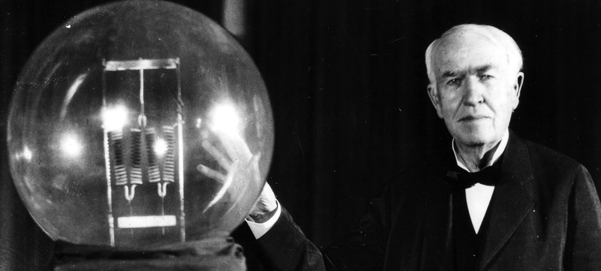
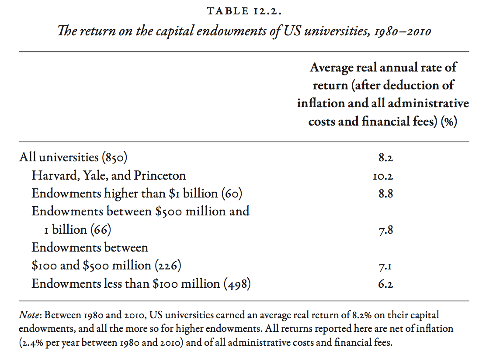
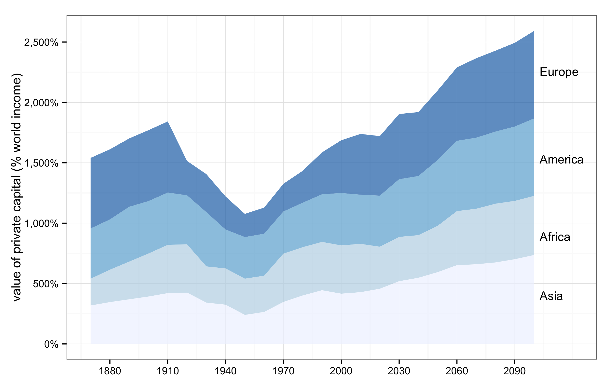

### Introduction  

- This set of slides surveys selected topics from *Capital in the Twenty-First Century*, a book written by economist Thomas Piketty, published in English in 2014 to great acclaim.
- All source files for this course are available for download by anyone without restrictions at https://github.com/ptoche/piketty
- The full course is expected to be completed by April 2015.
- Chapter 11 analyzed the role of inheritance and saving in wealth accumulation and wealth concentration.
- Chapter 12 studies the dynamics of wealth inequality at the global level.

---

### Some Questions

- This chapter analyzes the dynamics of wealth inequality at the global level.
- Does globalization lead to an ever greater concentration of wealth?
- Will the share of wealth owned by the wealthiest individuals in the world rise in the 21st century? 
- Will wealthy countries become owned by oil-producing countries like Saudi Arabia or by exporting countries like China? 

---

### Inequality of Returns on Wealth

- Do wealthier people earn greater returns than the typical market return?
- `1`. **Economies of scale**: The wealthier you are, the better the wealth management consultants and financial advisors you can afford. 
- `2`. **Liquidity premium**: The wealthier you are, the greater the access to liquidity, the easier it is to take on risk and achieve greater returns. 
- Piketty argues that there is strong evidence of `1`. If the average return is 4%, the wealthiest earn 6% on average and the least wealthy 2%, over several decades. 
- Example of `2`: during the financial crisis of 2008, governments subsidized loans to ventures that would otherwise have failed.   

---

### Inequality of Returns on Wealth

- Inequality in the returns on wealth mechanically lead to a greater concentration of wealth. 
- The 'law of compound interest' accentuates the effect.
- The inequality $r > g$ is more likely to hold if $r$ is the average rate of return at the very top of the wealth distribution.
- Two countervailing forces:
- `1`. **Taxes on wealth and estates**  
- `2`. **Growth-enhancing policies**

---

### Inequality of Returns on Wealth

- Piketty presents 3 pieces of evidence:
- `1`. Rankings of wealthy individuals around the world. 
- `2`. Returns on US universities endowments. 
- `3`. Returns on sovereign wealth funds. 

---

### Ranking of the Super Wealthy

<figure class = "centered">  

<figcaption class = 'figcaption'>Jack Ma, Founder of Alibaba, on the cover of Forbes magazine, November 2015.
</figcaption>  
</figure> 

---

### Ranking of the Super Wealthy

- Data on the wealthiest individuals around the world is scant. Most studies by national governments and statistical agencies are for specific countries. 
- Magazines such as Forbes publish annual rankings of the super rich. These rankings are a useful starting point &mdash; they give an order of magnitude.
- Figure 12.1 shows the Forbes billionaires list, published since 1987. 
- The Forbes billionaires list was led by a Japanese from 1987 to 1995, then an American from 1995 to 2009. In 1987, there were 140 billionaires in the world. By 2013, there were more than 1,400. 
- However, these numbers should be adjusted for inflation and growth.

---

### Ranking of the Super Wealthy

- Figure 12.2 shows adjusted measures based on the Forbes list. 
- In 1987, billionaires owned 0.4% of global private wealth. By 2013, they owned 1.5%. Some of this reflects population growth. In 1987, there were 5 billionaires per 100 million adults. By 2013, there were 30. 
- More informative is to look at the amount of wealth owned by a fixed percentage of world population. 
- Figure 12.3 shows the wealth shares of the richest 20/1,000,000. In 1987, this elite group had about 150 people out of 3 billion adults, with an average wealth of \\$1.5B. By 2013, the group had 225 people out of 4.5 billion, with an average wealth of \\$15B. 

---

### Ranking of the Super Wealthy

- Table 12.1 shows the growth rate of wealth held by the richest, with other statistics for comparison.  
- The average annual real growth rate of the richest 1/(20 million) was 6.4%. This compares with an average annual real growth rate of global wealth per capita of 2.1%, and global income of 1.4%. The wealth shares rose by more than 3 in less than 30 years. 
- The structural growth rate of the wealthiest is systematically greater than the typical growth rate of average wealth. 
- Example: Over 1990-2010, the annual real growth rate of the wealthiest was 4% &mdash; Over 1987-2013, it was  6%. (global stock and real estate prices peaked in 1990, `troughed' in 2010). 

---

<figure class = "centered">  

</figure> 

---

#### **The World Wealthiest Individuals**

```{r ForbesWealthRanking, echo=FALSE, message=FALSE, warnings=FALSE, results='asis'}
# http://www.forbes.com/billionaires/list/
tbl <- "
| Rank | Name | Wealth (Billion)  | Age | Company | Country |
|------|:----:|------------------:|----:|--------:|--------:|
| 1  | Bill Gates          | $79.2 | 59 | Microsoft          | United States  |
| 2  | Carlos Slim Helu    | $77.1 | 75 | Telecom            | Mexico         | 
| 3	 | Warren Buffett      | $72.7 | 84 | Berkshire Hathaway | United States  |
| 4  | Amancio Ortega      | $64.5 | 78 | Zara               | Spain          |
| 5	 | Larry Ellison       | $54.3 | 70 | Oracle             | United States  |
| 6  | Charles Koch        | $42.9 | 79 | Diversified        | United States  |
| 6	 | David Koch          | $42.9 | 74 | Diversified        | United States  |
| 8  | Christy Walton      | $41.7 | 60 | Wal-Mart           | United States  |
| 9	 | Jim Walton          | $40.6 | 67 | Wal-Mart           | United States  |
| 10 | Liliane Bettencourt | $40.1 | 92 | L'Oreal            | France         |
| 11 | Alice Walton	       | $39.4 | 65 | Wal-Mart           | United States  |
| 12 | S. Robson Walton    | $39.1 | 71 | Wal-Mart           | United States  |
| 13 | Bernard Arnault     | $37.2 | 65 | LVMH               | France         |
| 14 | Michael Bloomberg   | $35.5 | 73 | Bloomberg LP       | United States  |
| 15 | Jeff Bezos          | $34.8 | 51 | Amazon.com         | United States  |
"
cat(tbl)  # output the table
```

---

#### **The World Wealthiest Individuals (continued)**

```{r ForbesWealthRanking2, echo=FALSE, message=FALSE, warnings=FALSE, results='asis'}
# http://www.forbes.com/billionaires/list/
tbl <- "
| Rank | Name | Wealth (Billion)  | Age | Company | Country |
|------|:----:|------------------:|----:|--------:|--------:|
| 16 | Mark Zuckerberg     | $33.4 | 30 | Facebook           | United States  |
| 17 | Li Ka-shing         | $33.3 | 86 | Diversified        | Hong Kong      |
| 18 | Sheldon Adelson     | $31.4 | 81 | Casinos            | United States  |
| 19 | Larry Page          | $29.7 | 41 | Google             | United States  |
| 20 | Sergey Brin         | $29.2 | 41 | Google             | United States  |
| 21 | Georg Schaeffler    | $26.9 | 50 | Ball Bearings      | Germany        |
| 22 | Forrest Mars, Jr.   | $26.6 | 83 | Candy              | United States  |
| 22 | Jacqueline Mars     | $26.6 | 75 | Candy              | United States  |
| 22 | John Mars           | $26.6 | 78 | Candy              | United States  |
| 25 | David Thomson       | $25.5 | 57 | Media              | Canada         |
| 26 | Jorge Paulo Lemann  | $25.0 | 75 | Beer               | Brazil         |
| 27 | Lee Shau Kee        | $24.8 | 87 | Real Estate        | Hong Kong      |
| 28 | Stefan Persson      | $24.5 | 67 | H&M                | Sweden         |
| 29 | George Soros        | $24.2 | 84 | Hedge Funds        | United States  |
| 29 | Wang Jianlin        | $24.2 | 60 | Real Estate        | China          |
"
cat(tbl)  # output the table
```
<figcaption class = 'figcaption'>[The 2015 Forbes Billionaires List](http://www.forbes.com/billionaires/list/) by ``Forbes Magazine``
</figcaption>  

---

### Ranking of the Super Wealthy

- The wealthiest 0.1% of people in the world have wealth of about 10 million euros on average &mdash; 200 times the average global wealth (€60,000 per adult) &mdash; about 20% of total global wealth. The wealthiest 0.1% include 4.5 million people (for an adult population of 4.5 billion). 
- The wealthiest 1% own about €3M on average &mdash;  50 times the average global wealth &mdash; about 50% of total global wealth. The wealthiest 1% include 45 million people. 
- Is the divergence process occurring solely among billionaires, or is it also affecting the groups immediately below?

---

### Heirs and Entrepreneurs

- Piketty claims that the Forbes rankings shows that above a threshold, large fortunes grow at above-average rates, with no apparent difference between inherited and entrepreneurial wealth.
- Between 1990 and 2010, Bill Gates, the founder of Microsoft, experienced a rise of wealth from \\$4 billion to \\$50 billion &mdash; an annual real (inflation-corrected) rate of return on capital in excess of 10 percent.
- Liliane Bettencourt, the L'Oreal heiress, experienced a similar return on capital. Unlike Bill Gates she has never had to work.
- The super wealthy can `afford' to save a large fraction of their income,  reinforcing economies of scale and the liquidity premium &mdash; money begets money. With better family wealth management, it becomes less likely that heirs will squander the family fortune.  

---

### Heirs and Entrepreneurs

<figure class = "centered">  

<figcaption class = 'figcaption'>Heiress Paris Hilton, best known for her social life, in her pink Bentley.
</figcaption>  
</figure> 

---

### Heirs and Entrepreneurs

<figure class = "centered">  

<figcaption class = 'figcaption'>Thomas Edison, inventor and entrepreneur, best known for inventing commercially practical incandescent light bulbs, the first phonograph, the motion picture camera.
</figcaption>  
</figure> 

---

### Ranking Heirs and Entrepreneurs

- The methods used by Forbes and other magazines significantly underestimate the size of inherited fortunes. 
- Journalists do not have access to comprehensive government records. They compile lists of stockholders of large publicly traded corporations. 
- This approach is more successful at tracking entrepreneurial wealth concentrated in a small number of firms than at tracking inherited wealth held in diversified portfolios.  

---

### The Moral Hierarchy of Wealth

- Every fortune is partially justified yet potentially excessive. Outright theft and absolute merit are rare. 
- In American media, it is often suggested that Mexican telecom tycoon Carlos Slim owes his wealth to favourable public contracts and licenses, while American software entrepreneur Bill Gates is innovative and visionary. Yet, both have cornered markets and extracted monopoly rents. 
- How is the Koch industrial wealth more "moral" than that of Saudi royals, Japanese real estate speculators, or Russian oligarchs? Attempts to establish a moral hierarchy of wealth are often ethnocentric. 
- Piketty suggests wealth accumulation should be regulated regardless of origin or nationality &mdash; a progressive tax on capital would impose democratic control on large fortunes.  

---

### The Moral Hierarchy of Wealth

<figure class = "centered">  

<figcaption class = 'figcaption'>Former Yukos CEO Mikhail Khodorkovsky, with business partner Platon Lebedev, during a trial in Moscow, 26 August 2004. Source: AP.
</figcaption>  
</figure> 

---

### Return on University Endowments

- Table 12.2 shows the real returns on American university endowments.
- Returns have been very high, averaging 8.2% a year between 1980 and 2010. Since taxes are virtually nonexistent for nonprofit institutions, these are pure return on capital.
- More than 800 public and private U.S. universities manage their own endowments, ranging from a few million dollars to billions.
- In 2010, Harvard (rank 1) had an endowment of \\$30B &mdash; Yale (rank 2) \\$20B &mdash; North Iowa Community College (rank 785) \\$11M.  
- Total assets of American universities exceeded \\$400B in 2010, with mean wealth \\$500M and median wealth \\$100M. 

---

<figure class = "centered">  

</figure> 

---

### Return on University Endowments

- The returns on university endowments are consistent with those of the world billionaires. They too increase with size.
- For the 500 of 850 universities whose endowment was less than \\$100M, the average real return was 6.2% in 1980–2010. 
- For the 60 universities with more than \\$1B, the average return was 8.8% &mdash; For the top 3 (Harvard, Yale, Princeton), the yield was 10.2%.
- While all universities hold highly diversified portfolios, the richer universities rely on "alternative investment strategies" &mdash; high yield investments such as shares in private equity funds and unlisted foreign stocks, hedge funds, derivatives, real estate, and raw materials, all of which require great expertise.

---

### The World's Richest University: Harvard

<figure class = "centered">  

<figcaption class = 'figcaption'>Harvard University has an endowment of $30B.
</figcaption>  
</figure> 

---

### Return on University Endowments

- These "alternative investment strategies" enable the very largest endowments to obtain real annual returns of 10%, while smaller endowments earn 5%. 
- The year-to-year volatility of these returns does not seem to be any greater for the largest endowments than for the smaller ones. 
- The higher returns of the largest endowments are due primarily to more sophisticated investment strategies &mdash; **economies of scale**.
- Harvard currently spends nearly \\$100M a year to manage its endowment, just over 0.3% a year, which pays for itself many times over.
- With an endowment of \\$10M, even 1 percent a year amounts to only \\$100,000, which is not enough to pay a full-time financial advisor.

---

### Effect of Inflation on the Return to Capital

- Moderate and predictable inflation has little impact on the return to capital, because asset price tends to rise with consumer prices.
- For most people, buying a home offers the simplest protection against inflation. It also allows the owner to avoid paying rent. 
- Homebuying yields a real return on investment of 3-4 percent a year. But buying in a big city may not be feasible even with accumulated saving of \\$100,000 to put up as downpayment.  
- In the 19th century, when inflation was zero, it was relatively easy for a small saver to obtain a real return of 3-4 percent by buying government bonds. Today, real rates are much lower.
- The main effect of inflation is thus to redistribute the return on capital to the benefit of the wealthiest. 

---

### Will Sovereign Wealth Funds Own the World?

```{r SovereignWealthFunds, echo=FALSE, message=FALSE, warnings=FALSE, results='asis'}
tbl <- "
| Rank | Name | Assets | Country | Origin |
|------|:----:|-------:|--------:|-------:|
| 1    | Government Pension Fund         | 825 | Norway | Oil |
| 2    | Abu Dhabi Investment Authority  | 773 | Abu Dhabi, UAE | Oil |
| 3    | China Investment Corporation    | 747 | China | Non-Commodity |
| 4    | SAMA Foreign Holdings           | 669 | Saudi Arabia | Oil |
| 5    | Kuwait Investment Authority     | 592 | Kuwait | Oil |
| 6    | SAFE Investment Company         | 547 | China | Non-Commodity |
| 7    | Hong Kong Monetary Authority Investment Portfolio | 418 | Hong Kong | Non-Commodity |
| 8    | Government of Singapore Investment Corporation | 344 | Singapore | Non-Commodity |
| 9    | Qatar Investment Authority      | 256 | Qatar | Oil & Gas |
| 10   | National Social Security Fund   | 236 | China | Non-Commodity |
| 11   | Temasek Holdings                | 194 | Singapore | Non-Commodity |
| 12   | Investment Corporation of Dubai | 183 | Dubai, UAE | Non-Commodity |
| 13   | Abu Dhabi Investment Council    | 110 | Abu Dhabi, UAE  | Oil |
| 14   | Australian Future Fund          | 95  | Australia | Non-Commodity |
| 15   | Samruk-Kazyna JSC               | 85  | Kazakhstan | Non-Commodity |
"
cat(tbl)  # output the table
```
<figcaption class = 'figcaption'>Data in Billion US dollars. Source: [Sovereign Wealth Fund Institute](http://www.swfinstitute.org/sovereign-wealth-fund-rankings/)
</figcaption>  

---

### Will Sovereign Wealth Funds Own the World?

- There is little data about the investment strategies and returns obtained by sovereign wealth funds. 
- The Norwegian Government Pension Fund publishes the most detailed financial reports. During 1970–2010, about 60% of the money Norway earned from oil was invested in the fund, while 40% went to government spending. In 2016, the fund was worth more than €800B, twice as much as all US university endowments combined.
- The annual nominal return for 1998–2012 was only 5%, but the appreciation of the large Norwegian krone makes this atypical. 
- The Abu Dhabi Investment Authority, a more opaque fund, reports a real annual return in excess of 8% for 1980–2010. 

---

### Will Sovereign Wealth Funds Own the World?

- How much richer can sovereign wealth funds become? 
- In 2013, sovereign wealth funds were worth \\$5.3 trillion &mdash; \\$3.2 trillion for petroleum exporting states alone. 
- Since the mid-2000s, the annual rent derived from the exploitation of natural resources (the difference between receipts from sales and the cost of production), has been about 5 percent of global GDP (half of which is petroleum rent, the rest includes gas, coal, minerals, and wood). In the 1990s, the rent was 2 percent. In the 1970s it was less than 1 percent.
- While it depends on supply and demand, on whether or not new oil deposits and/or sources of energy are discovered, and on how rapidly people learn to live without petroleum, the sovereign wealth funds of the petroleum exporting countries will continue to grow &mdash; their share of global asset could be 2 to 3 times greater by 2030–2040.

---

### Will China Own the World?

- China and other emerging countries are growing very rapidly, but this growth will end after they have caught up with the productivity frontier. 
- Today, households' net real estate and financial assets exceed 70 trillion euros in Europe &mdash; but less than 3 trillion euros in China.
- If the national savings rate remains much higher in China &mdash; say China saves 20% of its national income, while Europe and the United States save 10% &mdash; China will eventually own a large part of global wealth. 
- But the process would take years. And if national savings rates stabilize everywhere at 10%, the accumulation of capital would reach comparable proportions in the United States, Europe, and China.

---

### Will the Oligarchs Own the World?

- Could rich countries come to be owned by the planet's billionaires? 
- Piketty argues that this process is already well under way and predicts that it will continue, because:
  - `1.` **$r$ will remain much greater than $g$ for decades**
  - `2.` **billionaires earn above average returns**
- Yet, rich countries fear that China and/or the Petroleum States more than their own billionaires. This is irrational.
- Example: the French believe that rich foreign buyers are responsible for the skyrocketing price of Paris real estate. However, the data shows that foreign-resident buyers can explain barely 3% of the price increase &mdash; 97% of the price increase is due to wealthy French buyers.

---

### Are Rich Countries Poor?

- Figure 12.6 shows the net foreign asset position of rich countries. 
- Official statistics suggest the net asset position of rich countries is negative relative to the rest of the world: about -4% of global GDP in 2010.
- Poor countries also have a negative position. Only Japan and Germany are in substantial surplus, a consequence of large, persistent trade surpluses. 
- Official statistics suggest the world as a whole is in deficit. More money leaves countries than enters them, a logical impossibility!
- In fact, a large fraction of global financial assets is hidden away in tax havens. **Gabriel Zucman** estimates nearly 10 percent of global GDP.
- The net asset position of the rich countries is in fact positive. Rich countries (by income) are by and large rich (by wealth)!

---

<figure class = "captioned">  
  
<figcaption class = 'figcaption'><b>Gabriel Zucman</b>, <i>The Hidden Wealth of Nations: The Scourge of Tax Havens</i>, Harvard University Press, 2015</figcaption>  
</figure> 


<!---

### The world's billionaires according to Forbes
<figure class = "captioned">  
  
<figcaption class = 'figcaption'>Figure 12.1. Between 1987 and 2013, according to Forbes, the number of $ billionaires rose from 140 to 1,400, and their total wealth rose from 300 to 5,400 billion dollars.</figcaption>  
</figure> 
<footer class = 'footnote'>Concept and data: Thomas Piketty. Chart created with ``ggplot2`` (author: Hadley Wickham)
</footer>  

-->

---

### The world's billionaires according to Forbes

```{r 'Figure_12_1_rcharts',  message = FALSE, warning = FALSE, error = FALSE, echo = FALSE, tidy = FALSE, cache = FALSE}
# Script for formatting multiChart's y-axes scale and tick mark format
dualAxisChartScript <- 
  "<script>
      $(document).ready(function(){
        draw{{chartId}}()
      });

      function draw{{chartId}}(){  
        var opts = {{{ opts }}},
        data = {{{ data }}}

        if (!(opts.type==='pieChart')) {
          var data = d3.nest()
          .key(function(d){
            return opts.group === undefined ? 'main' : d[opts.group]
          })
          .entries(data);
        }

        //loop through to give an expected x and y
        //then give the type and yAxis hopefully provided by R
        data.forEach(
          function(variables) {
            variables.values.forEach(
              function(values){
                values.x = values[opts.x];
                values.y = values[opts.y];
              }
            );
            variables.type = opts.multi[variables.key].type;
            variables.yAxis = opts.multi[variables.key].yAxis;
          }
        );

        nv.addGraph(function() {
          var chart = nv.models[opts.type]()
          //.x(function(d) { return d[opts.x] })
          //.y(function(d) { return d[opts.y] })
          // Shrink the width a bit such that both axes' tick marks can fit
          .width(opts.width - 20)
          .height(opts.height)

          {{{ chart }}}

          {{{ xAxis }}}

          {{{ x2Axis }}}

          // force the y Axis range or limits for both axes
          chart.yDomain1([0, 6000]);
          chart.yDomain2([0, 1500]);

          // format ticks so 10000 appears as 10,000
          // prepend a currency symbol next to the formatted value
          var format = d3.format('0,0.0f');
          chart.yAxis1.tickFormat(function(y) {return '$' + format(y) + 'B';});
          
          // make space for axis labels
          chart.margin({top: 20, right: 100, bottom: 20, left: 100});

          // set axis labels
          chart.yAxis1.axisLabel('Wealth of $ billionaires in billions of dollars');
          chart.yAxis2.axisLabel('Number of $ billionaires (head count)');
          
          // show legend
          chart.showLegend(true);
          
          d3.select('#' + opts.id)
            .append('svg')
            .datum(data)
            .transition().duration(500)
            .call(chart);

          nv.utils.windowResize(chart.update);
          return chart;
        });
      };
  </script>"
require(rCharts)
load("../../data/df_12_1.Rda") 
# round data for rChart tooltip display
df_12_1$value <- round(df_12_1$value, 3)
# make multiChart to support dual axis
n <- nPlot(data = df_12_1, value ~ Year, group = 'variable', type = 'multiChart')
# Set which axes the item should follow
n$params$multi <- list(
  'Number of $ billionaires' = list(type = "line", yAxis = 2),
  'Total wealth in billions of dollars' = list(type = "line", yAxis = 1))
n$setTemplate(script = dualAxisChartScript)
n$xAxis(axisLabel = NULL)
n$chart(color = colorPalette)
n$addParams(height = 450, width = 900)
n$setTemplate(afterScript = '<style>
  .nv-point {
    stroke-opacity: 1!important;
    stroke-width: 5px!important;
    fill-opacity: 1!important;
  } 
</style>')
n$save('figures/Figure_12_1.html', standalone = TRUE)
```
<iframe src = "figures/Figure_12_1.html" alt = "Figure 12.1. The world's billionaires according to Forbes, 1987-2013.">
</iframe><icaption class = 'icaption'>Figure 12.1. Between 1987 and 2013, according to Forbes, the number of $ billionaires rose from 140 to 1,400, and their total wealth rose from 300 to 5,400 billion dollars.</icaption>
<footer class = 'footnote'>Concept and data: Thomas Piketty. Chart created with ``rCharts`` (author: Ramnath Vaidyanathan)  
</footer>  

<!---  

### Billionaires as a fraction of global population and wealth

<figure class = "captioned">  
  
<figcaption class = 'figcaption'>Figure 12.2. Between 1987 and 2013, the number of billionaires per 100 million adults rose from five to thirty, and their share in aggregate private wealth rose from 0.4 percent to 1.5 percent.</figcaption>  
</figure> 
<footer class = 'footnote'>Concept and data: Thomas Piketty. Concept and data: Thomas Piketty. Chart created with ``ggplot2`` (author: Hadley Wickham)
</footer>  

-->

---

### Billionaires as a fraction of global population and wealth

```{r 'Figure_12_2_rcharts',  message = FALSE, warning = FALSE, error = FALSE, echo = FALSE, tidy = FALSE, cache = FALSE} 
# Script for formatting multiChart's y-axes scale and tick mark format
dualAxisChartScript <- 
  "<script>
      $(document).ready(function(){
        draw{{chartId}}()
      });

      function draw{{chartId}}(){  
        var opts = {{{ opts }}},
        data = {{{ data }}}

        if (!(opts.type==='pieChart')) {
          var data = d3.nest()
          .key(function(d){
            return opts.group === undefined ? 'main' : d[opts.group]
          })
          .entries(data);
        }

        //loop through to give an expected x and y
        //then give the type and yAxis hopefully provided by R
        data.forEach(
          function(variables) {
            variables.values.forEach(
              function(values){
                values.x = values[opts.x];
                values.y = values[opts.y];
              }
            );
            variables.type = opts.multi[variables.key].type;
            variables.yAxis = opts.multi[variables.key].yAxis;
          }
        );

        nv.addGraph(function() {
          var chart = nv.models[opts.type]()
          //.x(function(d) { return d[opts.x] })
          //.y(function(d) { return d[opts.y] })
          // Shrink the width a bit such that both axes' tick marks can fit
          .width(opts.width - 20)
          .height(opts.height)

          {{{ chart }}}

          {{{ xAxis }}}

          {{{ x2Axis }}}

          // force the y Axis range or limits for both axes
          chart.yDomain1([0, .016]);
          chart.yDomain2([0, 40]);

          // format ticks so 10000 appears as 10,000
          // prepend a currency symbol next to the formatted value
          var format = d3.format('0,0.0f');
          chart.yAxis1.tickFormat(function(y) {return Math.round(y*100*100)/100 + '%'});

          // make space for axis labels
          chart.margin({top: 20, right: 100, bottom: 20, left: 100});

          // set axis labels
          chart.yAxis1.axisLabel('Wealth of $ billionaires (% aggregate private wealth)');
          chart.yAxis2.axisLabel('Number of $ billionaires per 100 million adults');
          
          // show legend
          chart.showLegend(true);
          
          d3.select('#' + opts.id)
            .append('svg')
            .datum(data)
            .transition().duration(500)
            .call(chart);

          nv.utils.windowResize(chart.update);
          return chart;
        });
      };
  </script>"
require(rCharts)
load("../../data/df_12_2_rc.Rda") 
df_12_2 <- df_12_2_rc
# round data for rChart tooltip display
df_12_2$value <- round(df_12_2$value, 4)
# make multiChart to support dual axis
n <- nPlot(data = df_12_2, value ~ Year, group = 'variable', type = 'multiChart')
# Set which axes the item should follow
n$params$multi <- list(
  'Number of billionaires per 100 million adults' = list(type = "line", yAxis = 2),
  'Total wealth of billionaires, as a fraction of aggregate private wealth' = list(type = "line", yAxis = 1))
n$setTemplate(script = dualAxisChartScript)
n$xAxis(axisLabel = NULL)
n$chart(color = colorPalette)
n$addParams(height = 450, width = 900)
n$setTemplate(afterScript = '<style>
  .nv-point {
    stroke-opacity: 1!important;
    stroke-width: 5px!important;
    fill-opacity: 1!important;
  } 
</style>')
n$save('figures/Figure_12_2.html', standalone = TRUE)
```
<iframe src = 'figures/Figure_12_2.html' alt = "Figure 12.2. Billionaires as a fraction of global population and wealth, 1987-2013.">
</iframe><icaption class = 'icaption'>Figure 12.2. Between 1987 and 2013, the number of billionaires per 100 million adults rose from five to thirty, and their share in aggregate private wealth rose from 0.4 percent to 1.5 percent.</icaption>
<footer class = 'footnote'>Concept and data: Thomas Piketty. Chart created with ``rCharts`` (author: Ramnath Vaidyanathan)  
</footer>  

<!---

### The share of top wealth fractiles in world wealth

<figure class = "captioned">  
  
<figcaption class = 'figcaption'>Figure 12.3. Between 1987 and 2013, the share of the top 1/20 million fractile rose from 0.3 percent to 0.9 percent of world wealth, and the share of the top 1/100 million fractile rose from 0.1 percent to 0.4 percent.</figcaption>  
</figure> 
<footer class = 'footnote'>
Chart created with ``ggplot2`` (author: Hadley Wickham)
</footer>  

-->

---

### The share of top wealth fractiles in world wealth

```{r 'Figure_12_3_rcharts',  message = FALSE, warning = FALSE, error = FALSE, echo = FALSE, tidy = FALSE, cache = FALSE}  
require(rCharts)
load("../../data/df_12_3_rc.Rda") 
df_12_3 <- df_12_3_rc
# round data for rChart tooltip display
df_12_3$value <- round(df_12_3$value, 4)
n <- nPlot(data = df_12_3, value ~ Year, group = 'variable', color = 'variable', shape = 'variable', type = 'lineChart') 
n$chart(forceY = c(0, .01))
n$chart(margin = list(left = 80))
n$yAxis(axisLabel = 'Annual value of bequests and gifts (% national income)')
n$yAxis(tickFormat = "#! function(d) {return Math.round(d*100*100)/100 + '%'} !#")
n$xAxis(axisLabel = NULL)
n$chart(useInteractiveGuideline = TRUE)
n$chart(color = colorPalette)
n$addParams(height = 450, width = 900)
n$setTemplate(afterScript = '<style>
  .nv-point {
    stroke-opacity: 1!important;
    stroke-width: 5px!important;
    fill-opacity: 1!important;
  } 
</style>')
n$save('figures/Figure_12_3.html', standalone = TRUE)
```
<iframe src = 'figures/Figure_12_3.html' alt = "Figure 12.3. The share of top wealth fractiles in world wealth, 1987-2013.">
</iframe><icaption class = 'icaption'>Figure 12.3. Between 1987 and 2013, the share of the top 1/20 million fractile rose from 0.3 percent to 0.9 percent of world wealth, and the share of the top 1/100 million fractile rose from 0.1 percent to 0.4 percent.</icaption>
<footer class = 'footnote'>Concept and data: Thomas Piketty. Chart created with ``rCharts`` (author: Ramnath Vaidyanathan)  
</footer>  

<!---

### The world capital/income ratio

<figure class = "captioned">  
  
<figcaption class = 'figcaption'>Figure 12.4. According to the simulations (central scenario), the world capital/income ratio might be near to 700 percent by the end of the twenty-first century.</figcaption>  
</figure> 
<footer class = 'footnote'>Concept and data: Thomas Piketty. Chart created with ``ggplot2`` (author: Hadley Wickham)
</footer>  

-->

---

### The world capital/income ratio

```{r 'Figure_12_4_rcharts',  message = FALSE, warning = FALSE, error = FALSE, echo = FALSE, tidy = FALSE, cache = FALSE}  
require(rCharts)
load("../../data/df_12_4.Rda") 
# round data for rChart tooltip display
df_12_4$value <- round(df_12_4$value, 2)
n <- nPlot(data = df_12_4, value ~ Year, group = 'Category', color = 'Category', shape = 'Category', type = 'lineChart') 
n$chart(forceY = c(2.5, 7))
n$chart(margin = list(left = 80))
n$yAxis(axisLabel = 'Value of private capital (% world income)')
n$yAxis(tickFormat = "#! function(y) {return Math.round(y*100*100)/100 + '%'} !#")
n$xAxis(axisLabel = NULL)
n$chart(useInteractiveGuideline = TRUE)
n$chart(color = colorPalette)
n$addParams(height = 450, width = 900)
n$setTemplate(afterScript = '<style>
  .nv-point {
    stroke-opacity: 1!important;
    stroke-width: 5px!important;
    fill-opacity: 1!important;
  } 
</style>')
n$save('figures/Figure_12_4.html', standalone = TRUE)
```
<iframe src = 'figures/Figure_12_4.html' alt = "Figure 12.4. The world capital/income ratio, 1870-2100.">
</iframe><icaption class = 'icaption'>Figure 12.4. According to the simulations (central scenario), the world capital/income ratio might be near to 700 percent by the end of the twenty-first century.</icaption>
<footer class = 'footnote'>Concept and data: Thomas Piketty. Chart created with ``rCharts`` (author: Ramnath Vaidyanathan)  
</footer>  

<!---

### The distribution of world capital

<figure class = "captioned">  
  
<figcaption class = 'figcaption'>Figure 12.5. According to the central scenario, Asian countries should own about half of world capital by the end of the twenty-first century.</figcaption>  
</figure> 
<footer class = 'footnote'>Concept and data: Thomas Piketty. Chart created with ``ggplot2`` (author: Hadley Wickham)
</footer>  

-->

---

### The distribution of world capital

```{r 'Figure_12_5_rcharts',  message = FALSE, warning = FALSE, error = FALSE, echo = FALSE, tidy = FALSE, cache = FALSE}  
require(rCharts)
load("../../data/df_12_5.Rda")
# round data for rChart tooltip display
df_12_5$value <- round(df_12_5$value, 3)
# reorder variables for stacking
df_12_5$variable <- factor(df_12_5$variable, levels = c("Europe", "America", "Africa", "Asia"), ordered = TRUE)  # re-order the factors
df_12_5 <- df_12_5[order(df_12_5$variable), ]  # re-order the variables
n <- nPlot(data = df_12_5, value ~ Year, group = 'variable', color = 'variable', shape = 'variable', type = 'stackedAreaChart') 
n$chart(xDomain = c(1870, 2100), clipEdge = TRUE)
n$chart(yDomain = c(0, 26))  # use yDomain instead of forceY
n$chart(margin = list(left = 80)) 
n$yAxis(axisLabel = 'value of private capital (% world income)')
n$yAxis(tickFormat = "#! function(d) {return Math.round(d*100*100)/100 + '%'} !#")
n$xAxis(axisLabel = NULL)
n$chart(style = 'stack')
n$chart(showControls = FALSE)
n$chart(useInteractiveGuideline = TRUE)
n$chart(color = c('#E41A1C', '#377EB8', '#4DAF4A', '#984EA3')) # classroom
# n$chart(color = c('#EFF3FF', '#BDD7E7', '#6BAED6', '#2171B5')) # computer
n$addParams(height = 450, width = 900)
n$save('figures/Figure_12_5.html', standalone = TRUE)
```
<iframe src = 'figures/Figure_12_5.html' alt = "Figure 12.5. The distribution of world capital, 1870-2100.">
</iframe><icaption class = 'icaption'>Figure 12.5. According to the central scenario, Asian countries should own about half of world capital by the end of the twenty-first century.</icaption>
<footer class = 'footnote'>Concept and data: Thomas Piketty. Chart created with ``rCharts`` (author: Ramnath Vaidyanathan)  
</footer>  

<!---

### The net foreign asset position of rich countries

<figure class = "captioned">  
  
<figcaption class = 'figcaption'>Figure 12.6. Unregistered financial assets held in tax havens are higher than the official net foreign debt of rich countries.</figcaption>  
</figure> 
<footer class = 'footnote'>Concept and data: Thomas Piketty. Chart created with ``ggplot2`` (author: Hadley Wickham)
</footer>  

-->

---

### The net foreign asset position of rich countries

```{r 'Figure_12_6_rcharts',  message = FALSE, warning = FALSE, error = FALSE, echo = FALSE, tidy = FALSE, cache = FALSE}  
require(rCharts)
load("../../data/df_12_6.Rda")
# round data for rChart tooltip display
df_12_6 <- na.omit(df_12_6)
df_12_6$value <- round(df_12_6$value, 3)
n <- nPlot(data = df_12_6, value ~ Year, group = 'variable', color = 'variable', shape = 'variable', type = 'lineChart') 
n$chart(forceY = c(-.08, .1))
n$chart(margin = list(left = 80)) 
n$yAxis(axisLabel = 'Net foreign assets (% world output)')
n$yAxis(tickFormat = "#! function(d) {return Math.round(d*100*100)/100 + '%'} !#")
n$xAxis(axisLabel = NULL)
n$chart(useInteractiveGuideline = TRUE)
n$chart(color = colorPalette)
n$addParams(height = 450, width = 900)
n$setTemplate(afterScript = '<style>
  .nv-point {
    stroke-opacity: 1!important;
    stroke-width: 5px!important;
    fill-opacity: 1!important;
  } 
</style>')
n$save('figures/Figure_12_6.html', standalone = TRUE)
```
<iframe src = 'figures/Figure_12_6.html' alt = "Figure 12.6. The net foreign asset position of rich countries.">
</iframe><icaption class = 'icaption'>Figure 12.6. Unregistered financial assets held in tax havens are higher than the official net foreign debt of rich countries.</icaption>
<footer class = 'footnote'>Concept and data: Thomas Piketty. Chart created with ``rCharts`` (author: Ramnath Vaidyanathan)  
</footer>  

