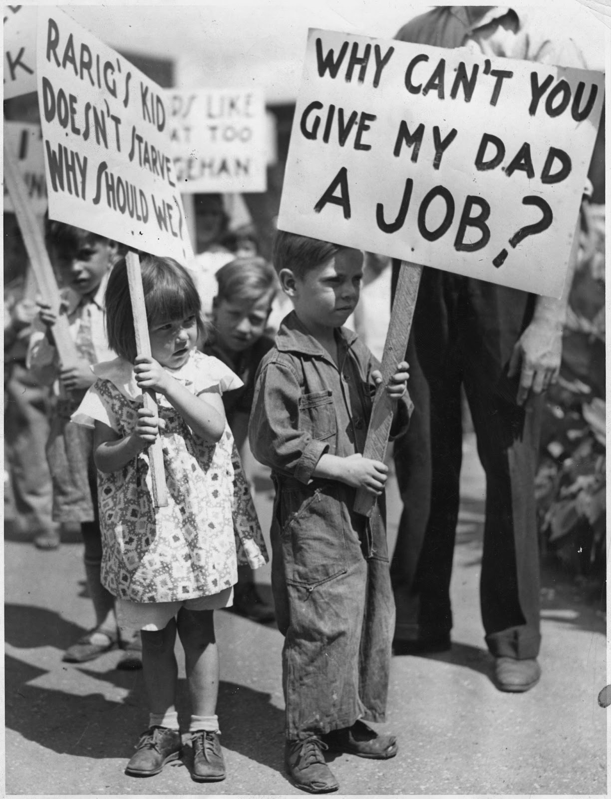
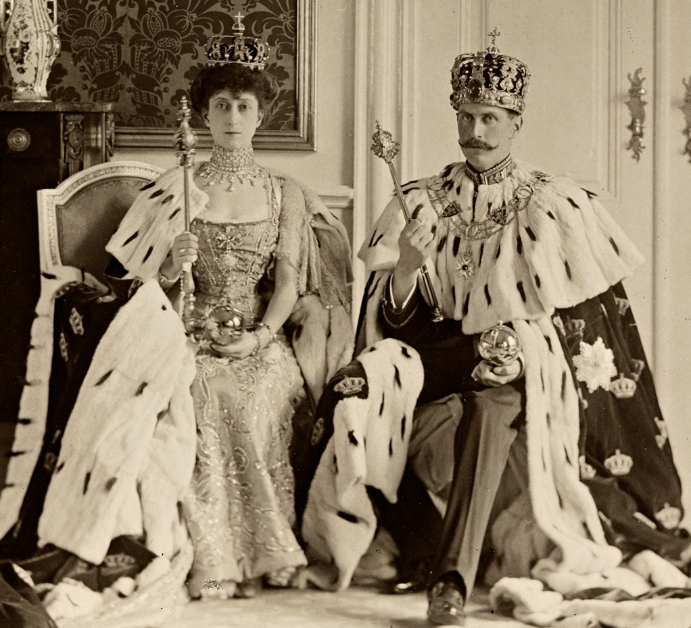
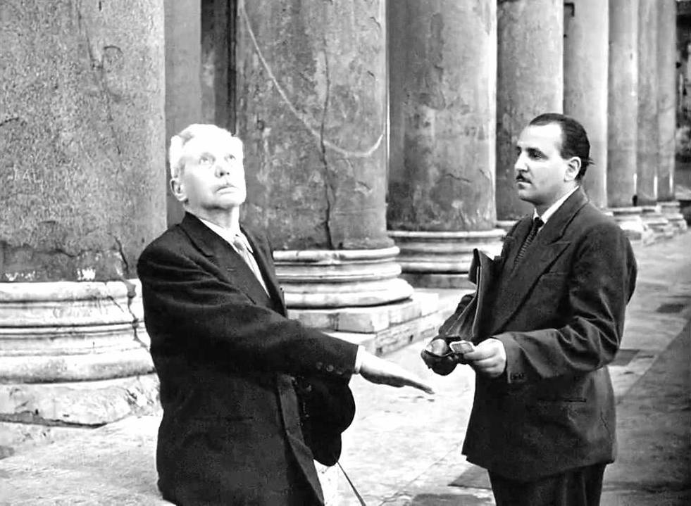
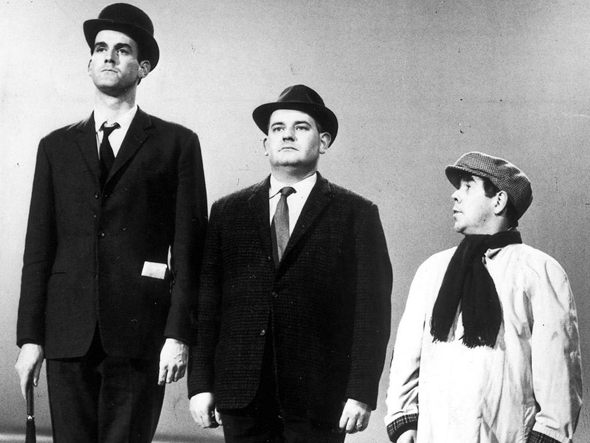

### Introduction  

- This set of slides surveys selected topics from *Capital in the Twenty-First Century*, a book written by economist Thomas Piketty, published in English in 2014 to great acclaim.
- All source files for this course are available for download by anyone without restrictions at https://github.com/ptoche/piketty
- The full course is expected to be completed by April 2015.
- Chapter 12 examined the dynamics of wealth inequality at the global level.
- Chapter 13 considers political institutions to regulate modern capitalism fairly and efficiently.

---

### Some Questions

- The 20th century wars wiped out much of the wealth accumulated over the previous centuries, and transformed the structure of inequality. 
- 70 years of peace have brought hopes and challenges:
  - `1`. the end of poverty
  - `2`. the rise of inequalities
- What political institutions could regulate the accumulation of wealth fairly and efficiently?
- New instruments are needed to regain control over the financial system. 
- The social state needs perpetual reforms, to reduce its complexity, to increase its efficiency, to face new challenges.

---

### Financial Crises

- Financial crises disrupt the accumulation of capital and harm everyone.
- The crisis of 2008 was less severe than the Great Depression, because governments and central banks acted to keep the financial system from collapsing. 
- Central banks are the only public institution capable of acting as lender of last resort and avert a total collapse of the economy. 
- But these actions are surely not a durable response to the structural problems that made the crisis possible. 
- A progressive global tax on capital would promote the general interest over private interests while preserving the forces of competition. 

--- 

### Financial Crises

<figure class = "centered">  

<figcaption class = 'figcaption'><b>The Great Depression</b>: Picket in 1937 (Rarig was a big engineering company).
</figcaption>  
</figure> 

---

### The State in the 20th Century

- Figure 13.1 shows the historical trajectory of the United States, United Kingdom, France, and Sweden, countries that are fairly representative of rich countries.
- Until 1914, total taxes were below 10% of national income.
- States mostly focused on the 'regalian' functions: police, courts, army, foreign affairs, general administration.
- States also financed some infrastructure, schools, hospitals.
- Between 1920 and 1980, social spending as a share of national income rose by a factor of 3 to 4 or even 5 (in the Nordic countries). 
- Between 1980 and 2010, the tax share stabilized everywhere. 

---

### Regalia

<figure class = "centered">  

<figcaption class = 'figcaption'>King Haakon VII and Queen Maud of Norway with their regalia. Prince Carl was elected King of Norway in 1905 after the dissolution of the union with Sweden. Queen Maud was the daughter of King Edward VII and Queen Alexandra of the United Kingdom. King Haakon is revered for his courage during the Nazi invasion.
</figcaption>  
</figure> 

---

### The State in the 20th Century

- Taxes stabilized at different shares of national income in different countries: 
  - 30% in the United States
  - 40% in the United Kingdom
  - 45% in Germany 
  - 50% in France
  - 55% in Sweden
- In all rich countries, the share of taxes in national income rose from below 1/10th to over 1/3, and 1/2 in some countries. 

---

### Government Social Spending

- The rise in government spending can be broken down into two roughly equal halves: 
  - `1`. health and education
  - `2`. transfer payments
- Health and education takes a share of 10–15%, amounting to between 1/2 and 3/4 of total cost. 
- Health insurance is public and universal in most of Europe. Obamacare is taking the United States in that general direction. 
- Primary and secondary education are free or greatly subsidised in most rich countries, but higher education is expensive in the United States. 

---

### Government Social Spending

- Social spending accounts for nearly all of the increase in public spending.
- Replacement incomes (pensions and unemployment compensation) and transfers (family allowances, guaranteed income) take a 10–20% share.
- Pensions account for 65-75% of the total. 
- Public pensions have eradicated poverty among the elderly. They are highest in Italy and France (13-15% of national income), lower in the United Kingdom and the United States (6-7% of national income). 
- Unemployment insurance takes less than 2%.
- Income support takes less than 1%.
- Total social spending takes 25–35% of national income.

---

### Before Public Pensions

<figure class = "centered">  

<figcaption class = 'figcaption'><b>Umberto D</b> by Vittorio de Sica, 1952.
</figcaption>  
</figure> 

---

### Modern Redistribution

- The modern state does not transfer much income from the rich to the poor directly &mdash; but it finances public services and replacement incomes available for everyone.
- The growth of the state was made possible by the high rates of post-war economic growth. 
- Since the 1980s, with per capita income growth barely above 1%, there is little support for tax increases. 
- The organization of a large state raises efficiency issues.

---

### Education and Social Mobility

- One of the main objectives of public spending in education is to promote social mobility. 
- Despite a large rise in the average level of education over the 20th century, earned income inequality has increased. Qualification levels have simply shifted upward. 
- The intergenerational correlation of education and earned incomes, which measures the reproduction of the skill hierarchy over time, shows no trend toward greater mobility over the long run. 
- Mobility is highest in the Nordic countries, lowest in the US, and intermediate in France, Germany, and the UK.

---

### Upper, Middle, and Lower Classes

<figure class = "centered">  

<figcaption class = 'figcaption'>John Cleese, Ronnie Barker and Ronnie Corbett in 'The Class Sketch', 7 April 1966.
</figcaption>  
</figure> 

---

### Education and Social Mobility

- Belief in high social mobility in the United States is a myth.
- The top US universities charge very high tuition fees. These fees have risen sharply since 1990. 
- The proportion of college degrees earned by children whose parents belong to the bottom two quartiles of the income hierarchy stagnated at 10–20% in 1970–2010, but rose from 40% to 80% for children with parents in the top quartile. 
- Parents' income is an almost perfect predictor of university access.
- The average income of the parents of Harvard students is currently about \\$450,000 &mdash; the average income of the top 2% of the US income hierarchy!

---

### The Future of Education

- In Nordic countries, Germany, France, Italy, and Spain, tuition fees are usually low (less than €500). Most people believe that access to higher education should be free or nearly free, just as primary and secondary education are. 
- There is no easy way to achieve real equality of opportunity in higher education. Parents' incomes are still the best predictor of their child's future income.
- High tuition fees create inequality of opportunities, but they foster the independence and prosperity that make American universities dominate world rankings.

---

### Free Education Protest

<figure class = "centered">  

<figcaption class = 'figcaption'>Student protest over tuition fees. Source: <i>The Guardian</i>, 19 November 2014.
</figcaption>  
</figure> 

---

### The Future of Retirement

- In pay-as-you-go (PAYGO) pension systems, contributions are deducted from the wages of active workers and paid out as benefits to retirees. 
- In capitalized pension plans, contributions are invested and the returns used to finance benefit payments. 
- Most public pension systems are PAYGO. 
- In PAYGO, the rate of return is by definition equal to the growth rate of the economy: contributions rise at the same rate as average wages.

---

### The Future of Retirement

- When PAYGO systems were introduced in the 1950s, growth rates were high &mdash; both demographic growth and productivity growth were high. 
- Today, the rate of wage growth is lower, but it is also more predictable, while the return on capital is very volatile.
- A transition from a capitalized system to PAYGO would be problematic. 
- A difficulty of PAYGO is that different rules apply to different professions. Governments need to establish a unified retirement scheme based on individual accounts with equal rights for everyone. 
- What kind of fiscal and social state will emerge in the developing world?
- China is developing a social state similar to Europe and America, financed by a broad-based income tax.
- India has maintained low levels of taxes and a small social state.

<!---

### Tax revenues in rich countries

<figure class = "captioned">  
  
<figcaption class = 'figcaption'>Figure 13.1. Total tax revenues were less than 10 percent of national income in rich countries until 1900-1910; they represent between 30 percent and 55 percent of national income in 2000-2010.</figcaption>  
</figure> 
<footer class = 'footnote'>Chart created with ``ggplot2`` (author: Hadley Wickham)
</footer>  

-->

---

### Tax revenues in rich countries

<iframe src = 'figures/Figure_13_1.html' alt = "Figure 13.1. Tax revenues in rich countries, 1870-2010.">
</iframe><icaption class = 'icaption'>Figure 13.1. Total tax revenues were less than 10 percent of national income in rich countries until 1900-1910; they represent between 30% and 55% of national income in 2000-2010.</icaption>
<footer class = 'footnote'>Concept and data: Thomas Piketty. Chart created with ``rCharts`` (author: Ramnath Vaidyanathan)  
</footer>  

