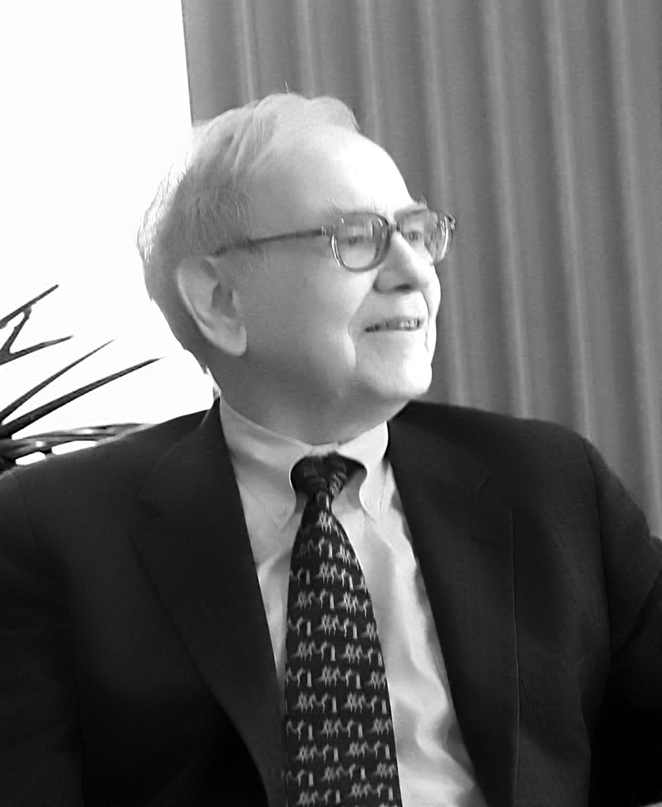

### Introduction  

- This set of slides surveys selected topics from *Capital in the Twenty-First Century*, a book written by economist Thomas Piketty, published in English in 2014 to great acclaim.
- All source files for this course are available for download by anyone without restrictions at https://github.com/ptoche/piketty
- The full course is expected to be completed by April 2015.
- Chapter 13 considered political institutions that might regulate today's global patrimonial capitalism fairly and efficiently.
- Chapter 14 examines more closely the structure of taxation.

---

### Progressive Taxation

- Without taxes, collective action is impossible. 
- The French and American revolutions are rooted in the principle **"No taxation without representation"**
How can sovereign citizens decide how much of their resources to devote to common goals such as education, health, retirement, employment, sustainable development, inequality reduction? 
- The progressive income tax is the most important fiscal innovation of the 20th century. It has been a powerful tool of inequality reduction, but is now weakened by international tax competition. 
- The progressive tax on inheritances is the second major fiscal innovation. 

---

### Types of Taxation

- 3 types of taxes have nearly always existed:
  - `1`. taxes on income
  - `2`. taxes on capital
  - `3`. taxes on consumption
- **Income taxes** apply to both earned income and capital income and are thus also a tax on capital.
- **Capital taxes** may apply to capital income (corporate income tax) or to the capital stock itself (real estate tax, estate tax, wealth tax). 
- **Consumption taxes** include value-added taxes and taxes on imported goods, drink, gasoline, tobacco, and services (indirect taxes).

---

### Social Contribution Taxes

- **Social contribution taxes** are a modern form of taxation designed to fund social spending. They are designed to 'advertise' the purpose for which the tax is intended. 
- In France, the 'Contribution Sociale Généralisée' (CSG) targets pensions, unemployment benefits, health insurance, family allowances &mdash; and generates half of all government revenue. 
- Intended to clarify the use of tax revenue, this tax accounting framework is arbitrary &mdash; in 2000, the Court of Justice of the European Union ruled that workers employed abroad are exempted from 'social contributions' in the jurisdiction of their residence, creating a tax avoidance opportunity. 
- In Denmark, comparable amounts of social spending are financed instead by a comprehensive income tax. 

---

### Tax Progressivity

- A tax is called 'proportional' if its rate is independent of the size of the base &mdash; _aka_ the 'flat tax.'
- A tax is 'progressive' if its rate increases with the size of the base, 'regressive' if its rate decreases. The 'poll tax' (introduced by Margaret Thatcher in 1990) was a regressive tax.
- In modern economies, total tax payments are roughly proportional to total income &mdash; yet, taxes have become regressive at the top.
- Estate taxes are much smaller than income taxes, so 'lifetime taxes' (on both income and capitalized inheritance) are less progressive still. 
- Progressive taxation is the only way to maintain the social state, but it is being challenged by 'neo-conservative' ideology and by tax competition.

---

### Tax Competition

- Progressive taxation of very high incomes and very large estates partly explains why the concentration of wealth has remained subdued. 
- The large reduction in the progressivity of the income tax after 1980, in the US and UK, explains much of the rise in top earned incomes. 
- The rise of tax competition in a world of free-flowing capital has led many governments to exempt capital income from the progressive income tax.
- European countries, in particular, have cut taxes on corporate profit, interest, dividends, while raising taxes on labor incomes.

---

### Case Study: France 2010

- A 2010 French study found: 
  - The overall tax raises 47% of national income
  - The bottom 50% of the income distribution pay 40–45%
  - The next 40% pay 45–50% 
  - The top 5% pay less than 45%
  - The top 0.1% pay 35%
- The high tax rates on the poor reflect the importance of consumption taxes and social contributions (3/4 of French tax revenues).
- The progressivity observed in the middle class is due to the growing importance of the income tax. 
- The regressivity at the top reflects the importance of capital income.

---

### History of the Income Tax

- Figure 14.1 shows the evolution of the top income tax rate in the United States, Britain, Germany, and France since 1900.
- The top rate remained low until 1914 and sky-rocketed after the war.
- France instituted an income tax in 1914, with a top rate of only 2%, for a tiny minority of taxpayers. The top rate was raised to 50% in 1920, 60% in 1924, 72% in 1925. This pattern is typical of many countries. 
- A few countries had introduced an income tax earlier: Denmark in 1870, Japan in 1887, Prussia in 1891, Sweden in 1903, the UK in 1909, the US in 1913, France in 1914. But rates remained low until after the war.

---

### History of the Estate Tax

- Figure 14.2 shows that, likewise, estate tax rates were low until 1914. 
- France instituted an estate tax after the French Revolution. It remained proportional until 1901, became slightly progressive after 1901 &mdash; the top rate was set at 5% until 1910, 6.5% until 1914, and applied to a dozen or so fortunes every year. It was raised greatly after the war.
- Germany instituted a very small estate tax in 1909, but bequests to a spouse or to children were fully exempt. In 1919, the tax was extended to family bequests and the rate rose to 35%.
- The United States instituted a federal tax on estates and gifts in 1916, raising its rate quickly above French and German rates.

---

### Confiscatory Rates

- The United States was the first country to institute rates above 70%, on income in 1919–1922, on estates in 1937–1939. 
- The United Kingdom had an estate tax of 98% in the 1940s and 1970s.
- The goal of confiscatory rates is to reduce inequality, not to raise revenue. 
- In 1919, Irving Fisher, president of the American Economic Association, lamented that "2 percent of the population owns more than 50 percent of the wealth" and "two-thirds of the population owns almost nothing," something he saw as "undemocratic". 
- France and Germany had top income tax rates between 50% and 70% from the late 1940s until the 1980s, but never as high as US rates &mdash; except under the US occupation of Germany in 1947–1949 &mdash; estate taxes were somewhat lower.

---

### The Explosion of Executive Compensation

- From the 1930s to the 1970s, the US and UK applied extreme tax burdens at the top, keeping inequality in check. 
- From the 1980s onwards, the US and UK, inspired by Reagan and Thatcher, cut top taxes dramatically. 
- Top marginal income tax rates fell from 80–90% in 1930–1980 to 30–40% in 1980–2010, well below levels in France, Germany, or Japan.
- As top tax rates were slashed, the top centile income share shot up. 

--- 

### The Reagan and Thatcher 'Revolutions'

<figure class = "centered">  

<figcaption class = 'figcaption'>UK Prime Minister <b>Margaret Thatcher</b> and US President <b>Ronald Reagan</b> won several elections on an agenda of large tax cuts in the 1980s.
</figcaption>  
</figure>

---

### Executive Compensation

- The cut in top income tax rates has revolutionised social and corporate norms of executive compensation. 
- In the 1950s and 1960s, 80–90% of top executive pay rise was taxed, reducing the incentive to negotiate for a pay rise. After 1980, the stakes were increased and executives negotiated harder for pay rises. 
- Nothing suggests that executive pay rise was correlated with productivity. 
- The US economy was much more innovative in 1950–1970 than in 1990–2010 &mdash; productivity growth was twice as large. 
- Countries with the largest cuts in top income tax rates saw top income shares rise the most. 

---

### Executive Compensation

<figure class = "centered">  

<figcaption class = 'figcaption'>CEOs testify before the House Financial Services Committee, 11 February 2009, Washington DC &mdash; left to right: <b>Jamie Dimon</b> (JPMorgan Chase & Co), <b>Robert P. Kelly</b> (The Bank of New York Mellon), <b>Ken Lewis</b> (Bank of America), <b>Ronald Logue</b> (State Street Corporation) <b>John Mack</b> (Morgan Stanley), <b>Vikram Pandit</b> (Citigroup).
</figcaption>  
</figure>

---

#### **CEO Compensation, United States 2008**

```{r ForbesCEORanking, echo=FALSE, message=FALSE, warnings=FALSE, results='asis'}
tbl <- "
| Rank | Name                 | Company               | Pay (Million) | Age |
|------|:--------------------:|----------------------:|--------------:|---:|
| 1    | Lawrence J. Ellison  | Oracle                | 193           | 63 |
| 2    | Frederick M. Poses   | Trane                 | 127           | 66 | 
| 3	   | Aubrey K McClendon   | Chesapeake Energy     | 117           | 47 |
| 4    | Angelo R Mozilo      | Countrywide Financial | 103           | 69 |
| 5	   | Howard D Schultz     | Starbucks             | 99            | 54 | 
| 6    | Nabeel Gareeb 	      | MEMC Electronic Mats  | 80            | 43 | 
| 7	   | Daniel P Amos        | Aflac                 | 75            | 56 | 
| 8    | Lloyd C Blankfein    | Goldman Sachs Group   | 74            | 53 | 
| 9	   | Richard D Fairbank   | Capital One Financial | 73            | 57 | 
| 10   | Bob R Simpson        | XTO Energy            | 72            | 59 | 
| 11   | Richard S Fuld Jr    | Lehman Bros Holdings  | 72            | 62 |
| 82   | James Dimon          | JPMorgan Chase        | 21            | 52 |
| 83   | Ronald E Logue       | State Street          | 21            | 62 |
| 85   | Kenneth D Lewis      | Bank of America       | 20            | 61 |
| 101  | John J Mack          | Morgan Stanley        | 18            | 63 |
| 113  | John A Thain         | Merrill Lynch         | 16            | 53 |
| 126  | Robert P Kelly       | Bank of New York      | 14            | 53 |
| 495  | Vikram S Pandit      | Citigroup             | 0.25          | 51 |
"
cat(tbl)  # output the table
```

---

### Top Marginal Tax Rates

- Evidence suggests that tax rates as high as 80 percent on annual incomes over \\$500,000 or \\$1 million would not reduce the economy's growth rate. 
- The US could apply this type of fiscal policy effectively, without inducing mass emigration of top executives to Canada or Mexico. 
- Confiscatory rates would not bring much revenue because compensation would adjust downwards at the top, while rising at lower levels. 
- Since the financial crisis of 2008, protesters have called for a tax hike on top incomes. In 2015, US president Obama raised the top marginal rate from 35% to 40%, with the top 1% of households paying about 33% of income on average &mdash; about half of the 1960s marginal rates.   
- Elected officials are much wealthier than the average voter &mdash; their own private interest may not be aligned with the general interest.

--- 

### Top Income Tax Rates

<figure class = "centered">  

<figcaption class = 'figcaption'>American Billionaire <b>Warren Buffett</b> has called for a rise on top tax rates. The Buffett 'rule' states that everyone making over a million dollars a year pay a minimum effective tax rate of at least 30 percent.
</figcaption>  
</figure>

---

### Top Income Tax Rates

<figure class = "centered">  

<figcaption class = 'figcaption'><b>Occupy Wall Street</b>. The slogan 'We are the 99%' suggests that the share of income and wealth going to the top 1% has risen above a socially acceptable level.
</figcaption>  
</figure>


<!---

### Top income tax rates

<figure class = "captioned">  
  
<figcaption class = 'figcaption'>Figure 14.1. The top marginal tax rate of the income tax (applying to the highest incomes) in the U.S. dropped from 70% in 1980 to 28% in 1988.</figcaption>  
</figure> 
<footer class = 'footnote'>Concept and data: Thomas Piketty. Chart created with ``ggplot2`` (author: Hadley Wickham)
</footer>  

-->

---

### Top income tax rates

```{r 'Figure_14_1_rcharts',  message = FALSE, warning = FALSE, error = FALSE, echo = FALSE, tidy = FALSE, cache = FALSE}  
require(rCharts)
load("../../data/df_14_1.Rda") 
# round data for rChart tooltip display
df_14_1$value <- round(df_14_1$value, 2)
n <- nPlot(data = df_14_1, value ~ Year, group = 'variable', color = 'variable', shape = 'variable', type = 'lineChart') 
n$chart(forceY = c(0, 1))
n$chart(margin = list(left = 80))
n$yAxis(axisLabel = 'Marginal tax rate applying to the highest incomes')
n$yAxis(tickFormat = "#! function(y) {return Math.round(y*100*100)/100 + '%'} !#")
n$xAxis(axisLabel = NULL)
n$chart(useInteractiveGuideline = TRUE)
n$chart(color = colorPalette)
n$addParams(height = 450, width = 900)
n$setTemplate(afterScript = '<style>
  .nv-point {
    stroke-opacity: 1!important;
    stroke-width: 5px!important;
    fill-opacity: 1!important;
  } 
</style>')
n$save('figures/Figure_14_1.html', standalone = TRUE)
```
<iframe src = 'figures/Figure_14_1.html' alt = "Figure 14.1. Top income tax rates, 1900-2013.">
</iframe><icaption class = 'icaption'>Figure 14.1. The top marginal tax rate of the income tax (applying to the highest incomes) in the U.S. dropped from 70% in 1980 to 28% in 1988.</icaption>
<footer class = 'footnote'>Concept and data: Thomas Piketty. Chart created with ``rCharts`` (author: Ramnath Vaidyanathan)  
</footer>  

<!---

### Top inheritance tax rates

<figure class = "captioned">  
  
<figcaption class = 'figcaption'>Figure 14.2. The top marginal tax rate of the inheritance tax (applying to the highest inheritances) in the U.S. dropped from 70% in 1980 to 35% in 2013.</figcaption>  
</figure> 
<footer class = 'footnote'>Concept and data: Thomas Piketty. Chart created with ``ggplot2`` (author: Hadley Wickham)
</footer>  

-->

---

### Top inheritance tax rates

```{r 'Figure_14_2_rcharts',  message = FALSE, warning = FALSE, error = FALSE, echo = FALSE, tidy = FALSE, cache = FALSE}  
require(rCharts)
load("../../data/df_14_2.Rda")
# round data for rChart tooltip display
df_14_2$value <- round(df_14_2$value, 2)
n <- nPlot(data = df_14_2, value ~ Year, group = 'variable', color = 'variable', shape = 'variable', type = 'lineChart') 
n$chart(forceY = c(0, 1))
n$chart(margin = list(left = 80))
n$yAxis(axisLabel = 'Marginal tax rate applying to the highest inheritances')
n$yAxis(tickFormat = "#! function(y) {return Math.round(y*100*100)/100 + '%'} !#")
n$xAxis(axisLabel = NULL)
n$chart(useInteractiveGuideline = TRUE)
n$chart(color = colorPalette)
n$addParams(height = 450, width = 900)
n$setTemplate(afterScript = '<style>
  .nv-point {
    stroke-opacity: 1!important;
    stroke-width: 5px!important;
    fill-opacity: 1!important;
  } 
</style>')
n$save('figures/Figure_14_2.html', standalone = TRUE)
```
<iframe src = 'figures/Figure_14_2.html' alt = "Figure 14.2. Top inheritance tax rates, 1900-2013.">
</iframe><icaption class = 'icaption'>Figure 14.2. The top marginal tax rate of the inheritance tax (applying to the highest inheritances) in the U.S. dropped from 70% in 1980 to 35% in 2013.</icaption>
<footer class = 'footnote'>Concept and data: Thomas Piketty. Chart created with ``rCharts`` (author: Ramnath Vaidyanathan)  
</footer>  


