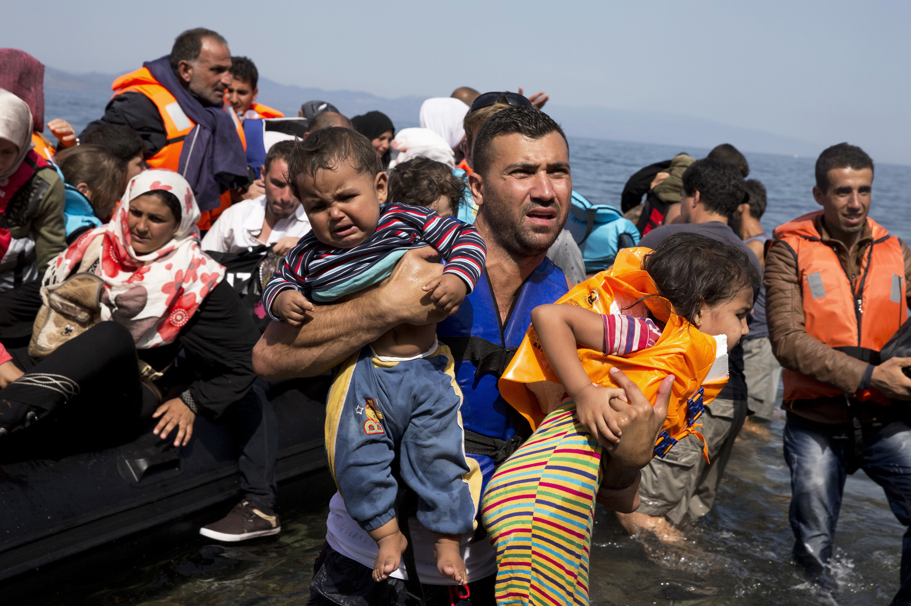

### Introduction  

- This set of slides surveys selected topics from *Capital in the Twenty-First Century*, a book written by economist Thomas Piketty, published in English in 2014 to great acclaim.
- All source files for this course are available for download by anyone without restrictions at https://github.com/ptoche/piketty
- The full course is expected to be completed by April 2015.
- Chapter 14 examined the structure of taxation.
- Chapter 15 makes the case for a global tax on capital.

---

### Financial Reform for the 21st Century

- Policies to preserve the welfare state:
  - `1`. financial **transparency** and international **cooperation**
  - `2`. a **global and progressive** tax on capital
- **Progressive taxation** &mdash; the greater the base, the greater the tax rate
- The challenge of a global tax on capital: 
  - `1`. a tax schedule applicable to global wealth
  - `2`. rules to apportion revenues
  - `3`. democratic support 
- This **Utopia** could start with information sharing between the United States and the European Union. 

---

### A Global Tax on Net Wealth

- The tax base would be **'net wealth'**, the market value of financial and non-financial assets &mdash; bank deposits, stocks, bonds, partnerships, equity in listed and unlisted firms, patents, real estate &mdash; **_net of debt_**. 
- A progressive tax schedule:
  - 1%  on net assets between €1M and €5M
  - 2%  on net assets above €5M
- A more progressive tax schedule:
  - 1%  on net assets between €1M and €5M
  - 2%  on net assets between €5M and €1B
  - 5% on net assets above €1B
  - 10% on net assets above €10B

---

### A Global Tax on Net Wealth

- **Objectives**:
  - `1`. reduce inequality of wealth 
  - `2`. regulate the financial and banking system
  - `3`. set rules for valuing assets, liabilities, and net wealth
  - `4`. share financial and banking data
- Some European countries tax wealth &mdash; France, Switzerland, Spain, and until recently Germany and Sweden &mdash; but these taxes are riddled with exemptions and asset values are too far from market values.
- Existing taxes on wealth are based on **gross wealth** &mdash; a heavily indebted person is taxed in the same way as a person with no debt.

---

### Automatic Transmission of Banking Information

- With existing tax loopholes, rich individuals and large corporations essentially "set their own taxes". 
- The amount of wealth hidden in tax havens is staggering.
- Tax havens defend bank secrecy because their clients evade taxes, not because privacy is valued per se.
- Free trade and a welfare state are inconsistent with tax havens.
- The first step towards the regulation of banking and financial markets is the automatic transmission of banking data across countries.
- Free trade in goods, services, and capital requires international exchange of financial information.

---

### FATCA

<figure class = "captioned">  
  
<figcaption class = 'figcaption'>FATCA - The Foreign Account Tax Compliance Act - in force since 2015.</figcaption>  
</figure> 

---

### Automatic Transmission of Banking Information
 
- Since 2015, the **Foreign Account Tax Compliance Act** (FATCA) requires all foreign banks to inform the United States Treasury Department about bank accounts and investments held abroad by US taxpayers.
- **FATCA** remains insufficient:
  - Sanctions are small &mdash; a 30% surtax on income that noncompliant banks derive from their US operations.
  - While large banks that need to do business in the US comply with FACTA, smaller banks specialize in "non compliance" &mdash; a profitable niche as long as business with US financial institutions is small.

---

### Automatic Transmission of Banking Information

- The 2003 **European Union Savings Directive** (EUSD) required the automatic exchange of information between member states on private savings income, and introduced a 'witholding tax' to be deducted from interest earned by European Union residents on investments made in another member state. 
- The 2003/48/EC directive concerned only interest-bearing deposit accounts &mdash; with large fortunes held in equity consequently exempted.
- In 2016, directive 2014/107/EU extended the scope of directive 2003/48/EC to include interest, dividends and other types of income.
- Andorra, Austria, Liechtenstein, Luxembourg, Monaco, San Marino, and Switzerland to be included, with temporary delays and exemptions.

---

### Why Should We Tax Wealth?

- `1`. A progressive tax on net wealth is **fair**:
  - Income is not a well-defined concept at the very top.
  - Liliane Bettencourt, the L'Oréal heiress whose wealth is €30B, has never declared annual income above €5M. Even a 100% income tax achieves little redistribution.
  - One solution is to expand the income tax base to include income held in trusts, holding companies, and partnerships. Another solution is to tax wealth rather than income. 
  - Since return on wealth is increasing in wealth, a progressive tax offsets this inequity, and is more 'fair' than a flat tax. 

---

### Why Should We Tax Wealth?

- `2`. A progressive tax on net wealth preserve **incentives**:
  - A wealth tax creates incentives to seek high returns. 
  - A wealth tax discourages inefficient investments, encourages risk-taking &mdash; a 2% wealth tax is reasonable if capital earns 10%, but confiscatory if it earns less than 2%. 
  - A tax system based solely on wealth and ignoring profit would put disproportionate pressure on loss-making companies.
  - The ideal tax system balances the incentive to take risk (which is at the heart of investment) and the incentive to smooth revenue (which is at the heart of consumption).
  - The ideal tax system combines income and wealth taxes.

---

### How Should We Tax Wealth?

- An inheritance tax can be high, because it is collected only once a generation. Figure 14.1 shows the top marginal rate on inheritance exceeded 60% between 1940 and 1980 in both the US and UK.
- But the average rate cannot be too high &mdash; if it were set at 50%, nearly all wealth would be taxed after 2 generations.
- It makes more sense to tax heirs incrementally throughout their lives (income, profit, wealth taxes), rather than once and for all at the time of inheritance (the estate tax). 
- A progressive tax on capital would reassert control over capitalism, while preserving the efficiency of private property and competition. 
- Each type of capital would be taxed in the same way. 

---

### How Should We Tax Wealth?

- A progressive, annual tax on wealth, even at modest rates, could generate large tax revenues.
- Because on average wealth is worth more than 5 years of GDP and, in the top centiles, even more. 
- An EU-wide wealth tax of 1% on €1M-€5M and 2% above €5M would affect 2.5% of the population and raise revenue of 2% of EU GDP.
- In 2012, Italy introduced a tax on wealth &mdash; a 0.8% flat rate on real estate and 0.1% flat rate on bank deposits and other financial assets ... except stocks! The overall rate was ... regressive and led to electoral defeat! 
- It is difficult for one country alone to impose a wealth tax, **it mut be a coordinated effort**.

---

### Oil Rents

<figure class = "captioned">  
  
<figcaption class = 'figcaption'>Aramco Oil Refinary, Saudi Arabia.</figcaption>  
</figure> 

---

### Oil Rents

- The geographic distribution of natural resources and especially of **oil rents** depends on country borders. In the middle east, these were arbitrarily drawn by occupying powers. 
  - Saudi Arabia &mdash; population 20M &mdash; have annual production 12M barrels per day (approx 100 litres), an annual revenue of \\$438B at \\$100 per barrel &mdash; equivalent to \\$22,000 per person, and half that at \\$50 per barrel.
  - Qatar &mdash; population 300,000 &mdash; have 2M barrels per day, an annual revenue of \\$73B at \\$100 per barrel &mdash; equivalent to \\$243,000 per person, and half that at \\$50 per barrel.

---

### Immigration

<figure class = "captioned">  
  
<figcaption class = 'figcaption'>Chinese immigrants in the United States, circa 1890. <u>Source:</u> Unknown.</figcaption> 
</figure> 

---

### Immigration

<figure class = "captioned">  
  
<figcaption class = 'figcaption'>Polish immigrants working in fields near Baltimore. <u>Source:</u> Lewis Hine, colorized by Wikipedia user Robek, based on public domain photo, dated 1909.</figcaption> 
</figure> 

---

### Immigration

<figure class = "captioned">  
  
<figcaption class = 'figcaption'>Syrian refugees on the island of Lesbos, Greece, 10 September 2015. <u>Source:</u> Petros Giannakouris, Associated Press, published in <i>Los Angeles Times</i>.</figcaption>  
</figure> 

---

### Immigration

- Immigration shares the economic benefits of free trade and globalization, and reduces inequality. 
- In the United States, immigration has been a key force behind wealth distribution: population rose from 3M in 1776 to 320M in 2016, largely thanks to successive waves of immigration. 
- The less developed countries would benefit most from a transparent international tax system. 
- In Africa, the outflow of capital exceeds the inflow of foreign aid!

